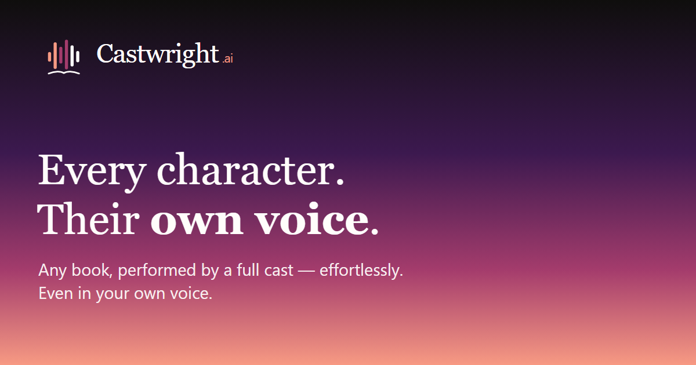

# Castwright

> _Any book, performed by a full cast — kept true, kept yours, book after book._

Turn a manuscript into a finished, **full-cast** audiobook on your own machine —
every character in their own voice, consistent across a whole series. Castwright
runs locally end-to-end; nothing leaves your computer unless you opt into a cloud
analyzer.

Upload `.md` / `.txt` / `.epub` / `.pdf` / `.mobi` / `.azw3` → an analyzer
extracts characters, chapters, and per-sentence speaker tags → assign a voice to
each character → generate per-chapter audio → listen, revise, and export to M4B
or MP3.

## What you get

- **Full-cast performance** — every character speaks in their own voice; one
  narrator can't be everyone.
- **Series memory** — a character keeps the same voice across every book in a
  series.
- **Designed voices** — every character gets a unique voice designed from its persona, kept consistent across the series. (Cloning a voice from your own sample is the next major release.)
- **On-device by default** — analysis and speech run on your machine; cloud is
  opt-in.
- **You own the files** — export standard M4B / MP3 / AAC / Opus and keep them.
  No lock-in.

## Features

- **Ingest** — paste or upload `.md`, `.txt`, `.epub`, `.pdf`, `.mobi`, or
  `.azw3`. Chapters and character names are extracted automatically; low-confidence
  speaker tags are surfaced for a quick review pass. DRM-protected files are
  rejected up front. Re-uploading a book shows a sentence-level diff before
  anything changes.
- **Try a sample** — a ready-made demo book (an original full-cast story) loads
  in one click with its whole cast already designed, so you can generate and hear
  a full performance before importing anything of your own.
- **Analyzer choice** — run a fully local model via Ollama (no API key, nothing
  leaves your machine) or use the Gemini free tier. For long books, an optional
  two-model pipeline runs cast detection and sentence attribution in parallel to
  roughly double throughput.
- **Voice & cast** — per-engine voice catalogues with family grouping, drag- or
  tap-to-assign, per-character overrides, and sample playback. Audition candidate
  voices in the profile drawer before committing, and compare two characters side
  by side — even across books.
- **Voice engines** — Kokoro (fast, English, runs on a modest GPU), Coqui XTTS v2
  (zero-shot voice cloning, optional download), Qwen3-TTS (designs a unique voice
  per character from a persona and reuses it across the series), and Gemini cloud.
  A character keeps its voice when you switch engines.
- **Generation** — per-chapter, resumable, and sticky across navigation; chapters
  synthesise in a bounded parallel pool. Each chapter opens with its title spoken
  in the narrator's voice. Open the same book in two tabs and progress stays in
  sync.
- **Revisions & drift** — pending-revision review, A/B audition with rollback, a
  per-chapter revision timeline, and automatic detection (with one-click
  regeneration) when a chapter's voices drift from the current cast.
- **Listening** — a built-in player with speed control, markers, a sleep timer,
  true waveform peaks, resume bookmarks, per-book notes, and one-tap sharing of a
  30-second clip or the whole book.
- **Library** — auto-fetched cover art with a manual cover picker (search /
  upload / frame), title & author search, tag filters, series grouping, and a
  portable book bundle for backup or transfer.
- **Export** — M4B (with cover and chapter markers), AAC/M4A, Opus, MP3 (zip or
  per-chapter folder), plus LAN download with a QR code. EBU R128 loudness
  normalisation is on by default.
- **Mobile, tablet & companion app** — every view is responsive across phone /
  tablet / desktop and reachable over your home network via HTTPS, with a native
  Android companion that syncs only what changed and plays offline (background,
  lock-screen, Bluetooth, Android Auto).

## Quickstart

Two ways to install:

- **One click, no terminal — [Pinokio](https://pinokio.computer).** Paste the repo URL
  into the Pinokio browser and click **Install**. Pinokio provisions its own Python,
  ffmpeg and voice engine, builds the latest release, and launches the app — nothing to
  set up by hand. See [INSTALL.md → Pinokio](INSTALL.md#install--pinokio-one-click).
- **Manual — the release zip.** Download the latest `castwright-vX.Y.Z.zip` from
  [Releases](https://github.com/dudarenok-maker/Castwright/releases), extract it, and
  follow **[INSTALL.md](INSTALL.md)**. You'll end up with a single `npm run start:prod`
  that brings up the server, the voice engine, and the web UI at <http://localhost:8080>.

**Prerequisites** (manual install only — Pinokio provisions these itself; full detail and per-OS steps in [INSTALL.md](INSTALL.md)):

- Node.js 20.19+
- Python 3.12 (exactly — for the voice engine)
- ffmpeg on `PATH`
- ~6 GB free disk (TTS weights ~1.1 GB + PyTorch ~2.5 GB + deps)
- A GPU is strongly recommended (TTS on CPU is far slower): NVIDIA on Windows/Linux (PyTorch `2.8.0` installs CUDA-bundled by default; for a specific toolkit like CUDA 12.8 see [INSTALL.md](INSTALL.md)), or Apple Silicon (M-series) on macOS — used automatically via Metal, no drivers or setup. **AMD GPUs are an experimental preview** (ROCm for Qwen/Coqui; Kokoro runs on CPU), auto-detected with a safe CPU fallback — see [INSTALL.md](INSTALL.md). No GPU? It still runs on CPU.

## Companion app (Android)

A native Flutter companion pairs to your running server over the home network
(HTTPS, cert-pinned), delta-syncs only the chapters that changed, and plays them
offline with background, lock-screen, Bluetooth, and Android Auto controls.
Pairing is cryptographically self-verified, so **no certificate install is needed
on the phone**.

Each [GitHub Release](https://github.com/dudarenok-maker/Castwright/releases)
attaches a ready-to-sideload `castwright-vX.Y.Z.apk`. Server-side pairing setup
(LAN HTTPS + an access token) is in [INSTALL.md](INSTALL.md); the app's own build
and usage notes are in [`apps/android/README.md`](apps/android/README.md).

## Releases

Tagged releases are published to
[GitHub Releases](https://github.com/dudarenok-maker/Castwright/releases). Each
attaches (all with `.sha256` checksums):

- `castwright-vX.Y.Z.zip` — the platform-independent **server** bundle
  (Windows / macOS / Linux); install via [INSTALL.md](INSTALL.md).
- `castwright-vX.Y.Z.apk` — the sideloadable **Android companion** app.

An iOS companion build isn't published yet — it lands with `app-12` (signed
`.ipa`); the Flutter codebase already stays iOS-ready.

After the first public release, upgrading is one click inside the app
(**Account → Application updates**); see [INSTALL.md](INSTALL.md#updating).

## How it's built

Castwright is a Vite + React frontend, a Node/Express server, and a Python
(FastAPI) voice engine, with a native Flutter companion app. Building from source,
the branching model, and the commit convention are documented in
**[CONTRIBUTING.md](CONTRIBUTING.md)**.

## Documentation

- **[INSTALL.md](INSTALL.md)** — install, configure, and update the app.
- **[`apps/android/README.md`](apps/android/README.md)** — the Android companion.
- **[CONTRIBUTING.md](CONTRIBUTING.md)** — building from source, branching, and
  the commit convention.

## License

Castwright is **source-available — not OSI open source**. The code is licensed
under the **Functional Source License v1.1 with an Apache-2.0 future grant**
(FSL-1.1-ALv2, a.k.a. FSL-1.1-Apache-2.0) — see **[LICENSE](LICENSE)**. In short:
use, modify, and share it for any purpose **except** building a competing product
or service; two years after each release, that release's code becomes Apache-2.0.
Leading with this plainly is deliberate — it bars a competing fork from day one
while keeping the source fully readable.

- **Name & brand** — the Castwright name and identity are all rights reserved and
  not part of this repository; see [`docs/legal/brand-and-trademarks.md`](docs/legal/brand-and-trademarks.md).
- **Model weights** carry their own upstream licences ([NOTICE](NOTICE)). Coqui
  XTTS v2 is non-commercial (CPML) and is therefore download-on-demand, never
  bundled.

**Contributing:** issues welcome; PRs by invitation for now (a DCO sign-off and a
lightweight CLA apply — see [CONTRIBUTING.md](CONTRIBUTING.md)).
