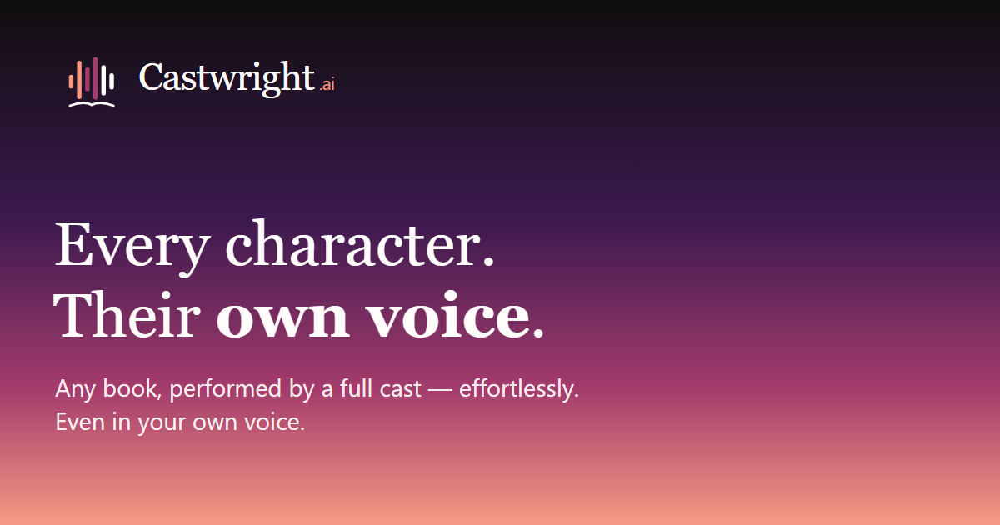

# Castwright

> _Any book, performed by a full cast — kept true, kept yours, book after book._

Turn a manuscript into a finished, **full-cast** audiobook on your own machine —
every character in their own voice, consistent across a whole series. Castwright
runs locally end-to-end; nothing leaves your computer unless you opt into a cloud
analyzer.

Upload `.md` / `.txt` / `.epub` / `.pdf` / `.mobi` / `.azw3` → an analyzer
extracts characters, chapters, and per-sentence speaker tags → assign a voice to
each character → generate per-chapter audio → listen, revise, and export to M4B
or MP3.

## What you get

- **Full-cast performance** — every character speaks in their own voice; one
  narrator can't be everyone.
- **Series memory** — a character keeps the same voice across every book in a
  series, even when an author renames someone mid-series. *(No other tool does
  this for readers.)*
- **Designed voices** — every character gets a unique voice designed from its persona, kept consistent across the series. (Cloning a voice from your own sample is the next major release.)
- **Quality gate** — every line is acoustically checked, transcript-verified, and drift-checked
  before a chapter is assembled, and any that fail are re-recorded automatically; the plainly
  broken lines never reach your ears.
- **On-device by default** — analysis and speech run on your machine; cloud is
  opt-in.
- **You own the files** — export standard M4B / MP3 / AAC / Opus and keep them.
  No lock-in.

## Documentation

The full user guide — installing, uploading a book, casting, generating
audio, listening, exporting, and every feature area — lives on the
[wiki](https://github.com/dudarenok-maker/Castwright/wiki), illustrated
with real screenshots.

- New here? Start at [Getting Started](https://github.com/dudarenok-maker/Castwright/wiki/Getting-Started).
- Installing from the release zip? See [INSTALL.md](./INSTALL.md).
- Release history: [RELEASE_NOTES.md](./RELEASE_NOTES.md).

## License

Castwright is **source-available — not OSI open source**. The code is licensed
under the **Functional Source License v1.1 with an Apache-2.0 future grant**
(FSL-1.1-ALv2, a.k.a. FSL-1.1-Apache-2.0) — see **[LICENSE](LICENSE)**. In short:
use, modify, and share it for any purpose **except** building a competing product
or service; two years after each release, that release's code becomes Apache-2.0.
Leading with this plainly is deliberate — it bars a competing fork from day one
while keeping the source fully readable.

- **Name & brand** — the Castwright name and identity are all rights reserved and
  not part of this repository; see [`docs/legal/brand-and-trademarks.md`](docs/legal/brand-and-trademarks.md).
- **Model weights** carry their own upstream licences ([NOTICE](NOTICE)). Coqui
  XTTS v2 is non-commercial (CPML) and is therefore download-on-demand, never
  bundled.
- **Privacy & terms** — the apps collect nothing and send nothing to us; the full
  policies live at [castwright.ai/legal/privacy](https://castwright.ai/legal/privacy)
  and [castwright.ai/legal/terms](https://castwright.ai/legal/terms). Castwright is a
  registered business name (ABN 52 641 247 931) in Australia.

**Contributing:** issues welcome; PRs by invitation for now (a DCO sign-off and a
lightweight CLA apply — see [CONTRIBUTING.md](CONTRIBUTING.md)).
