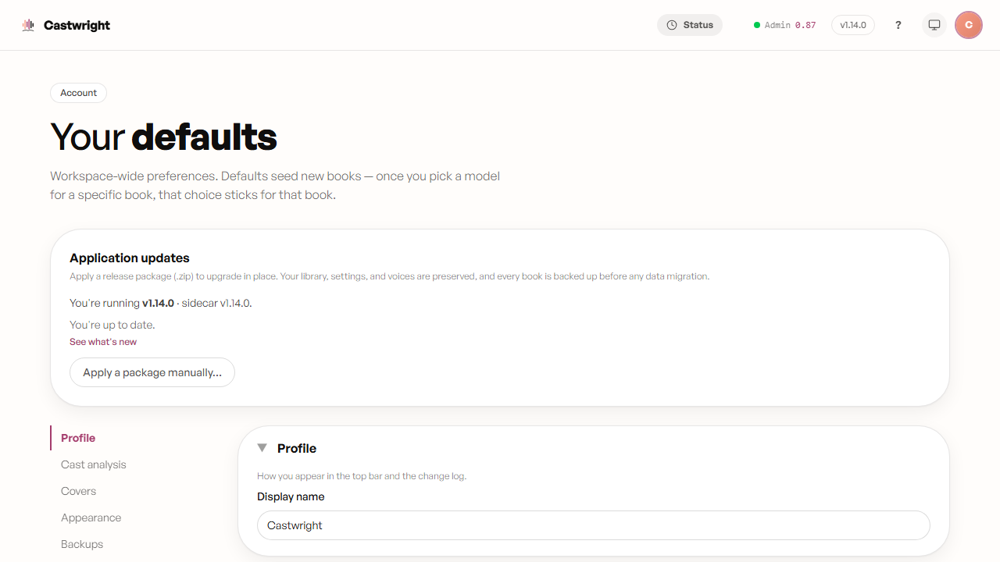

# Account & Settings

**Account** (`#/account`) is reached from the avatar in the top-right of the
top bar. It centralises workspace-wide defaults and non-secret server
overrides — things that seed new books, not per-book choices; once you pick
a model for a specific book, that book's choice sticks regardless of what's
set here.

At the top, the **Application updates** card shows your installed app +
sidecar version, whether you're up to date, a **See what's new** link, and
**Apply a package manually…** for sideloading a release `.zip`. Below it is
the same side-nav accordion pattern as
[Model Manager](Model-Manager) and
[Advanced Settings](Advanced-Settings), with these sections:

- **Profile** — your display name, shown in the top bar and the change log.
- **Cast analysis** — the minor-cast line-count threshold: characters with
  fewer attributed sentences than this get folded into the generic
  `Unknown male` / `Unknown female` buckets rather than earning their own
  voice profile. Set to 0 to disable the fold entirely.
- **Covers** — which tab (Search OpenLibrary or Upload local) opens first
  when picking a book's cover image.
- **Appearance** — the default theme (System / Light / Dark) any new
  device or session inherits. The sun/moon toggle in the top bar is a
  *per-device* override that always wins until cleared — when one is set,
  a pill appears here explaining which device is overridden and offers
  **Use account default** to clear it.
- **Backups** — automatic snapshots of a book's `state.json` (cast,
  chapters, metadata), with a cadence (daily/weekly) and a retention count
  (1–365 snapshots), plus a **Restore from backup** picker: choose a book,
  see its snapshots, take one on demand with **Back up now**, or roll back
  to an earlier snapshot (confirm-gated, since it overwrites the current
  state).
- **Workspace** — an override for where this machine keeps your library on
  disk (leave empty to use `WORKSPACE_DIR` from `server/.env`); changing it
  needs a server restart, flagged inline the instant the field diverges
  from the saved value. The active workspace root and its source are shown
  read-only underneath.
- **Device-local (this browser only)** — everything here applies instantly,
  per-browser, with no Save button: rebindable keyboard shortcuts for
  play/pause and skip-back/skip-forward, the skip amounts in seconds,
  auto-advance to the next chapter, a high-contrast theme, a text-size
  scale (Normal/Large/Larger), and the autosave debounce (how long edits to
  cast/manuscript/notes wait before writing to disk).
- **Models & engines** and **Advanced configuration** — thin pointer cards
  into [Model Manager](Model-Manager) and
  [Advanced Settings](Advanced-Settings) respectively; model setup and
  low-level tuning both live on those dedicated pages now, not here.
- **Help & troubleshooting**, **Listening stats**, and **First-run setup** —
  further pointer cards, to Help, to your hours-listened/streak/per-book
  stats, and to re-running the first-run setup wizard.

Changes in the account-level sections (everything above **Device-local**)
are staged locally and only take effect once you click **Save changes** at
the bottom of the page; device-local settings and the pointer cards apply
immediately since there's nothing to stage.

Next: [Multi-language Support](Multi-language-Support).
