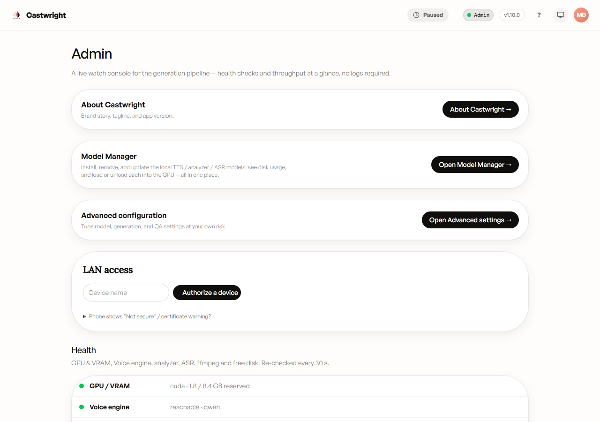
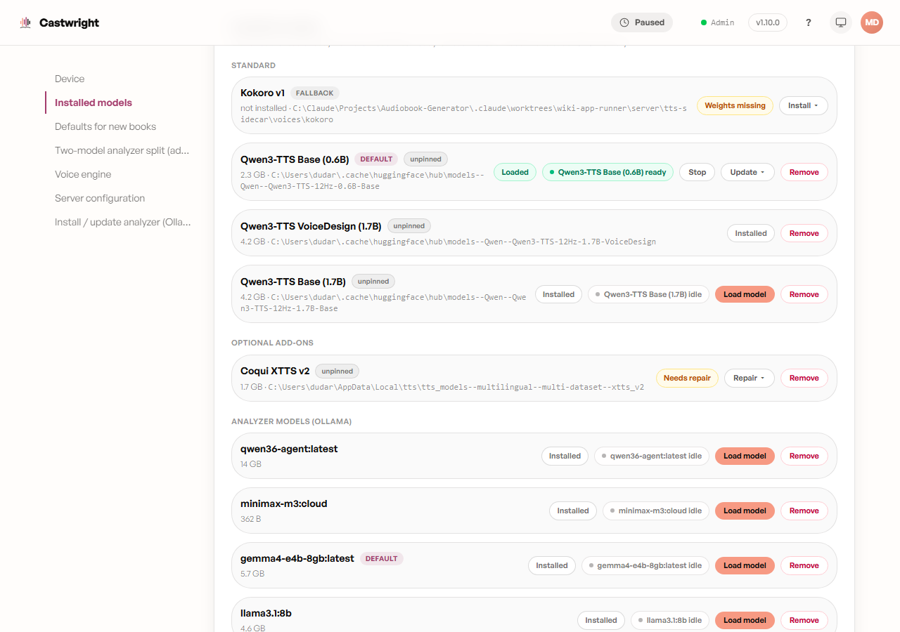

# Admin & Model Manager

**Admin** (`#/admin`) is a live watch console for the generation pipeline —
health checks and throughput at a glance, no logs required. It's reached
from the **Admin** pill in the top bar.

The top of the page is three link-out cards — **About Castwright** (brand
story, tagline, app version), **Model Manager** (below), and **Advanced
configuration** (see [Advanced Settings](Advanced-Settings)) — followed by
the **LAN access** card for pairing phones/tablets (see
[Mobile, Tablet & Companion App](Mobile-Tablet-and-Companion-App)).

Below that sits the actual console, three stacked sections:

- **Health** — one glanceable board covering GPU & VRAM, the voice engine,
  the analyzer, ASR, ffmpeg, and free disk, each as a green/amber/red dot
  with a plain-language label and a technical detail line. Re-checked every
  30 seconds; a failed refresh just leaves the last good board in place
  rather than blanking out.
- **Generation throughput** — per-chapter RTF (real-time factor: synth-wall
  time ÷ audio duration; under 1.0 means faster than real-time) for the
  current session, newest first, with an up/down arrow flagging whether a
  chapter ran slower or faster than the one before it.
- **Resource trends** — the same per-chapter history plotted as VRAM and
  wall-time alongside RTF, grouped by book, with a small inline sparkline —
  useful for spotting a slow VRAM climb before it turns into a spill or an
  out-of-memory recycle.

> Running the dev build (`npm run dev`) adds a fourth, dev-only
> **Worktrees** section listing every git worktree and a live port probe —
> it doesn't appear in a production build.

## Model Manager

**Model Manager** (`#/models`, reached only via the **Open Model Manager**
button above — there's no direct top-bar link) is where every local model —
TTS engines, the ASR model, and the local analyzer — gets installed,
updated, removed, and loaded or unloaded from the GPU, all from one place.

The page is a side-nav accordion. **Device** shows the detected GPU(s) and
VRAM; **Installed models** — shown above — lists every model grouped under
**Standard** (Kokoro, Qwen3-TTS Base 0.6B/1.7B, Qwen3-TTS VoiceDesign),
**Optional add-ons** (Coqui XTTS v2), **Analyzer models (Ollama)**, and
**Speech recognition (ASR)**. Each row shows:

- **Disk size + path** — read straight off the model files on disk, not a
  cached estimate.
- **Status badges** — `Not installed`, `Weights missing` / `Needs repair`
  (present but broken — offers a **Repair** action instead of Load),
  `Installed`, or `Loaded`, plus `Default` / `Fallback` tags for the
  engines that hold those roles, and an integrity chip (`verified` /
  `mismatch` / `unpinned`) for fixed-file models.
- **Load / Stop** — the same [Model Control Pill](The-Model-Control-Pill)
  used everywhere else in the app, when the row has a usable install.
- **Install / Update / Repair** — expands an inline installer under the
  row for engines that ship one (Kokoro, Coqui, Qwen Base, Whisper).
- **Remove** — deletes the model's weights from disk, gated by a confirm
  dialog that explains and blocks the three cases the server itself
  refuses: the model is currently loaded, it's the universal fallback
  engine, or it's your current default engine.

Scrolling further down the same accordion reaches the settings sections
that used to live on the Account page — default engine per model kind,
the two-model analyzer split, TTS sidecar tuning, and server
configuration — consolidated here so model setup and model settings share
one screen.

Next: [Advanced Settings](Advanced-Settings).
