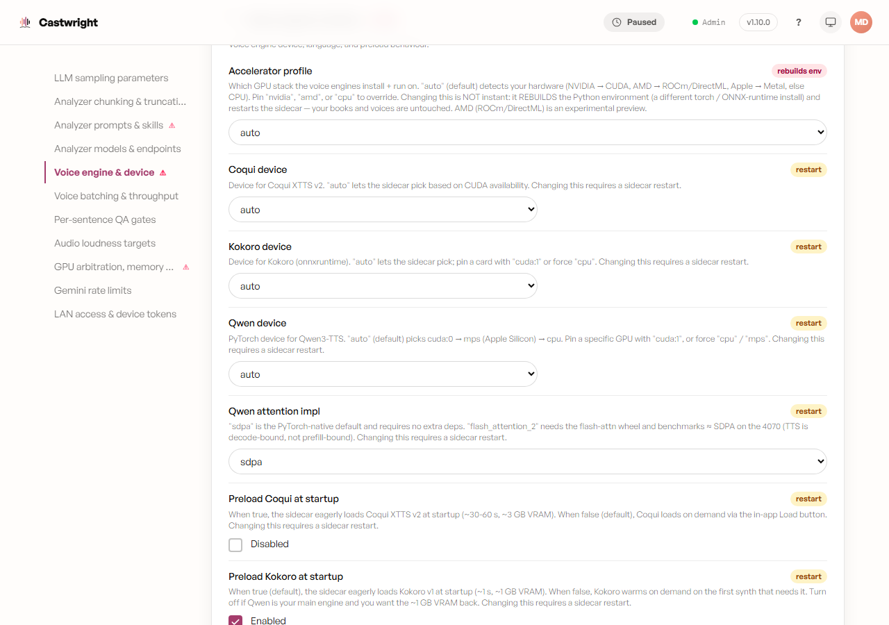

# Advanced Settings

**Advanced configuration** (`#/advanced`) is where every tunable model,
generation, and QA knob lives — reached from Admin's **Advanced
configuration →** card or Account's own pointer of the same name. Everything
here persists on disk and survives server restarts; the page itself warns
you're tuning "at your own risk."

The knobs are grouped into the same collapsible, side-nav-indexed accordion
used by [Model Manager](Admin-and-Model-Manager): LLM sampling parameters,
analyzer chunking & truncation, analyzer prompts & skills, analyzer models &
endpoints, voice engine & device, voice batching & throughput, per-sentence
QA gates, audio loudness targets, GPU arbitration & memory, Gemini rate
limits, and LAN access & device tokens. High-risk groups (marked with a
small warning glyph) start collapsed; the rest start open.

## Accelerator profile

The **Voice engine & device** group is the one most people reach for first
— it pins which GPU stack each engine runs on:

**Accelerator profile** is the headline knob: `auto` (default) detects your
hardware and picks NVIDIA/CUDA, AMD/ROCm-DirectML, Apple/Metal, or CPU;
pinning `nvidia`, `amd`, or `cpu` overrides that detection. Changing it is
tagged **rebuilds env** for a reason — it's not instant. It rebuilds the
Python virtual environment with a different torch / ONNX-runtime install
and restarts the sidecar. Your books, cast, and voices are untouched.

Below it sit the per-engine device pins (Coqui, Kokoro, Qwen), the Qwen
attention implementation, and the Coqui/Kokoro preload-at-startup toggles —
each tagged **restart** (needs a sidecar restart, not a full env rebuild) or
left plain where the change applies live. When the local analyzer is your
active analyzer engine, a read-only **Analyzer (Ollama) device** row also
appears at the end of this group — Ollama's device isn't app-pinnable, so
it just reports what the daemon is currently doing and links to the
documented OS-level steps to change it.

## Everything else on the page

- **Reset all** (top-right) and a per-section **Reset section** button
  (once that section has at least one overridden value) both revert to
  shipped defaults, no partial-reset trap.
- Prompt-shaped knobs (the analyzer's system prompts, under **Analyzer
  prompts & skills**) render as an **Edit** / **Revert to default** pair
  instead of a form control — editing forks the prompt to your own copy; a
  `Using your fork` vs. `Using shipped default` chip always shows which one
  is active.
- A **Restart sidecar** banner appears the moment a sidecar-scoped change is
  pending, and a plainer amber banner appears for changes that need a full
  app restart instead. If `CUDA_VISIBLE_DEVICES` / `CUDA_DEVICE_ORDER` is
  set in `server/.env`, a banner explains that env var overrides every
  per-engine device pin above it, with a link to switch to per-engine pins.

Next: [Account & Settings](Account-and-Settings).
