# Advanced Settings

**Advanced configuration** (`#/advanced`) is where every tunable model,
generation, and QA knob lives — reached from Admin's **Advanced
configuration →** card or [Model Manager](Model-Manager)'s own pointer of
the same name. Everything here persists on disk and survives server
restarts; the page itself warns you're tuning "at your own risk."

The knobs are grouped into a collapsible, side-nav-indexed accordion:
LLM sampling parameters, analyzer chunking & truncation, analyzer prompts &
skills, analyzer models & endpoints, voice engine & device, voice batching &
throughput, per-sentence QA gates, audio loudness targets, GPU arbitration &
memory, Gemini rate limits, LAN access & device tokens, and dialogue-structure
attribution — 105 knobs across 12 groups in total. High-risk groups (marked
with a small warning glyph) start collapsed; the rest start open.

- **Reset all** (top-right) and a per-section **Reset section** button
  (once that section has at least one overridden value) both revert to
  shipped defaults, no partial-reset trap.
- Prompt-shaped knobs (group 3, below) render as an **Edit** / **Revert to
  default** pair instead of a form control — editing forks the prompt to
  your own copy; a `Using your fork` vs. `Using shipped default` chip
  always shows which one is active.
- A **Restart sidecar** banner appears the moment a sidecar-scoped change is
  pending, and a plainer amber banner appears for changes that need a full
  app restart instead. If `CUDA_VISIBLE_DEVICES` / `CUDA_DEVICE_ORDER` is
  set in `server/.env`, a banner explains that env var overrides every
  per-engine device pin in group 5, with a link to switch to per-engine pins.

**There's no Save button — by design.** Every field autosaves; that's the
whole point of the page (that's also why there's a **Revert** button per
field and **Reset section**/**Reset all**, instead of a Cancel). A
checkbox, dropdown, or GPU picker saves the instant you pick a new value.
A **number or text field saves when you leave it** — tab to the next
field, click elsewhere, or click that field's own **Revert** — not on
every keystroke. That's deliberate: typing "32768" one digit at a time and
firing a save on every digit would be both wasteful and, on a slow
connection, could make the field visibly flicker back to the old value
mid-type. Clicking **Revert** (or a **Reset** button) on a field you're
still typing into discards whatever you'd typed rather than saving it
first — so if you change your mind partway through, walking away from the
keyboard/mouse and clicking Revert is the same as never having typed
anything.

Apply-tag legend used in every table below: **live** (takes effect
immediately), **restart · sidecar** (needs the TTS sidecar restarted),
**restart · app** (needs the whole app restarted), **rebuilds env** (rebuilds
the Python virtual environment — not instant). A **.env** pill instead of any
of these means the value is locked by an environment variable and the field
is disabled.

## 1. LLM sampling parameters

<picture>
  <source media="(prefers-color-scheme: dark)" srcset="images/advanced-settings/01-llm-sampling-parameters-dark.png">
  <source media="(prefers-color-scheme: light)" srcset="images/advanced-settings/01-llm-sampling-parameters.png">
  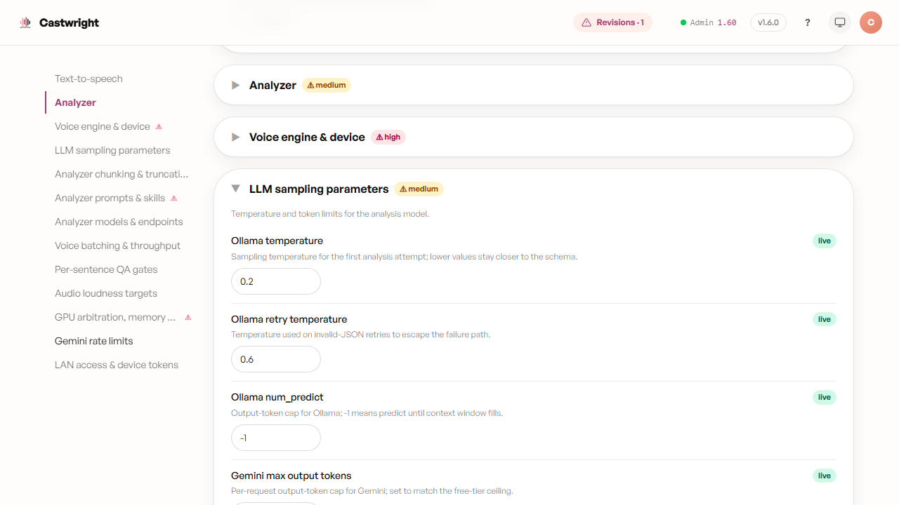
</picture>

| Knob | What it does | Default | Range | Apply | Risk |
|---|---|---|---|---|---|
| Ollama temperature | Sampling temperature for the first analysis attempt | 0.2 | 0–2, step 0.1 | live | medium |
| Ollama retry temperature | Temp used on invalid-JSON retries | 0.6 | 0–2, step 0.1 | live | medium |
| Ollama num_predict | Output-token cap for Ollama; -1 = predict until context fills | -1 | integer, min -1 | live | medium |
| Gemini max output tokens | Per-request output-token cap for Gemini | 8192 | 256–32768 | live | medium |
| Ollama num_ctx | Context-window size sent on every /api/chat call | 32768 | integer, min 0 | live | medium |
| Ollama num_gpu | GPU layers for Ollama (999 = all) | 999 | integer, min 0 | live | medium |

## 2. Analyzer chunking & truncation guards

<picture>
  <source media="(prefers-color-scheme: dark)" srcset="images/advanced-settings/02-analyzer-chunking-truncation-dark.png">
  <source media="(prefers-color-scheme: light)" srcset="images/advanced-settings/02-analyzer-chunking-truncation.png">
  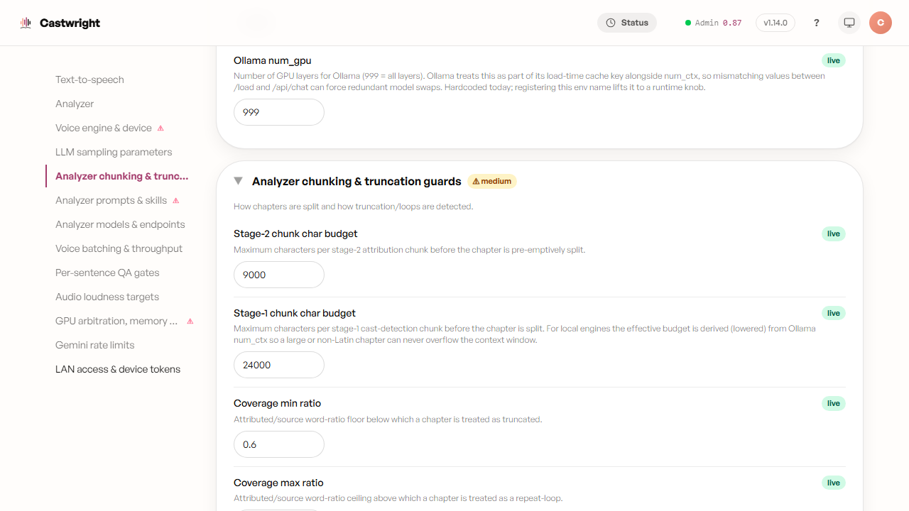
</picture>

| Knob | What it does | Default | Range | Apply | Risk |
|---|---|---|---|---|---|
| Stage-2 chunk char budget | Max chars per stage-2 attribution chunk before pre-emptive split | 9000 | integer | live | medium |
| Stage-1 chunk char budget | Max chars per stage-1 cast-detection chunk before split | 24000 | integer | live | medium |
| Coverage min ratio | Attributed/source word-ratio floor → treated as truncated | 0.6 | 0–1, step 0.05 | live | medium |
| Coverage max ratio | Ratio ceiling → treated as a repeat-loop | 1.6 | 1–5, step 0.1 | live | medium |
| Ending tail words | Trailing source words required present for "ending found" | 8 | integer | live | medium |
| Min duplicated-sentence run | Smallest contiguous dup run flagged as repeat-loop | 4 | integer | live | medium |
| Coverage-guard retries | Re-runs when stage-2 coverage fails; 0 disables the guard | 2 | integer | live | medium |

## 3. Analyzer prompts & skills

<picture>
  <source media="(prefers-color-scheme: dark)" srcset="images/advanced-settings/03-analyzer-prompts-skills-dark.png">
  <source media="(prefers-color-scheme: light)" srcset="images/advanced-settings/03-analyzer-prompts-skills.png">
  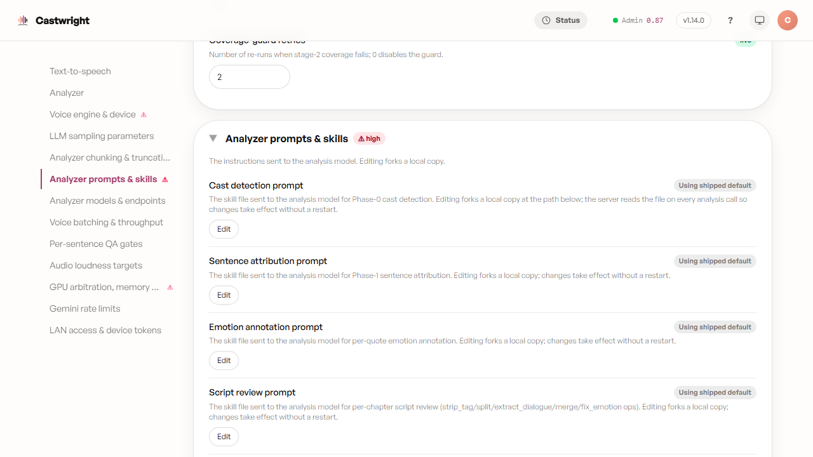
</picture>

**High risk, starts collapsed.** All 6 rows are prompt-shaped — an Edit /
Revert-to-default pair, not a form control. Editing forks the prompt to
your own on-disk copy; nothing here changes until you explicitly edit.

| Knob | What it does | Default (shipped file) |
|---|---|---|
| Cast detection prompt | Phase-0 cast-detection skill sent to the model | `skills/audiobook-character-detection-per-chapter.md` |
| Sentence attribution prompt | Phase-1 sentence-attribution skill | `skills/audiobook-sentence-attribution.md` |
| Emotion annotation prompt | Per-quote emotion-annotation skill | `skills/audiobook-emotion-annotation.md` |
| Script review prompt | Per-chapter script-review ops skill | `skills/audiobook-script-review.md` |
| Instruct-annotation prompt | Delivery-direction / vocalization-flag skill | `skills/audiobook-instruct-annotation.md` |
| Voice-style prompt | Voice-persona-generation skill (one call/cast member) | `skills/audiobook-voice-style.md` |

## 4. Analyzer models & endpoints

<picture>
  <source media="(prefers-color-scheme: dark)" srcset="images/advanced-settings/04-analyzer-models-endpoints-dark.png">
  <source media="(prefers-color-scheme: light)" srcset="images/advanced-settings/04-analyzer-models-endpoints.png">
  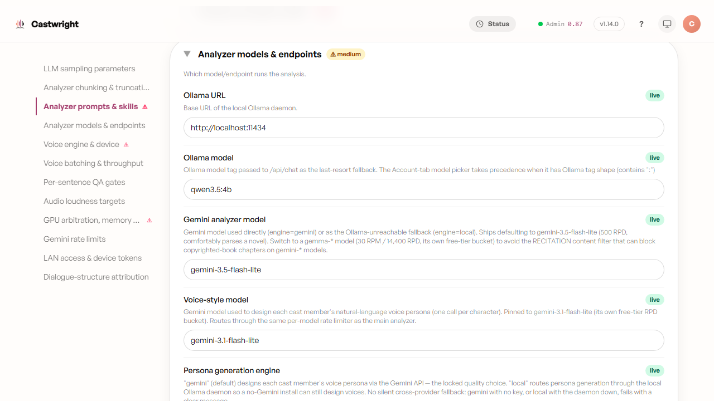
</picture>

> **Not the same knob as [Model Manager](Model-Manager)'s "Analyzer
> engine."** This one is the server/env-level config knob (defaults to
> `local` — see `server/.env.example`); Model Manager's is your per-account
> preference (defaults to `gemini`), which takes precedence when set. Same
> English label, two different controls.

| Knob | What it does | Default | Range | Apply | Risk |
|---|---|---|---|---|---|
| Analyzer engine | "local" routes through Ollama (auto-falls back to Gemini when Ollama is unreachable and a key is set); "gemini" always goes direct | `local` | local / gemini | live | medium |
| Ollama URL | Base URL of the local Ollama daemon | `http://localhost:11434` | string | live | medium |
| Ollama model | Model tag for the /api/chat fallback | `qwen3.5:4b` | string | live | medium |
| Gemini analyzer model | Model used directly or as Ollama-unreachable fallback | `gemma-4-31b-it` | string | live | medium |
| Voice-style model | Model used to design each cast member's voice persona | `gemini-3.1-flash-lite` | string | live | medium |
| Persona generation engine | gemini (default, locked quality) vs local persona design | `gemini` | local / gemini | live | medium |
| Persona local model | Ollama tag when persona engine=local; blank inherits analyzer model | (blank) | string | live | low |
| Phase-0 model override | Drives cast detection with a distinct model | (blank) | string | live | medium |
| Phase-1 model override | Drives sentence attribution with a distinct model | (blank) | string | live | medium |
| Phase-1 minimum lag (chapters) | Min completed Phase-0 chapters before Phase-1 dispatch starts; 0 releases lag | 10 | integer, min 0 | live | medium |
| Analyzer keep-alive | How long Ollama holds the resident analyzer model warm | `5m` | string (Ollama keep_alive syntax) | live | medium |

## 5. Voice engine & device

<picture>
  <source media="(prefers-color-scheme: dark)" srcset="images/advanced-settings/05-voice-engine-device-dark.png">
  <source media="(prefers-color-scheme: light)" srcset="images/advanced-settings/05-voice-engine-device.png">
  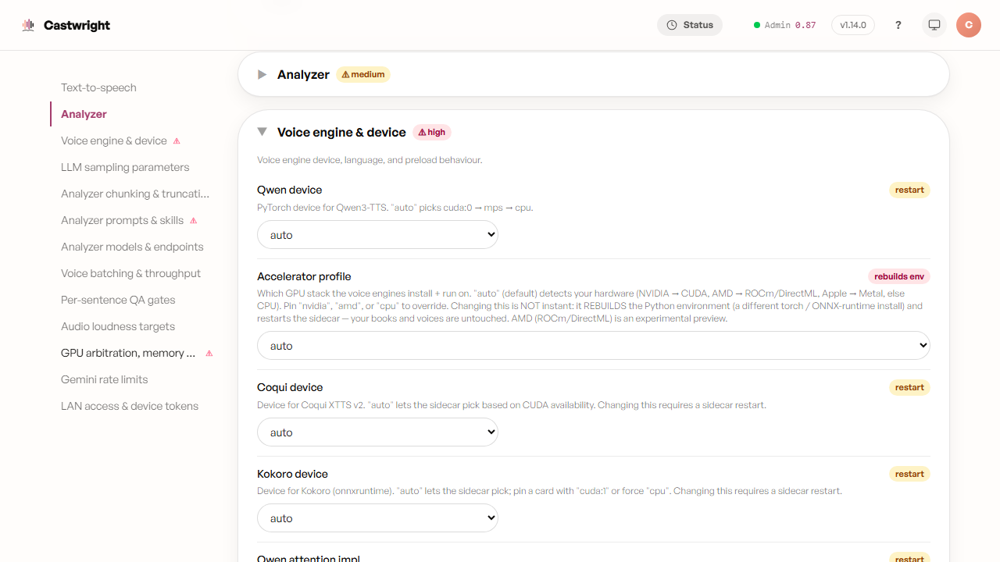
</picture>

**High risk, starts collapsed.** The headline knob is **Accelerator
profile**: `auto` (default) detects your hardware and picks NVIDIA/CUDA,
AMD/ROCm-DirectML, Apple/Metal, or CPU; pinning overrides that detection.
Changing it rebuilds the Python virtual environment and restarts the
sidecar — not instant, but your books/cast/voices are untouched.

| Knob | What it does | Default | Range | Apply | Risk |
|---|---|---|---|---|---|
| Accelerator profile | Which GPU stack all voice engines install+run on | `auto` | auto / nvidia / amd / cpu | rebuilds env | high |
| Coqui device | Device for Coqui XTTS v2 | `auto` | device dropdown | restart · sidecar | high |
| Kokoro device | Device for Kokoro (onnxruntime) | `auto` | device dropdown | restart · sidecar | high |
| Qwen device | PyTorch device for Qwen3-TTS | `auto` | device dropdown | restart · sidecar | high |
| Qwen attention impl | sdpa (default) vs flash_attention_2 | `sdpa` | sdpa / flash_attention_2 | restart · sidecar | high |
| Qwen codec device | Moves the Code2Wav codec decode off CPU onto a GPU — an opt-in speed boost | `cpu` | device dropdown | restart · sidecar | high |
| Qwen codec chunk size | Codec decode chunk width; lower it if GPU codec decode runs a card out of memory | 300 | integer, min 1 | restart · sidecar | high |
| Qwen codec left-context size | Codec chunk overlap, for smoother chunk boundaries | 25 | integer, min 0 | restart · sidecar | high |
| Preload Coqui at startup | Eager-load Coqui at boot (~3GB VRAM) | `false` | boolean | restart · sidecar | high |
| Preload Kokoro at startup | Eager-load Kokoro at boot (~1GB VRAM); off by default, so Kokoro warms on demand | `false` | boolean | restart · sidecar | high |
| Preload Qwen at startup | Eager-load Qwen Base at boot (~1.2GB VRAM) | `false` | boolean | restart · sidecar | high |
| Preload Qwen 1.7B-Base at startup | Eager-load 1.7B-Base for anchored emotion variants (~3.4GB) | `false` | boolean | restart · sidecar | high |
| Qwen degeneracy guard | Catches near-silent Qwen renders and reloads/retries instead of shipping them — leave on unless isolating a false-positive | `true` | boolean | restart · sidecar | medium |

**Qwen codec device** ships off by default, so it changes nothing on its
own — leave it on `cpu` and every book renders exactly as it does today.
Flipping it to `auto` (or pinning a card) hands the codec's decode step to
your GPU alongside the rest of Qwen, which can meaningfully speed up
batches — but it also raises Qwen's VRAM footprint, so it's worth trying
chunk size lower before you commit a tight card to it. If a batch starts
spilling into slower shared GPU memory or the sidecar reports a poisoned
CUDA state, see [Troubleshooting](Troubleshooting#gpu-out-of-memory-vram)
and dial it back to `cpu`.

**Qwen degeneracy guard** is on by default and best left there. It's a
safety net, not a tuning knob: it catches the rare case where the Qwen model
runs without error but emits near-silent audio under VRAM churn, reloads and
retries the line, and escalates to a voice-engine recycle rather than shipping
the bad render. Turning it off removes that protection — only do so to isolate
a suspected false-positive on unusual text, and switch it back on afterwards.
See [Troubleshooting](Troubleshooting#a-line-came-out-silent-or-nearly-empty-qwen-degeneracy-guard).

A read-only **Analyzer (Ollama) device** row appears at the end of this
group when the local analyzer is active — Ollama's device isn't
app-pinnable, so it just reports what the daemon is currently doing.

## 6. Voice batching & throughput

<picture>
  <source media="(prefers-color-scheme: dark)" srcset="images/advanced-settings/06-voice-batching-throughput-dark.png">
  <source media="(prefers-color-scheme: light)" srcset="images/advanced-settings/06-voice-batching-throughput.png">
  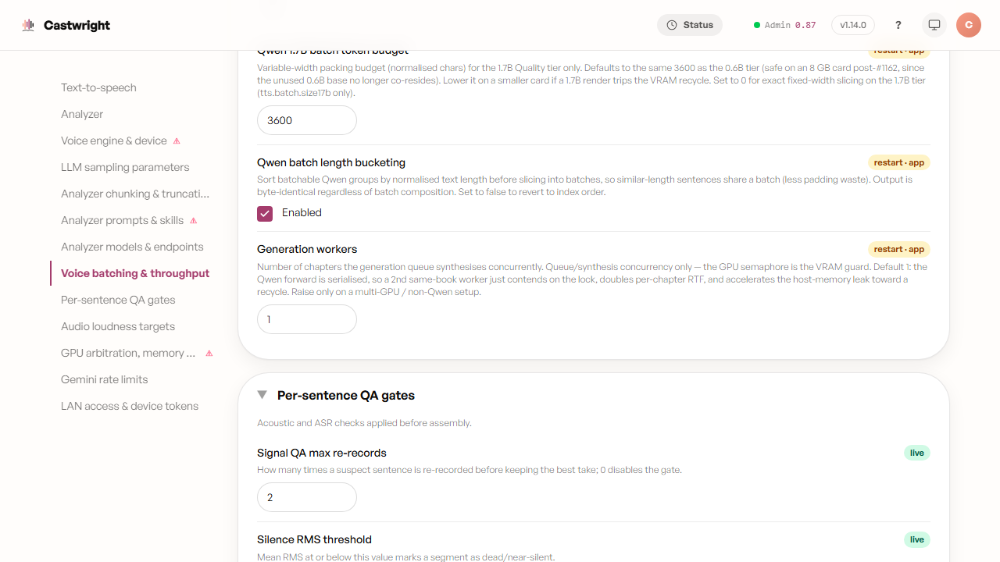
</picture>

| Knob | What it does | Default | Range | Apply | Risk |
|---|---|---|---|---|---|
| Qwen batch size | Hard width cap for sentences packed per Qwen forward; 1 disables batching | 32 | integer, min 1 | restart · app | medium |
| Qwen batch token budget | Variable-width packing budget; 0 = fixed-width only | 3600 | integer, min 0 | restart · app | medium |
| Qwen 1.7B batch size | Hard width cap for the 1.7B Quality tier | 32 | integer, min 1 | restart · app | medium |
| Qwen 1.7B batch token budget | Packing budget for the 1.7B tier | 3600 | integer, min 0 | restart · app | medium |
| Qwen batch length bucketing | Sort batchable groups by length before slicing | `true` | boolean | restart · app | medium |
| Generation workers | Chapters synthesised concurrently by the generation queue | 1 | integer, 1–4 | restart · app | medium |

## 7. Per-sentence QA gates

<picture>
  <source media="(prefers-color-scheme: dark)" srcset="images/advanced-settings/07-per-sentence-qa-gates-dark.png">
  <source media="(prefers-color-scheme: light)" srcset="images/advanced-settings/07-per-sentence-qa-gates.png">
  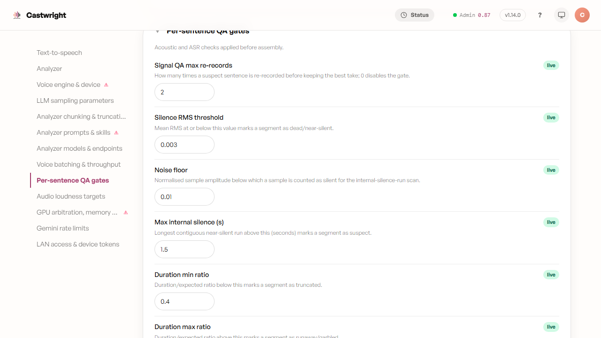
</picture>

Group risk is **low** overall, but 3 knobs in this group are individually
**medium** risk (Voice-QA device, Content-QA device, Auto-fix voice
mismatches) — the table's risk column shows each correctly.

| Knob | What it does | Default | Range | Apply | Risk |
|---|---|---|---|---|---|
| Signal QA max re-records | Re-record budget for a suspect sentence; 0 disables gate | 2 | integer | live | low |
| Silence RMS threshold | RMS at/below = dead/near-silent | 0.003 | 0–0.1, step 0.001 | live | low |
| Noise floor | Amplitude below which counted silent | 0.01 | 0–0.1, step 0.001 | live | low |
| Max internal silence (s) | Longest near-silent run → suspect | 1.5 | 0.1–10, step 0.1 | live | low |
| Duration min ratio | Duration/expected ratio below = truncated | 0.4 | 0–5, step 0.1 | live | low |
| Duration max ratio | Ratio above = runaway/garbled | 2.5 | 0–5, step 0.1 | live | low |
| Runaway absolute floor (s) | Min audio length before "runaway" can fire; 0 disables | 3.0 | 0–30, step 0.5 | live | low |
| ASR QA enabled | Enable Whisper-based content verification | `false` | boolean | live | low |
| ASR max re-records | Re-record budget for ASR drift; 0 = flag only | 2 | integer | live | low |
| ASR sample rate | Transcribe 1-in-N sentences | 1 | integer | live | low |
| ASR max WER | Word-error-rate threshold for drift | 0.4 | 0–1, step 0.05 | live | low |
| ASR max WER (Spanish) | Spanish-specific WER cap | 0.4 | 0–1, step 0.05 | live | low |
| ASR max WER (Russian) | Russian-specific WER cap | 0.4 | 0–1, step 0.05 | live | low |
| Render-integrity QA (voice match) | ECAPA speaker-embed match check per rendered line | `false` | boolean | live | low |
| Voice-QA device | cpu (0 VRAM) vs cuda for the ECAPA embed | `cpu` | string | restart · sidecar | **medium** |
| Content-QA (Whisper) device | cpu vs cuda for Whisper | `cpu` | string | restart · sidecar | **medium** |
| Auto-fix voice mismatches | Re-render+replace severe voice mismatches | `false` | boolean | live | **medium** |
| ASR max deletion run | Longest deletion run → truncation/drop drift | 4 | integer | live | low |
| ASR min chars | Sentences shorter than this aren't scored | 12 | integer | live | low |
| ASR min reference words | 2-word single-sub mismatches routed to inconclusive; 0 disables | 2 | 0–10 | live | low |
| ASR max compound-bridge run | Token-run length rejoined to one manuscript token | 3 | 2–4 | live | low |
| ASR 1-word homophone tolerance | 1-word single-edit substitution treated as spelling variant | `true` | boolean | live | low |
| ASR max compression ratio | Whisper compression_ratio above = loop/hallucination | 2.4 | 1–10, step 0.1 | live | low |
| ASR min avg log-prob | Below this, transcript untrustworthy | -1.0 | -5–0, step 0.1 | live | low |
| ASR max no-speech prob | Above this, transcript untrustworthy | 0.6 | 0–1, step 0.05 | live | low |

## 8. Audio loudness targets

<picture>
  <source media="(prefers-color-scheme: dark)" srcset="images/advanced-settings/08-audio-loudness-targets-dark.png">
  <source media="(prefers-color-scheme: light)" srcset="images/advanced-settings/08-audio-loudness-targets.png">
  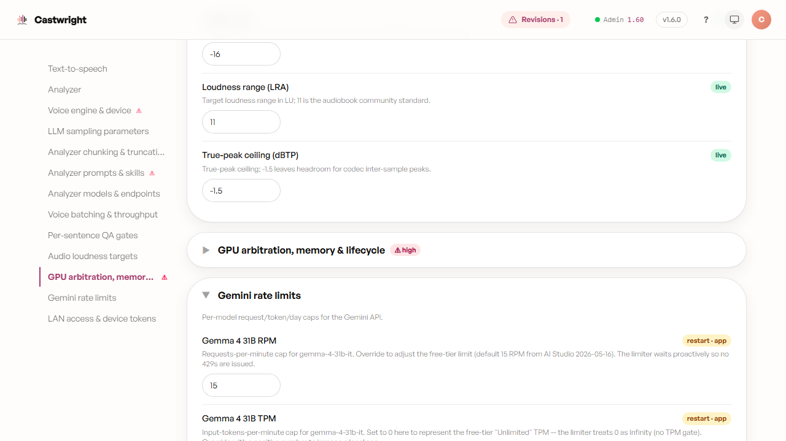
</picture>

| Knob | What it does | Default | Range | Apply | Risk |
|---|---|---|---|---|---|
| Loudnorm enabled | Enable EBU R128 two-pass loudness normalization | `true` | boolean | live | low |
| Target LUFS | Integrated loudness target (-16 = Audible/ACX spec) | -16 | number | live | low |
| Loudness range (LRA) | Target loudness range in LU (11 = audiobook standard) | 11 | number | live | low |
| True-peak ceiling (dBTP) | True-peak ceiling; leaves codec headroom | -1.5 | number | live | low |

## 9. GPU arbitration, memory & lifecycle

<picture>
  <source media="(prefers-color-scheme: dark)" srcset="images/advanced-settings/09-gpu-arbitration-memory-lifecycle-dark.png">
  <source media="(prefers-color-scheme: light)" srcset="images/advanced-settings/09-gpu-arbitration-memory-lifecycle.png">
  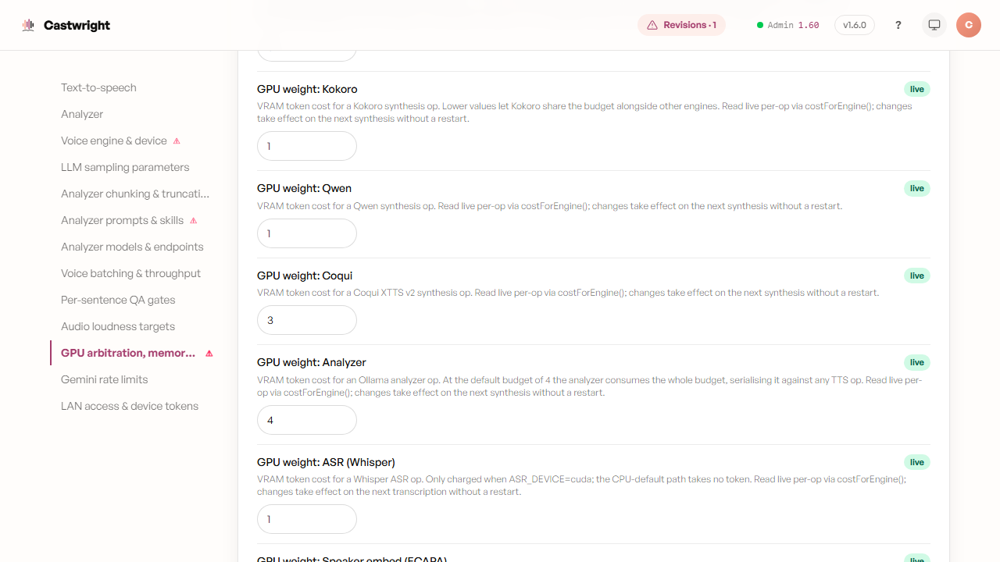
</picture>

**High risk, starts collapsed.** One knob in this group is individually
**medium** risk (Per-card VRAM free floor) — everything else is high.

| Knob | What it does | Default | Range | Apply | Risk |
|---|---|---|---|---|---|
| GPU concurrency | Max concurrent GPU ops (fallback when VRAM budget unset) | 1 | integer, min 1 | restart · app | high |
| GPU VRAM token budget | Total token budget for the weighted semaphore; 0 disables | 0 | integer, min 0 | restart · app | high |
| GPU weight: Kokoro | VRAM token cost per Kokoro op | 1 | integer, min 0 | live | high |
| GPU weight: Qwen | VRAM token cost per Qwen op | 1 | integer, min 0 | live | high |
| GPU weight: Coqui | VRAM token cost per Coqui op | 3 | integer, min 0 | live | high |
| GPU weight: Analyzer | VRAM token cost per Ollama op | 4 | integer, min 0 | live | high |
| GPU weight: ASR (Whisper) | VRAM token cost per Whisper op (cuda only) | 1 | integer, min 0 | live | high |
| GPU weight: Speaker embed (ECAPA) | VRAM token cost per ECAPA op (cuda only) | 1 | integer, min 0 | live | high |
| Safe analyzer+TTS coexistence VRAM (MB) | Below this, evict resident Ollama before sidecar TTS load; 0 = always evict | 11000 | integer, min 0 | live | high |
| Qwen VoiceDesign idle TTL (s) | Idle secs before freeing transient VoiceDesign model (~4-5GB) | 120 | integer, min 0 | restart · sidecar | high |
| Qwen 1.7B-Base idle TTL (s) | Idle secs before freeing resident 1.7B-Base (~3.4GB) | 120 | integer, min 0 | restart · sidecar | high |
| ASR (Whisper) idle TTL (s) | Idle secs before freeing Whisper model | 120 | integer, min 0 | restart · sidecar | high |
| Speaker-embed (ECAPA) idle TTL (s) | Idle secs before freeing ECAPA model | 120 | integer, min 0 | restart · sidecar | high |
| Disable torch MKLDNN | Curb variable-shape CPU host-RAM leak; no-op on CUDA | `false` | boolean | restart · sidecar | high |
| Soft recycle threshold (MB committed RAM) | Clean chapter-boundary recycle trigger; 0 disables | 0 | integer, min 0 | restart · sidecar | high |
| Hard restart threshold (MB committed RAM) | Sidecar self-exits at this RAM; 0 = auto (70% of total) | 0 | integer, min 0 | restart · sidecar | high |
| Soft VRAM recycle threshold (MB reserved) | Recycle trigger; 0 = auto (90% of device VRAM) | 0 | integer, min 0 | restart · sidecar | high |
| Hard VRAM restart threshold (MB reserved) | Self-exits to reset CUDA context; 0 = auto (98% of VRAM) | 0 | integer, min 0 | restart · sidecar | high |
| Per-card VRAM free floor (MB) | Absolute free-VRAM floor before recycle | 1024 | integer, min 0 | restart · sidecar | **medium** |

## 10. Gemini rate limits

<picture>
  <source media="(prefers-color-scheme: dark)" srcset="images/advanced-settings/10-gemini-rate-limits-dark.png">
  <source media="(prefers-color-scheme: light)" srcset="images/advanced-settings/10-gemini-rate-limits.png">
  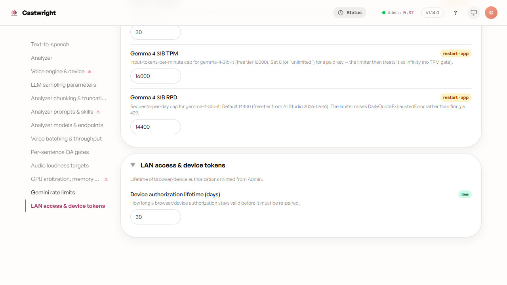
</picture>

| Knob | What it does | Default | Range | Apply | Risk |
|---|---|---|---|---|---|
| Gemma 4 31B RPM | Requests-per-minute cap | 15 | integer, min 1 | restart · app | low |
| Gemma 4 31B TPM | Input-tokens-per-minute cap; 0 = unlimited sentinel | 0 | integer, min 0 | restart · app | low |
| Gemma 4 31B RPD | Requests-per-day cap | 1500 | integer, min 1 | restart · app | low |

## 11. LAN access & device tokens

<picture>
  <source media="(prefers-color-scheme: dark)" srcset="images/advanced-settings/11-lan-access-device-tokens-dark.png">
  <source media="(prefers-color-scheme: light)" srcset="images/advanced-settings/11-lan-access-device-tokens.png">
  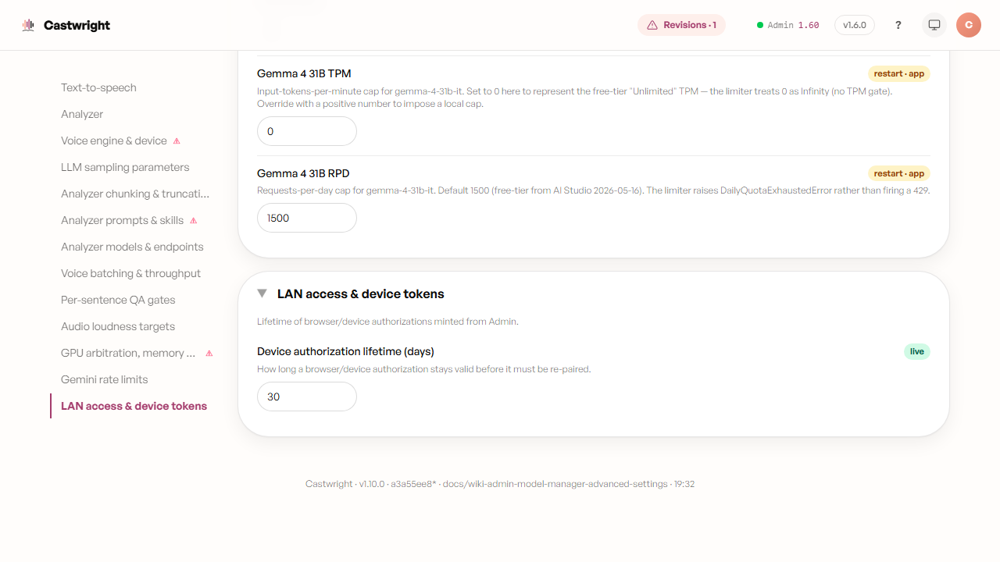
</picture>

| Knob | What it does | Default | Range | Apply | Risk |
|---|---|---|---|---|---|
| Device authorization lifetime (days) | How long a browser/device authorization stays valid before re-pairing | 30 | integer, min 1 | live | low |

## 12. Dialogue-structure attribution

<picture>
  <source media="(prefers-color-scheme: dark)" srcset="images/advanced-settings/12-dialogue-structure-attribution-dark.png">
  <source media="(prefers-color-scheme: light)" srcset="images/advanced-settings/12-dialogue-structure-attribution.png">
  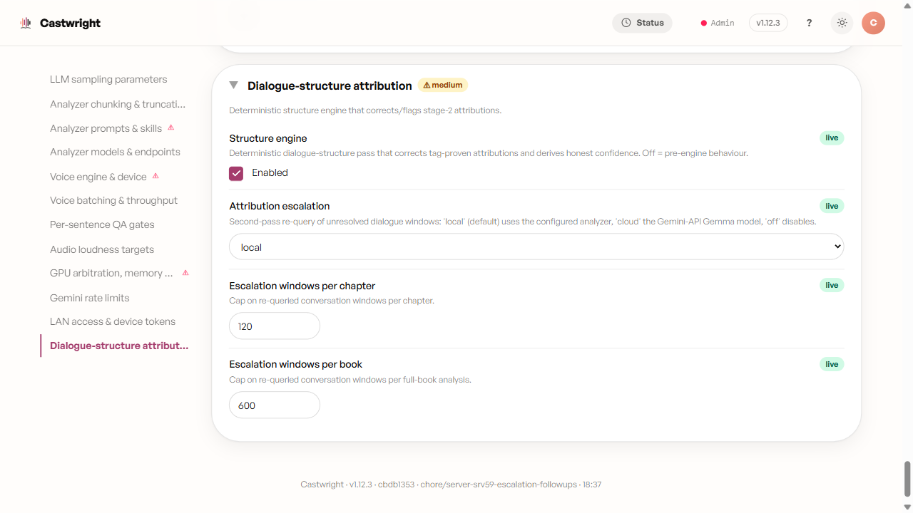
</picture>

| Knob | What it does | Default | Range | Apply | Risk |
|---|---|---|---|---|---|
| Structure engine | Deterministic dialogue-structure pass that corrects tag-proven attributions and derives honest confidence. Off = pre-engine behaviour. | `true` | boolean | live | medium |
| Attribution escalation | Second-pass re-query of unresolved dialogue windows: 'local' (default) uses the configured analyzer, 'cloud' the Gemini-API Gemma model, 'off' disables. | `local` | off / local / cloud | live | medium |
| Escalation windows per chapter | Cap on re-queried conversation windows per chapter. | 120 | integer, min 0 | live | low |
| Escalation windows per book | Cap on re-queried conversation windows per full-book analysis. | 600 | integer, min 0 | live | low |

Next: [Account & Settings](Account-and-Settings).
