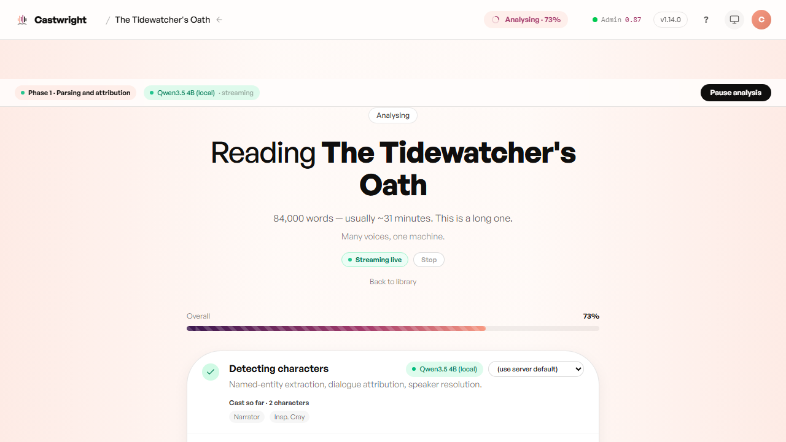
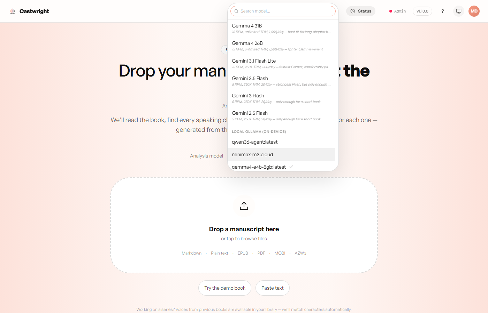

# Analysis & the Analyzer

This is where Castwright reads your book. Once a manuscript is saved, the analyzer works through it chapter by chapter — finding every character who speaks, and tagging each line with who's saying it — before a single second of audio gets rendered. Get this step right and everything downstream (casting, voices, the performance itself) inherits that accuracy; it's worth understanding what's actually happening on this screen rather than just watching a bar fill.

Under the hood it's a phased pipeline, not one giant pass: chapter boundaries are found first with a measured, observed-rate ETA rather than a guess; each chapter's cast is detected on its own, so one difficult chapter's failure doesn't torch the whole run; and every claimed line of evidence is checked back against your actual source text before it's trusted. The Analysing screen streams all of this live — phase, percentage, ETA, and the cast roster growing in front of you as it's discovered.

<picture>
  <source media="(prefers-color-scheme: dark)" srcset="images/analysis-and-the-analyzer/01-analysing-progress-dark.png">
  <source media="(prefers-color-scheme: light)" srcset="images/analysis-and-the-analyzer/01-analysing-progress.png">
  
</picture>

## Choosing an analyzer

The model picker on the upload screen groups two kinds of analyzer:

- **Local Ollama (on-device)** — free, private, runs on your own GPU/CPU.
  Whatever tags you've pulled with Ollama show up here automatically.
- **Gemini / Gemma (cloud)** — Google's free-tier API. Useful on a
  low-VRAM machine, or when you'd rather not tie up local compute.

<picture>
  <source media="(prefers-color-scheme: dark)" srcset="images/analysis-and-the-analyzer/02-analyzer-choice-dark.png">
  <source media="(prefers-color-scheme: light)" srcset="images/analysis-and-the-analyzer/02-analyzer-choice.png">
  
</picture>

See [Installing Castwright](Installing-Castwright) for setting up either
path (pulling an Ollama model vs. [adding a Gemini API key](Getting-a-Gemini-API-Key)).

## Two models, reading in parallel

A cloud analyzer also unlocks a **pipelined two-model split** on the Analysing screen itself — one model races ahead detecting characters (Phase 0) while a second, more careful model trails behind verifying attribution (Phase 1), gated by a warm-up lag so the second model always has a roster to work against before it starts. Configure each phase independently, or leave both on "(use server default)" for the ordinary single-model path.

Next: [Reviewing Low-Confidence Speaker Tags](Reviewing-Low-Confidence-Speaker-Tags).
