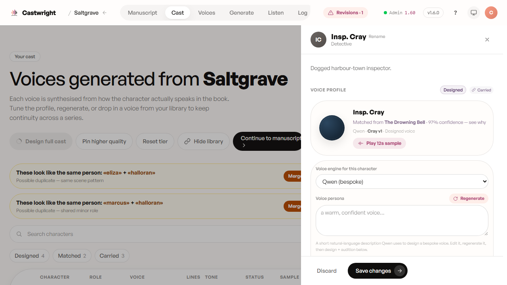
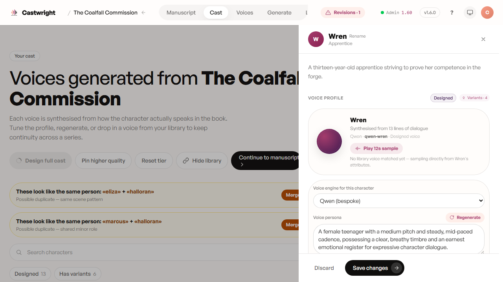

# Designing a Voice

Kokoro reads from a fixed catalogue and Coqui clones from a sample — both work, but neither handles a twenty-plus-character book without a few voices starting to repeat. Qwen VoiceDesign takes a different approach: describe a persona, and it designs a bespoke voice to match, built from how that character actually speaks in your book rather than picked off a shelf.

Open a cast member's profile drawer — a character with no voice yet is flagged "Needs voice" — and Castwright drafts a starting **voice persona** straight from the text: age, accent, the vocal qualities the writer kept gesturing at. Below, Insp. Cray — carried across from *The Drowning Bell* into *Saltgrave* at 97% match confidence — shows the same drawer mid-series: engine set to **Qwen (bespoke)**, a persona textarea with **Regenerate** for a fresh draft, and a **Play 12s sample** button to audition the current voice before touching anything.

Edit the persona text (or click "Regenerate" for a fresh draft), pick **Qwen
(bespoke)** as the voice engine, and click **Design & preview**. Generating
persona text needs a `GEMINI_API_KEY` set from Account → Server
Configuration (or in `server/.env` for CI / power users) — the drawer warns
inline when it's missing.

Design runs on the GPU, one character at a time. The top bar shows a
"Designing · N%" pill while it works, and it's safe to close the drawer —
progress keeps going in the background, so you can move on to the next character while this one finishes.

## Emotion variants

A single flat voice gets you *who's* speaking; emotion variants get you *how*. Once a character has a designed base voice, the profile samples directly from that design (no library voice matched yet) and the button becomes **Design & compare** for another pass. Saving pins the voice across the whole series, so it travels with this character into book two the way it should. From here, per-emotion variants — Whisper, Angry, and any other tags used in the manuscript — become available to design individually, so a character who's furious in chapter three actually sounds furious. Below, Wren — a thirteen-year-old apprentice, designed from 13 lines of dialogue — already carries 4 emotion variants.

## Designing for one character vs. the full cast

Doing this one character at a time works, but a twenty-voice cast makes for twenty errands. **"Design full cast"** (next to the cast table) opens a scope picker instead: **Base voices** for whoever still needs one, **Emotion variants** for tagged emotions missing a take, or **Both** — bases first, then their variants — with live counts of exactly how much work each choice queues. Designs still run one at a time on the GPU under the hood; the picker itself is safe to close while the queue works through it.

> Screenshots of the design-in-progress state and the full-cast scope picker are tracked as a follow-up.

Next: [Voice Engines](Voice-Engines).
