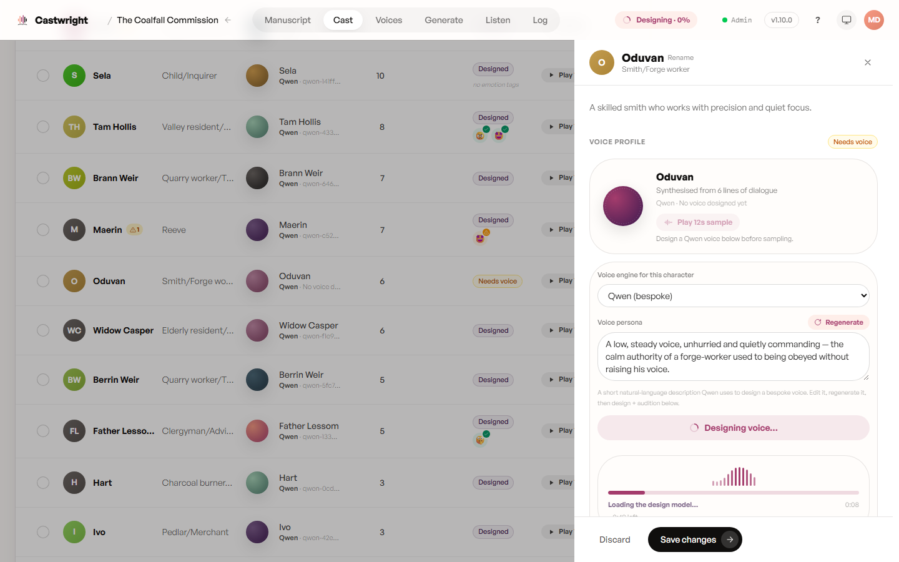
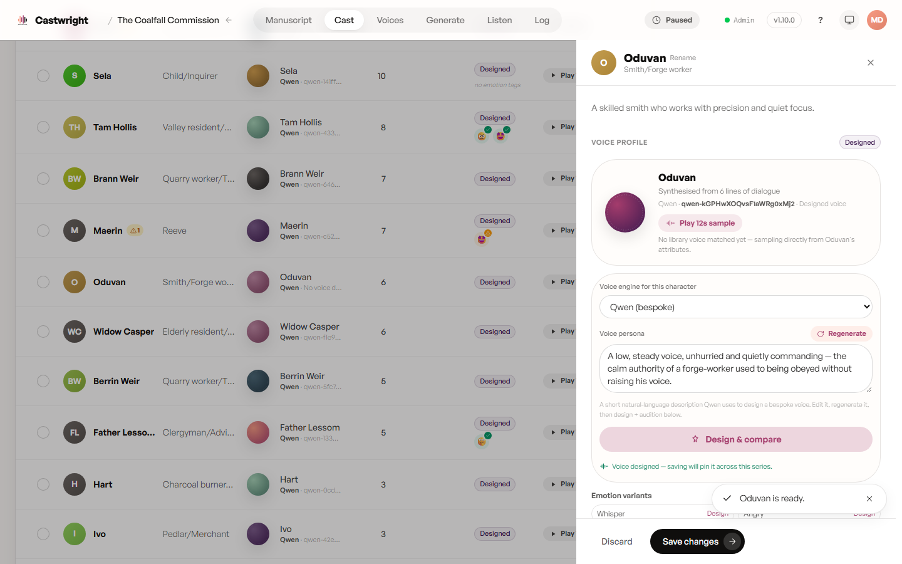
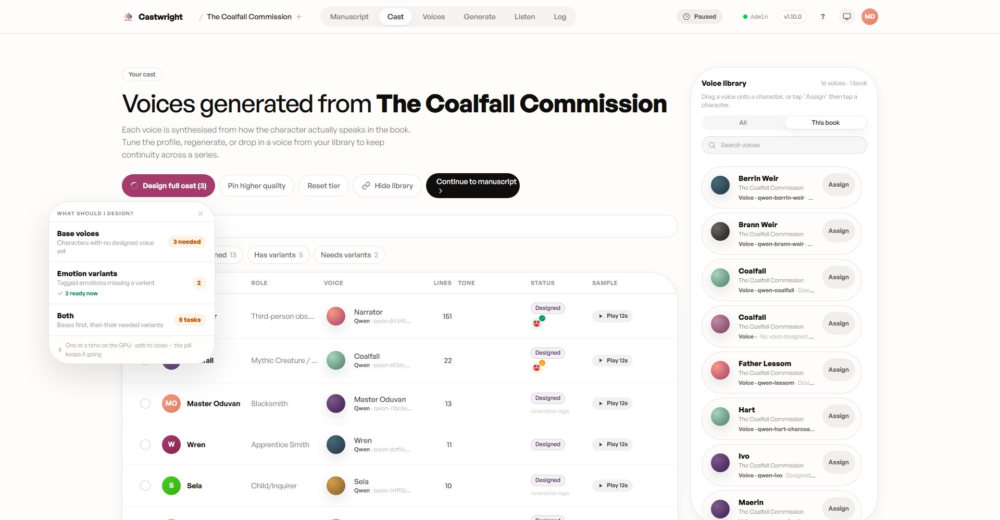

# Designing a Voice

Describe a persona and Qwen VoiceDesign generates a matching voice. Open a
cast member's profile drawer — a character with no voice yet is flagged
"Needs voice" — and Castwright drafts a starting **voice persona** from how
they actually speak in the book.

Edit the persona text (or click "Regenerate" for a fresh draft), pick **Qwen
(bespoke)** as the voice engine, and click **Design & preview**. Generating
persona text needs a `GEMINI_API_KEY` set from Account → Server
Configuration (or in `server/.env` for CI / power users) — the drawer warns
inline when it's missing.

Design runs on the GPU, one character at a time. The top bar shows a
"Designing · N%" pill while it works, and it's safe to close the drawer —
progress keeps going in the background.

## Emotion variants

Once a character has a designed base voice, the profile samples directly
from that design (no library voice matched yet) and the button becomes
**Design & compare** for another pass. Saving pins the voice across the
whole series. From here, per-emotion variants — Whisper, Angry, and any
other tags used in the manuscript — become available to design individually.

## Designing for one character vs. the full cast

"Design full cast" (next to the cast table) opens a scope picker instead of
working through characters one at a time: **Base voices** for whoever still
needs one, **Emotion variants** for tagged emotions missing a take, or
**Both** — bases first, then their variants. Designs still run one at a time
on the GPU; the picker is safe to close while the queue works through it.

Next: [Voice Engines](Voice-Engines).
