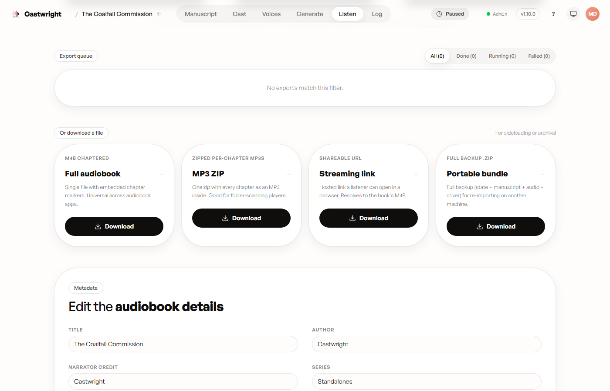
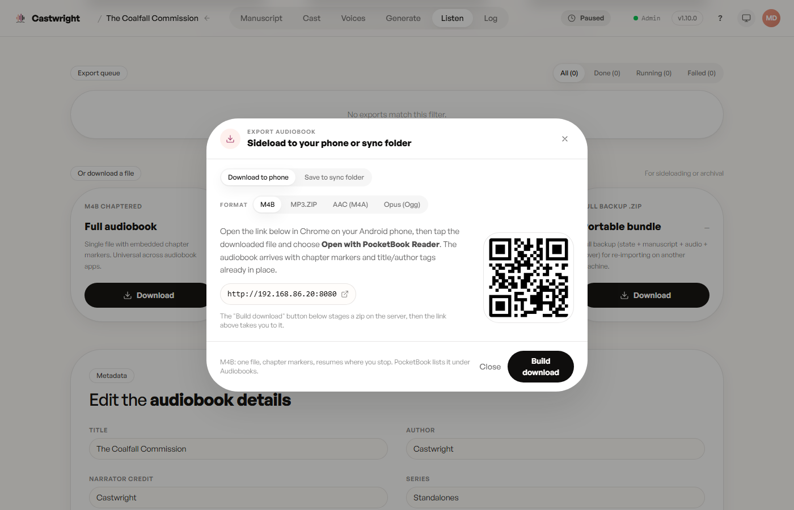

# Exporting

## Choose a format

Four ways to get a finished book out of Castwright: a single chaptered M4B,
a zip of per-chapter MP3s, a shareable streaming link, or a full portable
backup (state + manuscript + audio + cover) for moving the whole project to
another machine.

## Export queue

Every export you start is tracked here — queued, running, done, or failed —
with retry and copy-link actions per row.

The demo book still has one chapter queued (Chapter 4 hasn't rendered yet),
so a whole-book export currently refuses with "some chapters still need
audio" instead of producing a running job. This shows the queue's empty
state; capturing an in-progress/done row is tracked as a follow-up, once the
whole book has rendered.

## Download over LAN

Open the export picker and switch to "Download to phone" for a LAN URL plus
a QR code — scan it with your phone's camera, no separate app or cable
needed, and the file lands straight in its Downloads folder. The same picker
also lets you switch between M4B, MP3.ZIP, AAC (M4A), and Opus (Ogg).

Next: [Reviewing Cast and Assigning Voices](Reviewing-Cast-and-Assigning-Voices).
