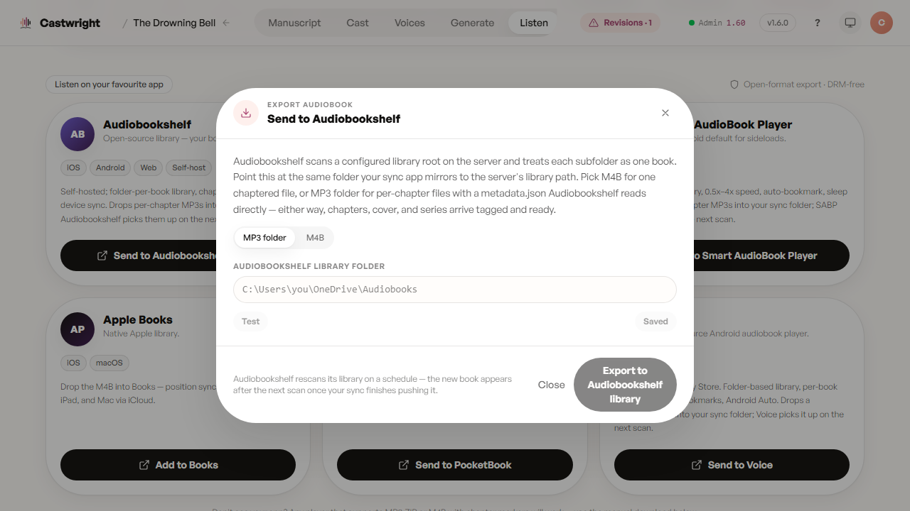

# Exporting

The conversion is the product — the last mile out of Castwright shouldn't feel like an afterthought. This screen covers every way the finished book leaves the app: a straight download, a push to a self-hosted library, a walkthrough into the audiobook app you already use, or a pairing with Castwright's own companion app.

## Choose a format

Four top-level ways to get a finished book out: a single chaptered **M4B**, a **zip of per-chapter MP3s**, a shareable **streaming link**, or a full **portable bundle** (state, manuscript, audio, and cover together) for moving the whole project to another machine. Inside the export picker, AAC (M4A) and Opus (Ogg) are available too, for players that prefer them.

## The Castwright Companion app

This screen leads with Castwright's own companion app — **Android today, iOS at launch** — above the listener-app list. Pair a device here with a QR code (or the manual code behind it) and it syncs your library over the home network, downloads books for offline listening, and remembers exactly where you left off, in a real native player with lock-screen controls and a sleep timer. If the maintainer's build has an APK ready to hand out, a **Download .apk** button appears right here too.

## Sending it to the app you already use

Nothing here locks you in — six listener apps get one-tap tiles, each opening the same export picker pre-filled with the right format and a few pointers for that app specifically: **Audiobookshelf**, BookPlayer, Smart AudioBook Player, Apple Books, PocketBook, and Voice. Any other MP3.ZIP- or chaptered-M4B-capable player works too via a manual download — you're never limited to this list.

**Audiobookshelf gets the deepest integration of the six**, because it's a self-hosted library server, not just a player: point it at your Audiobookshelf library folder and Castwright explains exactly what lands where — a single chaptered M4B if you want one file, or a folder of per-chapter MP3s with a `metadata.json` alongside them that Audiobookshelf reads directly. Either way, chapters, cover art, and series metadata arrive already tagged, so the book shows up on your shelf looking like it belongs there — below, exactly that dialog, opened from *The Drowning Bell*'s export tile.

## Export queue

Every export you start is tracked here — queued, running, done, or failed, filterable by status with live counts — and it survives a reload, so kicking off a long export and closing the tab doesn't lose it. Each row carries **Download**, **Copy link**, **Remove**, and **Retry** (for a failed export, without starting over from the format picker).

## Download over LAN

Switch the export picker to "Download to phone" for a LAN URL plus a QR code — scan it with your phone's camera, no cable and no separate app required, and the file lands straight in its Downloads folder.

> Screenshots of the format-tile row, the Companion banner, the export queue, and the LAN/QR tab are tracked as a follow-up (Refs #1289) — this page currently shows the Audiobookshelf dialog only, captured against the real app rather than left as a placeholder.

Next: [Reviewing Cast & Assigning Voices](Reviewing-Cast-and-Assigning-Voices).
