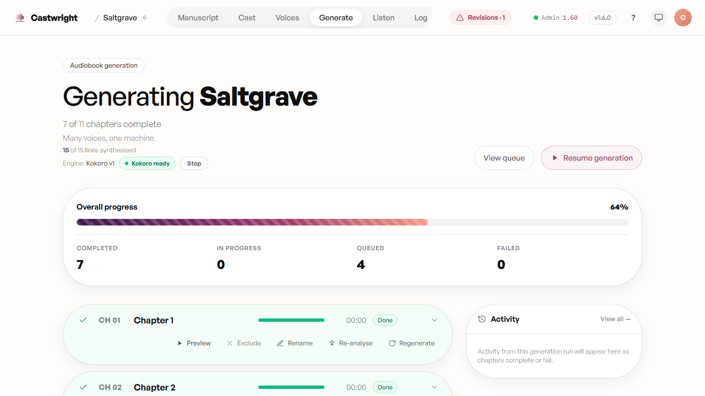
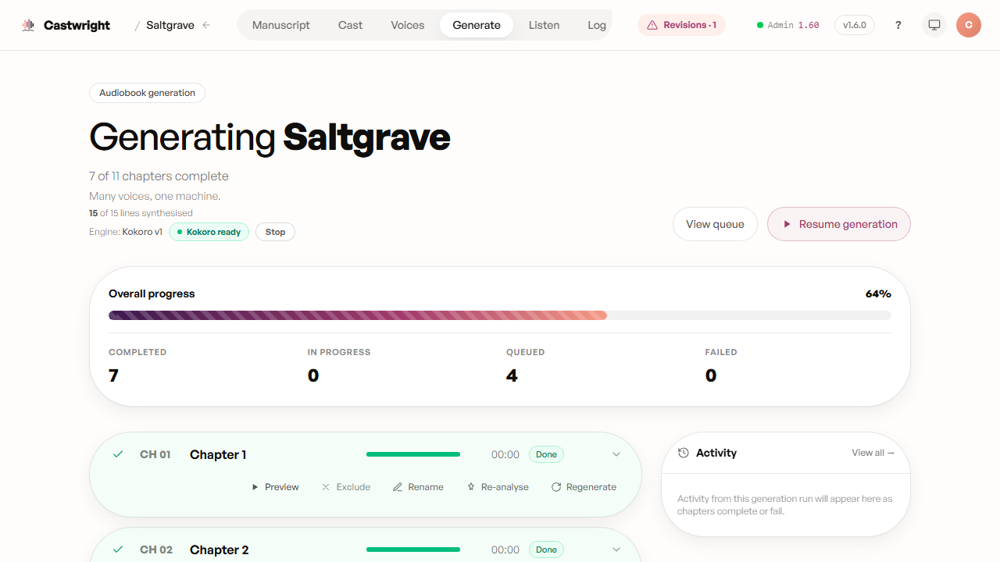

# Generating Audio

This is the engine room — where a confirmed cast becomes an actual performance, chapter by chapter, and where you send any single line back for another take without touching the rest of the book.

## Before anything renders

Starting generation opens a pre-flight check, not a render. Any speaking character on the Qwen engine who hasn't had a voice designed yet gets flagged right here, so you can design it on the spot or knowingly proceed on a generic fallback.

An English book gets a "Proceed anyway — generic Kokoro fallback voices" escape hatch alongside "Design full cast." A non-English book doesn't: every speaking character needs a designed voice before the book can generate at all — there's no generic fallback across languages. If you're rendering on Qwen, you'll also see a "Choose the voice model" tier prompt — the leaner 0.6B model or the higher-quality, slightly slower 1.7B — before the first chapter starts.

## While it's rendering

Chapters list down the left; the whole run's overall progress, a completed/in-progress/queued/failed breakdown, and an activity feed sit at the top. Below, *Saltgrave* mid-render — 7 of 11 chapters complete, 64% overall:

## Previewing a finished chapter

A chapter that turns green with a "Done" badge, like Chapter 1 above, expands to a row of actions: **Preview** plays it right there through the mini-player pinned to the bottom of the screen — no trip to the Listen tab required — alongside **Exclude**, **Rename**, **Re-analyse**, and **Regenerate**. It's the fastest way to spot-check a chapter the moment it finishes.

## Sending a line back for another take

Nothing here is final the moment it renders. Two regeneration paths cover the two things you're usually reacting to — a chapter that didn't land, or a character whose voice needs adjusting everywhere they speak:

**Per chapter.** Click Regenerate on any chapter and choose a scope — just this chapter, or this chapter and every one after it — pick a reason, optionally switch the quality tier, and watch a live ETA update as you adjust the scope. Confirming flips that chapter from done back to in-progress and re-queues it.

**Per character, with a preview-first option.** From the character's profile in the Cast tab, "Regenerate across the book" lists every chapter they speak in and lets you re-render all of them at once — or choose **Preview** instead, which renders only the first affected chapter and stops there. That preview opens the same A/B revision player used throughout the app: the old take and the new one, side by side, playable segment by segment. Accept it and the rest of that character's chapters fan out to regenerate on the same settings; reject it and nothing else is touched, so you can adjust and try again before committing to a full re-render. Selecting several characters at once in the Cast table's multi-select runs the same flow across all of them together.

> Screenshots of the voice-readiness gate, the regenerate-scope modal, and the preview/A-B revision player in action are tracked as a follow-up — the two shots above are the real Generate view, captured mid-render.

Next: every rendered line — regenerated or not — still has to clear [The Quality Gate](The-Quality-Gate) before it counts as done.
