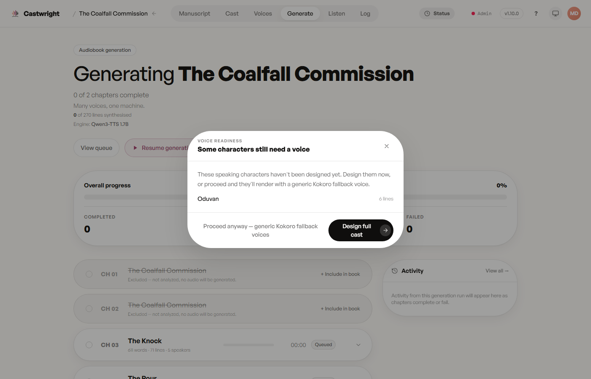
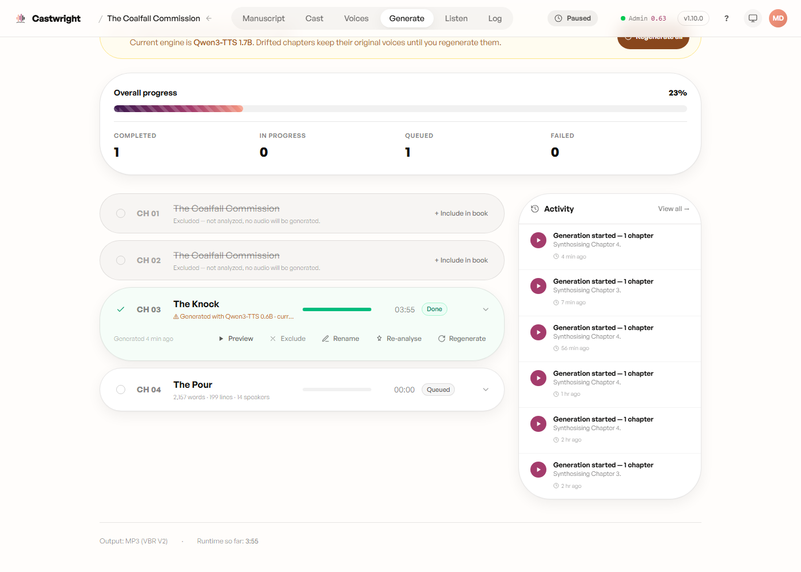

# Generating Audio

Once the cast is approved, starting generation kicks off a pre-flight check
before anything renders: any speaking character on the Qwen engine that
hasn't had a voice designed yet is flagged, so you can design it now or
knowingly proceed with a generic fallback voice.

English books get a "Proceed anyway — generic Kokoro fallback voices" link
alongside "Design full cast"; a non-English book has no proceed affordance
at all — every speaking character needs a designed voice before it can
generate.

## Progress

Once you're past the gate (and, for a Qwen book, past the "Choose the voice
model" tier prompt), each chapter renders line by line. The Generate screen
shows the whole run's overall progress, an ETA, and a live "Synthesising
`<character>` · line N of M" counter for the chapter currently in flight.

## Done

A finished chapter turns green with a "Done" badge and duration, and picks
up Preview / Exclude / Rename / Re-analyse / Regenerate actions. The rest of
the book keeps its place in the queue underneath.

Next: [The Quality Gate](The-Quality-Gate).
