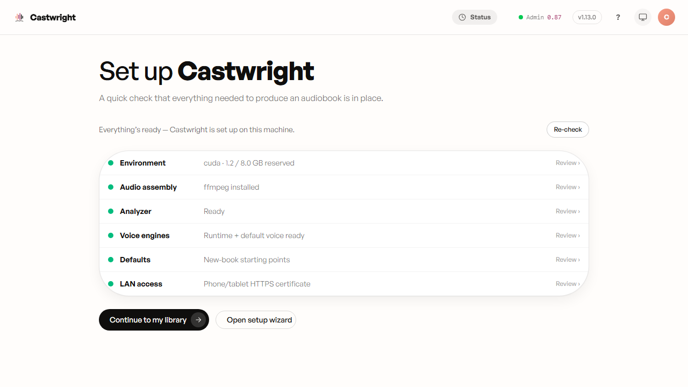
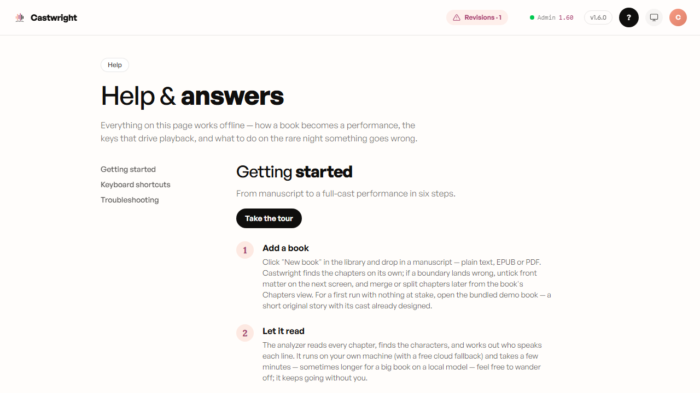
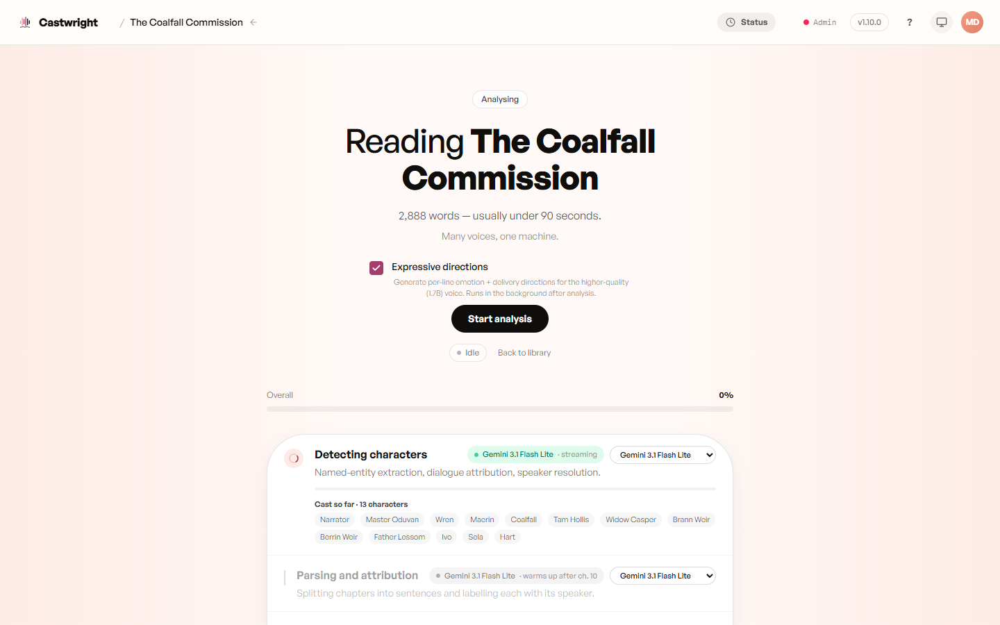

# Getting Started

A condensed quickstart. For full per-OS install steps, see
[Installing Castwright](Installing-Castwright).

## 1. Install and let the app check itself

Follow [Installing Castwright](Installing-Castwright) to bring the app up, then run it. First launch doesn't drop you straight into an empty library — a **Setup wizard** runs a readiness check for everything the pipeline needs (the Python environment, the voice engine's weights, the analyzer, ffmpeg, the audio-assembly path) and walks you through whatever's missing, in plain language, with the fix attached rather than a stack trace. Seven short steps — Environment, ffmpeg, Analysis, Voice, Defaults, LAN access, Finish — and Next is never blocked on a failing check, so you can move through the whole thing even before every box is ticked. Analysis and Voice are separate steps: Analysis is local-first (list and pull an Ollama model right there in-app, or fall back to a cloud key), and Voice is where the synthesis engines are set up.

Once setup is done, re-opening it later collapses into a compact summary board instead — one row per area with a colored dot, so you can see at a glance that everything's still ready, and drill back into a single step only if something needs attention. The analyzer row carries a three-state signal: **green** means it'll run and has a second analyzer provisioned as backup, **yellow — "ready, no backup"** means it'll run but with nothing to fall back on, and **red** means it won't run as configured. A cloud-only setup — a Gemini key with no local Ollama — reads yellow by design; it's fully ready, just without a backup, so a yellow analyzer dot isn't a problem to fix.

<picture>
  <source media="(prefers-color-scheme: dark)" srcset="images/getting-started/01-books-view-dark.png">
  <source media="(prefers-color-scheme: light)" srcset="images/getting-started/01-books-view.png">
  
</picture>

> **About this screenshot:** this is the re-entry summary board (everything already set up) — one row per area, including the new **Analyzer**, **Voice engines**, and **LAN access** rows. The first-run guided walkthrough itself, page by page (Environment → Analysis → Voice → Defaults → …), is shown step by step over in [Installing Castwright](Installing-Castwright).

## 2. Try the built-in sample book

Castwright ships with a demo book — *The Coalfall Commission* — a two-chapter, thirteen-character original story with its cast already designed, so you can hear a full-cast performance before uploading anything of your own. It's the fastest way to answer the only question that matters: does this sound like a cast, or like one voice reading everyone?

## 3. The guided tour and the in-app Getting Started page

Beyond this wiki, the app has its own **Help** page (`#/help`, reached from the top-bar "?" or from Account) with a six-step Getting Started walkthrough — Add a book, Let it read, Meet the cast, Give everyone a voice, Generate, Listen & take it anywhere — plus a **Take the tour** button that spotlights the real screens as you go, anchoring each step to the live element it describes rather than just describing it in prose. It works offline, so it's there even with the server down.

> A screenshot of the Help page's walkthrough and the guided tour in action is tracked as a follow-up.

## 4. Upload → Analyze → Cast → Generate → Listen

That's the whole pipeline — here it is mid-analysis on the demo book itself, the cast roster filling in live as the analyzer reads. Each stage gets its own wiki page — see the
sidebar's "Core journey" section for [Uploading a Book](Uploading-a-Book)
onward.

