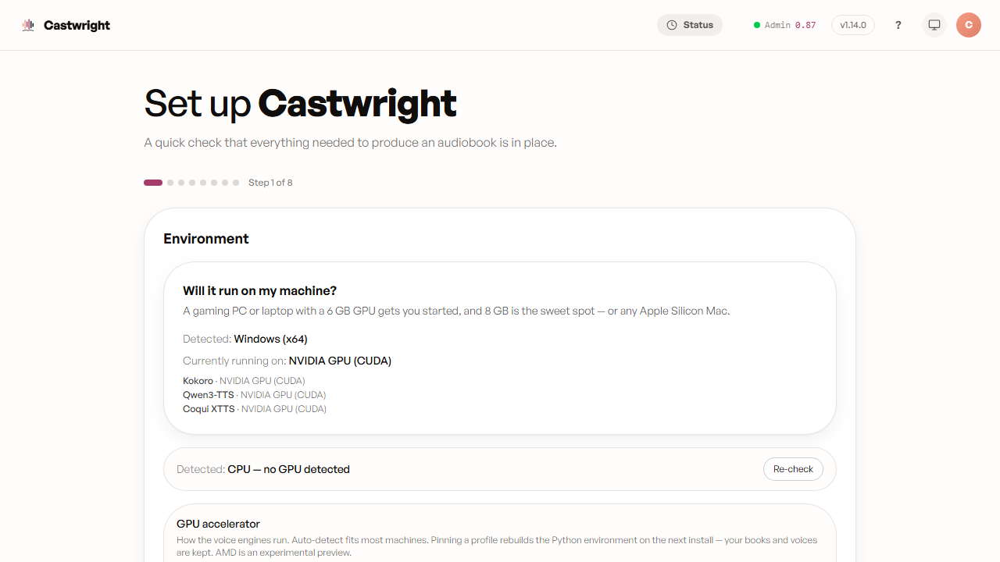
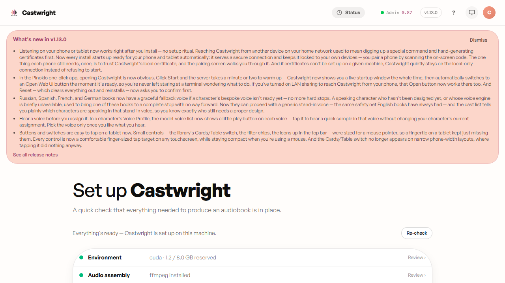
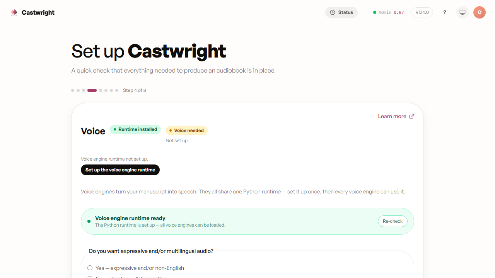
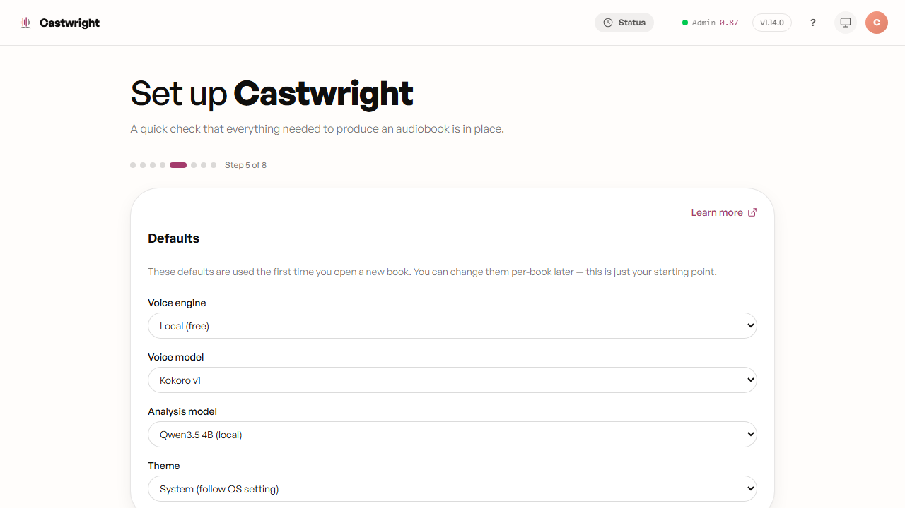

# Installing Castwright

This page duplicates [INSTALL.md](https://github.com/dudarenok-maker/Castwright/blob/main/INSTALL.md)
with screenshots. INSTALL.md remains the authoritative offline reference
shipped inside the release zip — if the two ever disagree, INSTALL.md wins.
Already installed? Jump straight to [Getting Started](Getting-Started) for the
condensed quickstart.

This guide walks a deployer through bringing the app up on a clean Windows, macOS, or Linux machine after extracting `castwright-vX.Y.Z.zip` from a [GitHub release](https://github.com/dudarenok-maker/Castwright/releases).

After install you'll have a single command (`npm run start:prod`) that brings up the Node server, the Python voice engine (port 9000), and the built frontend.

> **New in v1.13.0 — LAN HTTPS is on by default.** A production start now serves over **HTTPS on `:8443`, bound to every interface**, so phones, tablets, and the Android companion work out of the box — no more discovering `npm run start:lan` by hand. On first launch the app provisions a local `mkcert` certificate automatically (Pinokio installs `mkcert` for you; native installs use the copy you install once, below). If no certificate can be made, it **falls back cleanly to `http://localhost:8080` on the local machine only** — it never fails to start. A `LAN_AUTH_TOKEN` is auto-generated so the LAN API is authenticated (devices still pair) from the first boot. To opt back out, set `LAN_HTTPS=0` in `server/.env`. Full details in [Mobile + tablet access over LAN HTTPS](#mobile--tablet-access-over-lan-https) below.

---

## Prerequisites

<picture>
  <source media="(prefers-color-scheme: dark)" srcset="images/installing-castwright/01-prerequisites-dark.png">
  <source media="(prefers-color-scheme: light)" srcset="images/installing-castwright/01-prerequisites.png">
  
</picture>

- **Node.js 20.19 or newer** (Vite 8 needs ≥20.19 / ≥22.12; the repo targets Node 24) — <https://nodejs.org>
- **Python 3.12** (exactly — the sidecar bootstrap probes for 3.12 and refuses other versions)
  - Windows: `winget install --id Python.Python.3.12` (or the <https://python.org> installer — tick "Add to PATH")
  - macOS: `brew install python@3.12`
  - Linux (Ubuntu / Debian): `sudo apt install python3.12 python3.12-venv`
  - Linux (Fedora / RHEL): `sudo dnf install python3.12`
- **ffmpeg on PATH** (server encodes chapter audio to MP3)
  - Windows: `winget install Gyan.FFmpeg`
  - macOS: `brew install ffmpeg`
  - Linux: `sudo apt install ffmpeg` (or `sudo dnf install ffmpeg`)
- **~6 GB free disk** (Kokoro TTS weights ~1.1 GB + PyTorch ~2.5 GB + Node modules + the Python venv)
- **A GPU is optional but strongly recommended** (Kokoro on CPU is ~10× slower than on a modest GPU):
  - Windows / Linux: an **NVIDIA GPU + recent drivers** (CUDA). The sidecar bootstrap pre-installs the CUDA (cu128) PyTorch build automatically, so GPU works out of the box; to pin a **different** CUDA index see "PyTorch / CUDA" below.
  - macOS: **Apple Silicon (M-series)** is used automatically via Metal (`mps`) — no drivers, no CUDA, no config. Intel Macs fall back to CPU.
  - **AMD GPU — experimental preview.** Auto-detected (or force with `ACCELERATOR=amd`); see "AMD GPU (experimental)" below. Qwen/Coqui run on **ROCm**, Kokoro on **CPU**, and a failed ROCm install **falls back to a working CPU install** automatically — so it never blocks setup.

> **PyTorch / CUDA.** `torch==2.11.0` + `torchaudio==2.11.0` (a matched pair) are explicit sidecar requirements (recent `coqui-tts` no longer pulls torch transitively) and install with `pip install -r requirements.txt` — used by the Coqui XTTS and Qwen engines (Kokoro uses ONNX Runtime, no torch). We **drop coqui-tts's `[codec]` extra** from the core install: the sidecar does all audio I/O via soundfile + ffmpeg and never calls `torchaudio.load`, so torchaudio's 2.9 backend removal doesn't affect it. The one exception is the opt-in Coqui add-on — recent `coqui-tts` raises at *import* time unless `torchcodec` is merely **present**, so its installer drops `torchcodec` in (`--no-deps`, so it can't perturb the pinned torch); it's never actually called at runtime. On an NVIDIA box the bootstrap pre-installs the **cu128** build from the PyTorch index before the overlay (PyPI's default torch wheel is CPU-only on Windows, so a plain install would silently drop GPU); macOS uses the default CPU/MPS build. To pin a **different** CUDA build, pre-install the pair yourself before the requirements — e.g. `pip install torch==2.11.0 torchaudio==2.11.0 --index-url https://download.pytorch.org/whl/cu128` (swap `cu128` for another CUDA index from pytorch.org, or use `…/whl/cpu` to force CPU-only).

> **AMD GPU (experimental preview).** The installer detects an AMD GPU and selects the **`amd`** accelerator profile (or force it with `ACCELERATOR=amd` in `server/.env`, the first-run wizard, or the `#/advanced` **Accelerator profile** knob). On that profile **Qwen and Coqui run on ROCm** (alpha preview `torch` wheels from `repo.radeon.com`, pre-installed before the requirements) and **Kokoro runs on CPU** — DirectML was validated and **cannot run the Kokoro model** (its ConvTranspose op fails in `onnxruntime-directml`), so Kokoro stays on the CPU EP. Requirements: a **ROCm-supported AMD GPU** + a recent AMD driver (Windows: latest Adrenalin). Because the ROCm wheels are alpha previews, the install is **best-effort with an automatic CPU fallback** — if any AMD step fails, the bootstrap completes a working **CPU** install instead of erroring (it records `.accelerator-fallback.json` and the app reports it's running on CPU). The accelerator profile is stamped into the venv, so switching it later rebuilds the environment; your books and designed voices are untouched (they live in the workspace dir, not the venv). More detail: [`server/tts-sidecar/README.md`](https://github.com/dudarenok-maker/Castwright/blob/main/server/tts-sidecar/README.md#accelerator-profiles-nvidia--amd--cpu--apple).

> **Upgrading an existing install?** A venv is bound to its Python, so a pre-3.12 (e.g. 3.11) venv can't be upgraded in place — the app detects the mismatch and asks you to reinstall fresh. Delete the old venv (`server/tts-sidecar/.venv`) and re-bootstrap; **your books and designed voices are safe** (they live in `WORKSPACE_DIR`, outside the install).

> **Note for Linux deployers**: validated on Ubuntu 22.04+. The same scripts should work on any glibc Linux with `bash`, `curl`, and the prereqs above. Snap-installed ffmpeg sometimes ends up at `/snap/bin/ffmpeg` instead of `/usr/bin/ffmpeg`; if `which ffmpeg` returns empty after `apt install`, prepend `/snap/bin` to your PATH.

---

## Install — Pinokio (one click)

If you use [Pinokio](https://pinokio.computer), Castwright installs with no terminal
and no system prerequisites — Pinokio provisions its own Python 3.12 + ffmpeg + Node.

1. Open the Pinokio browser and paste the Castwright repo URL:
   `https://github.com/dudarenok-maker/Castwright`.
2. Click **Install**. Pinokio builds the latest published release, provisions the
   Python voice engine (~2.5 GB PyTorch) plus `ffmpeg` and `mkcert`, generates the
   local LAN certificate, and configures the app — one click, ~10–20 min.
3. Click **Start**. During the ~1–2 minute warmup the menu shows a **Terminal** tab so
   you can watch progress; once the server is up it flips to **Open Web UI** and selects
   it automatically. The first launch runs the in-app setup wizard (GPU detect + one-time
   Kokoro voice-model download) — identical to the native installers.

> **Phone & tablet work out of the box under Pinokio (v1.13.0+).** Because the
> installer provisions `mkcert` and the LAN certificate for you, Start comes up on
> **HTTPS `:8443`** and pairs devices automatically — no extra steps. The **Open Web UI**
> tab opens `https://localhost:8443` on the desktop; scan the pairing QR from a phone to
> add it (install the mkcert root CA on the phone once — see
> [Mobile + tablet access](#mobile--tablet-access-over-lan-https)). If `mkcert` can't be
> provisioned, Start still comes up on loopback `http://localhost:8080` rather than
> failing. The friendly `castwright.local` hostname stays opt-in (`npm run start:lan`);
> the Pinokio default pairs via the LAN-IP QR.

<picture>
  <source media="(prefers-color-scheme: dark)" srcset="images/installing-castwright/pinokio-setup-wizard-dark.png">
  <source media="(prefers-color-scheme: light)" srcset="images/installing-castwright/pinokio-setup-wizard.png">
  
</picture>

Update anytime via the **Update** menu (rebuilds from the newest published release).
**Stop** cleanly tears down the server + voice engine; **Reset** rebuilds from scratch
(your books and designed voices in the workspace are preserved).

---

## Install — Windows

Open PowerShell in the extracted folder, then run:

```powershell
# 1. Install Node deps (root + server).
npm ci
npm --prefix server ci

# 2. Bootstrap the Python sidecar (Python 3.12; installs PyTorch ~2.5 GB).
cd server\tts-sidecar
py -3.12 -m venv .venv
.\.venv\Scripts\python.exe -m pip install -r requirements.txt

# 3. Fetch the Kokoro TTS weights (~1.1 GB, one-time download).
#    Option A — in-app: start the app first, then Admin → Model Manager → Kokoro → Install (no terminal needed).
#    Option B — terminal:
powershell -ExecutionPolicy Bypass -File scripts\install-kokoro.ps1
cd ..\..

# 4. Configure server.
copy server\.env.example server\.env
# Open server\.env and edit WORKSPACE_DIR to a writable folder where your
# audiobooks will live (e.g. C:\Users\you\Documents\audiobooks).

# 5. Run.
npm run start:prod
```

<picture>
  <source media="(prefers-color-scheme: dark)" srcset="images/installing-castwright/02-install-windows-dark.png">
  <source media="(prefers-color-scheme: light)" srcset="images/installing-castwright/02-install-windows.png">
  
</picture>

Browser opens `https://localhost:8443` (the v1.13.0 LAN-HTTPS default; falls back to `http://localhost:8080` if no LAN certificate is present — see [Mobile + tablet access](#mobile--tablet-access-over-lan-https)).

To stop: `npm run stop:prod` in the same folder.

---

## Install — macOS

Open Terminal in the extracted folder, then run:

```bash
# 1. Install Node deps.
npm ci
npm --prefix server ci

# 2. Bootstrap the Python sidecar (Python 3.12; installs PyTorch ~2.5 GB).
cd server/tts-sidecar
python3.12 -m venv .venv
./.venv/bin/python -m pip install -r requirements.txt

# 3. Fetch the Kokoro TTS weights (~1.1 GB).
#    Option A — in-app: start the app first, then Admin → Model Manager → Kokoro → Install (no terminal needed).
#    Option B — terminal:
bash scripts/install-kokoro.sh
cd ../..

# 4. Configure server.
cp server/.env.example server/.env
# Open server/.env and edit WORKSPACE_DIR (e.g. ~/Documents/audiobooks).

# 5. Run.
npm run start:prod
```

> **Apple Silicon TTS device**: no configuration needed — the sidecar auto-detects
> the GPU (`mps`) and falls back to CPU. To force a specific device, set
> `QWEN_DEVICE=cpu` (or `mps`) in `server/.env`.

Browser opens `https://localhost:8443` (the v1.13.0 LAN-HTTPS default; falls back to `http://localhost:8080` if no LAN certificate is present — see [Mobile + tablet access](#mobile--tablet-access-over-lan-https)).

To stop: `npm run stop:prod`.

> **Gatekeeper note**: macOS may prompt that downloaded binaries (`python`, `ffmpeg`, sidecar `.dylib`s) are from an "unidentified developer." Allowing them once via System Settings → Privacy & Security is expected; this release zip is not codesigned.

---

## Install — Linux

Open a terminal in the extracted folder, then run:

```bash
# 1. Install Node deps.
npm ci
npm --prefix server ci

# 2. Bootstrap the Python sidecar (Python 3.12; installs PyTorch ~2.5 GB).
cd server/tts-sidecar
python3.12 -m venv .venv
./.venv/bin/python -m pip install -r requirements.txt

# 3. Fetch the Kokoro TTS weights (~1.1 GB).
#    Option A — in-app: start the app first, then Admin → Model Manager → Kokoro → Install (no terminal needed).
#    Option B — terminal:
bash scripts/install-kokoro.sh
cd ../..

# 4. Configure server.
cp server/.env.example server/.env
# Edit WORKSPACE_DIR to a writable folder.

# 5. Run.
npm run start:prod
```

Browser: `https://localhost:8443` (the v1.13.0 LAN-HTTPS default; falls back to `http://localhost:8080` if no LAN certificate is present — see [Mobile + tablet access](#mobile--tablet-access-over-lan-https)).

To stop: `npm run stop:prod`.

---

## Try the demo book

The app ships with a generate-able demo — **The Coalfall Commission** (an original
Castwright work). On the books-library empty state or the upload screen, click
**"try a sample book"** to load it into your workspace with its full 13-character
cast already designed, then **Generate** to hear it.

The designed voices are **Qwen** (the flagship per-character engine), so generating
the demo as designed needs the Qwen model installed (Model Manager → install Qwen)
on a GPU. Every character also carries a **Kokoro** fallback preset, so the demo
still generates with a full cast on a box without Qwen — just less bespoke. No audio
ships in the bundle; the demo runs the real pipeline locally.

---

## Troubleshooting

Short version — the full version lives on the [Troubleshooting](Troubleshooting) wiki page.

- **"ffmpeg not found on PATH"** — confirm with `ffmpeg -version`; prepend its directory to PATH if it's installed but not found.
- **Port :8080 already in use** — in production the server now auto-shifts to the next free port (8080→8081→…, and likewise 8443→… for HTTPS) instead of dying, so this usually resolves itself; to force a specific port, `npm run stop:prod` then retry, or override for one run via `PORT=8081 npm run start:prod`.
- **Sidecar fails to load Kokoro** — usually an interrupted weights download; re-run `install-kokoro.sh` / `install-kokoro.ps1`.
- **GPU not detected** — sidecar falls back to CPU and logs it; check driver/CUDA versions (NVIDIA), confirm `device=mps` in the log (Apple Silicon), or check for `.accelerator-fallback.json` (AMD preview).
- **"Cannot find module '../../dist/index.html'"** — the release zip ships `dist/` pre-built; re-extract if it's missing.
- **Analysis fails immediately — "Gemini … returned an empty response"** — Gemini's recitation filter blocked a copyrighted-book chapter; switch to `GEMINI_MODEL=gemma-4-31b-it` or go fully local with `ANALYZER=local`.

See [Troubleshooting](Troubleshooting) for the full symptom → fix table.

---

## Configuration

The server reads `server/.env` (copied from `server/.env.example` in the install
steps above). All knobs have safe defaults — set only what you need.

<picture>
  <source media="(prefers-color-scheme: dark)" srcset="images/installing-castwright/03-configuration-dark.png">
  <source media="(prefers-color-scheme: light)" srcset="images/installing-castwright/03-configuration.png">
  
</picture>

**Analyzer**

- `ANALYZER` — `local` (default, Ollama) or `gemini`.
- `GEMINI_API_KEY` — required when `ANALYZER=gemini` (or as the automatic
  fallback when Ollama is unreachable).
- `GEMINI_MODEL` — the Gemini model id; plus per-model `GEMINI_RPM_*` /
  `GEMINI_TPM_*` / `GEMINI_RPD_*` rate caps (see `server/.env.example`).
- `ANALYZER_PHASE0_MODEL` / `ANALYZER_PHASE1_MODEL` /
  `ANALYZER_PHASE1_MIN_LAG_CHAPTERS` — optional two-model analyzer (cast
  detection + sentence attribution in parallel). Set both phase vars to enable.

**Generation & TTS**

- `WORKSPACE_DIR` — where your per-book library lives (set this to a writable
  folder).
- `GEN_WORKERS` — how many chapters synthesise at once (default `2`).
- `GPU_VRAM_BUDGET` — VRAM-weighted GPU budget in GiB (default `8`). Drop to `6`
  on a 6 GB card.
- `PRELOAD_COQUI` — `0` (default; Coqui loads on demand) or `1`.
- `QWEN_BATCH_SIZE` (default `8`) and `QWEN_ATTN_IMPL` (default `sdpa`) — Qwen
  tuning knobs.
- `AUDIO_LOUDNORM_ENABLED` — `true` (default; two-pass EBU R128 at
  -16 LUFS / 11 LU / -1.5 dBTP) or `false` to opt out.

**LAN / companion access** _(defaults changed in v1.13.0)_

- `LAN_HTTPS` — serves over mkcert-backed HTTPS on `:8443`, bound on all interfaces
  (phone/tablet web + the Android companion). **On by default in production** (any
  `npm run start:prod` / native installer / Pinokio) — set `LAN_HTTPS=0` to opt out and
  serve plain `http://localhost:8080` instead. `1` forces it on (e.g. under `npm run dev`,
  which is otherwise plain-HTTP). If the LAN certificate is missing the server **degrades
  to loopback HTTP with a one-command-fix hint** — it no longer refuses to start (the old
  `LAN_HTTPS=1` "won't start without a cert" behaviour is gone).
- `LAN_AUTH_TOKEN` — the shared pairing secret guarding `/api` + `/workspace` (and used by
  the companion). **You no longer need to set this by hand:** when LAN is on and no token
  is set, the server auto-generates one on first boot and persists it outside the release
  folder, so it survives upgrades and devices don't re-pair. Set it explicitly only if you
  want a known fixed value (e.g. for scripted setups); an explicit value always wins.
- `npm run start:lan` — still available for the **explicit** LAN profile: it additionally
  advertises the friendly `castwright.local` mDNS hostname and runs the privileged `:443`
  port-forwarder. The bare production default gives HTTPS `:8443` + IP-based pairing QR
  without those extras.

## Setting up the analyzer

The install bundle ships Kokoro weights for TTS only — the analyzer needs either a local Ollama daemon or a Gemini API key. The server-side default is `ANALYZER=local` (Ollama); if no Ollama daemon is reachable, the analyzer auto-falls back to the Gemini free tier when a key is configured.

**Option A — Ollama (private, fully on-device).** The Account → Models card in the running app installs Ollama and pulls models without leaving the UI:

1. Start the app (`npm run start:prod`), open **Account → Models**.
2. Click **Install Ollama** (platform-aware bootstrap; Windows / macOS / Linux all covered).
3. Click **Pull model** and pick e.g. `qwen3.5:4b` (~2.5 GB).
4. **Account → Defaults for new books → Analysis model** → pick the pulled model. Save.

Or the manual path: install Ollama from <https://ollama.com>, `ollama pull qwen3.5:4b`, then set the model in the Account tab. On macOS, also run `brew services start ollama` so the daemon starts on login and survives reboots (registers a launchd login item).

**Option B — Gemini (cloud, free tier).** Get a key by following [Getting a Gemini API Key](Getting-a-Gemini-API-Key), then paste it into **Account → Server configuration → Gemini API key**. Engine selection follows from the model picker — pick any Gemini model in **Defaults for new books → Analysis model**. Save. The key persists to your per-user settings file `~/.castwright/user-settings.json` (plaintext, same trust model as `server/.env`).

**Option C — Pipelined two-model split.** For long books: Phase 0 (cast detection) runs on Gemma while Phase 1 (sentence attribution) runs on Gemini Flash in parallel, hitting independent rate-limit buckets so effective quota nearly doubles. Configure under **Account → Defaults for new books → Phase 0 model + Phase 1 model + Min-lag chapters** (default 10), or set `ANALYZER_PHASE0_MODEL` / `ANALYZER_PHASE1_MODEL` / `ANALYZER_PHASE1_MIN_LAG_CHAPTERS` in `server/.env`.

> **Chinese or Japanese books need a capable analyzer model.** CJK attribution
> depends on the analyzer model more than English does, and there's no
> automatic per-language routing — the model you pick applies to every book.
> For a `zh`/`ja` book, choose a strong **local Qwen** analyzer model (set the
> phase-0/phase-1 model above, or `ANALYZER_PHASE0_MODEL` / `ANALYZER_PHASE1_MODEL`)
> rather than a lightweight cloud default; a weak model can attribute CJK
> dialogue poorly enough to trip the attribution-drift safety net and refuse
> the run. Both Coqui XTTS (`zh-cn`/`ja`) and Qwen render CJK once analysed.
> See [Multi-language Support](Multi-language-Support).

## Voice engines: standard vs optional

Castwright ships three **standard** voice engines that install automatically with the Python sidecar:

| Engine | Profile | What it does |
|---|---|---|
| **Kokoro** (default) | all boxes | High-quality preset-catalogue TTS; warms on demand (no longer eager-loaded by default — opt in with `PRELOAD_KOKORO=1`); ~1.1 GB weights. |
| **Qwen3-TTS** | GPU only (NVIDIA / AMD) | Per-character bespoke voice design from the cast persona. `qwen-tts` is included in `requirements/nvidia-cuda.txt` and `requirements/amd-rocm.txt`, so it installs with the standard `pip install -r requirements/<profile>.txt` step. Weights (~2.5 GB) are fetched separately (see below). |
| **Whisper ASR** | all boxes | Speech-to-text QA gate (`faster-whisper` ships in `requirements/base.txt`). Off by default (`SEG_ASR_ENABLED=0`); model weights are fetched on first ASR load. |

**Coqui XTTS v2** is an **optional add-on** (not in any requirements overlay). Install it from **Admin → Model Manager → Optional add-ons → Coqui → Install**. The in-app installer runs `pip install coqui-tts` constrained against `base.txt` to preserve the shared `transformers<5.0` lockstep; it also pulls `torchcodec` (present-only, required for `import TTS` to succeed on the CVE-pinned torch) and, for Chinese/Japanese synthesis, the extra text frontends `coqui-tts` doesn't (`pypinyin`, `cutlet`, `unidic-lite`). Existing Coqui installs from before this release are preserved across upgrades (pip-install never uninstalls).

> **Manual pip install note.** If you need to `pip install` a package into the sidecar venv by hand (e.g. a scripted / offline setup), always pass `-c server/tts-sidecar/requirements/base.txt` to stay within the shared `transformers>=4.45,<5.0` pin that keeps Qwen, Kokoro, and optional Coqui compatible.

## Installing Qwen3-TTS weights

On a GPU box the `qwen-tts` Python package installs automatically with `pip install -r requirements/<profile>.txt`. The model weights (~2.5 GB) are a separate one-time download:

**Recommended — install in-app (no terminal).** Start the app, open **Admin → Model Manager**, and click **Install** on the Qwen card. It downloads the Base + VoiceDesign models in the background with live progress; when it finishes, new books default to Qwen. The CLI below is equivalent for scripted / offline / CI setups.

**CLI alternative.** From the extracted folder, with the sidecar venv already bootstrapped:

```sh
node server/tts-sidecar/scripts/install-qwen3.mjs
```

Cross-platform Node ESM — same command on Windows / macOS / Linux. Idempotent (pip is a no-op when already satisfied; the model download is a no-op when the Hugging Face cache already has the snapshot). Fetches the Base (synth) + VoiceDesign models into `server/tts-sidecar/voices/qwen/hf`. Add `--skip-design` to skip the VoiceDesign model (saves ~1.7 GB on machines that won't host the cast-review design step); add `--cpu` to force CPU-only torch on a box without a CUDA GPU.

**Optional — FlashAttention-2.** SDPA is the default attention impl and benchmarked at parity with FA2 on TTS-decode-bound workloads, so skipping FA2 costs nothing measurable. To opt in anyway (e.g. for a benchmark):

```sh
node server/tts-sidecar/scripts/install-qwen3.mjs --flash-attn
```

The installer checks any platform first: if `flash_attn` is already importable in the sidecar venv, it skips straight to telling you how to activate it — no reinstall attempt. Otherwise the path depends on your OS:

- **Windows** installs a prebuilt wheel, but that specific wheel's own build tag is `cp311 + torch-2.6 + cu124` — it can't load on the sidecar's actual **cp312 + torch 2.11 + cu128** stack, so the script **auto-skips** and Qwen runs on SDPA instead. A native wheel for the real stack is tracked separately (side-22, #1001).
- **Linux** attempts an unpinned `pip install flash-attn --no-build-isolation` build when the standalone NVIDIA CUDA Toolkit (`nvcc`) is on `PATH`; without the toolkit it skips cleanly rather than starting a doomed compile.
- **macOS** always skips — no FA2 path there.

When a compatible build is present (however it got there), activate it via `QWEN_ATTN_IMPL=flash_attention_2` in `server/.env`.

**Switch a book to Qwen3.** Start the app and go to **Account → Defaults for new books → Voice engine** → "Local (free)" → **Voice model** → pick the Qwen3 entry. Save. For an existing book opened under Kokoro / Coqui, use the cast view's "Rebaseline the series" modal to design Qwen voices for the principal cast before regenerating.

**Disk + VRAM.** Qwen Base ~1 GB on disk, Base + VoiceDesign together ~2.5 GB. At runtime Base resides at ~2 GB VRAM during synth and VoiceDesign loads transiently during a design (~4–5 GB on top of Base, freed on idle or at the next synth). The GPU-arbitration semaphore (`GPU_VRAM_BUDGET` in `server/.env`, default 8 GiB) keeps an 8 GB GPU from double-booking against the analyzer.

## Adding Coqui XTTS v2 (optional add-on)

Coqui XTTS v2 is not installed by default. To add it:

1. Start the app, open **Admin → Model Manager → Optional add-ons**.
2. Click **Install** on the Coqui card. The installer runs `pip install coqui-tts` against a sanitized `base.txt` constraints file (respecting the shared `transformers<5.0` pin — the earlier `ERROR: Constraints cannot have extras` abort is fixed), adds `torchcodec` plus the Chinese/Japanese text frontends (`pypinyin`, `cutlet`, `unidic-lite`), and fetches the model weights (~2 GB) in the background.
3. Once complete, go to **Account → Defaults for new books → Voice model** → pick "Coqui XTTS v2". Save.

## Using Gemini for TTS (cloud, free tier)

The same Gemini key configured for the analyzer (see Option B above) doubles as the TTS provider when picked.

1. Get an API key by following [Getting a Gemini API Key](Getting-a-Gemini-API-Key) (Google account required), saved via **Account → Server configuration → Gemini API key**.
2. **Account → Defaults for new books → Voice engine** → "Gemini (cloud)".
3. **Voice model** → pick `gemini-3.1-flash-preview-tts` or `gemini-2.5-flash-preview-tts`. Save.

The key is stored plaintext in `~/.castwright/user-settings.json` (per-user, same trust model as `server/.env` for a single-user workspace). The env var `GEMINI_API_KEY` in `server/.env` still wins if both are set — useful for CI / scripted setups.

---

## Picking a chapter audio format

Chapter audio defaults to MP3 VBR V2. Two newer codecs are available per-book under **Listen view → metadata editor → Audio format** or in the export modal:

- **MP3** (default) — broadest player support; VBR V2.
- **AAC / M4A** — smaller files at equal perceived quality; `libfdk_aac` is auto-detected on the host ffmpeg with a graceful fallback to the native AAC encoder.
- **Opus** — best ratio at very low bitrates; ideal for streaming over LAN.

The `audioFormat` field is new on `BookStateJson` (default `'mp3'`) — existing books carry the default and need no migration. Export shapes mirror the codec: `aac-m4a-zip`, `opus-ogg-zip`, plus the existing `mp3-zip` + `mp3-folder` + `m4b-single`.

Loudness normalization (EBU R128, two-pass, targeting -16 LUFS / 11 LU / -1.5 dBTP) is **on by default** for every newly-rendered chapter. To opt out per server install, set `AUDIO_LOUDNORM_ENABLED=false` in `server/.env`. The Listen view's loudness report card surfaces measured LUFS / LRA / dBTP and flags drift between chapters.

---

## Mobile + tablet access over LAN HTTPS

The app drives on phone + tablet via LAN HTTPS using `mkcert` so iOS / Android trust the cert without browser warnings.

**As of v1.13.0 this is the default** — a production start already serves HTTPS on `:8443` across your LAN and auto-generates the pairing token, so you don't need `npm run start:lan`. What still needs a human, once per setup:

1. **Install `mkcert`** — `scoop install mkcert` (Windows), `brew install mkcert` (macOS), or `apt install mkcert` (Linux), then `mkcert -install`. **Pinokio does this for you**; native/manual installs need it present so the app can auto-provision the LAN certificate on first `npm run start:prod`. (If it's missing, the app runs on loopback HTTP instead of failing — install `mkcert` and restart to enable LAN.)
2. **Install the root CA on each mobile device once** (iOS: Settings → Profile downloaded → Install → trust; Android: Settings → Security → Install certificate). Grab the QR/URL from the running app's **Admin → LAN access** card, or run `npm run install:cert-mobile` to print the LAN URL + a terminal QR + per-OS steps. _(The companion app pins the CA itself and skips this — see below.)_
3. **Open the LAN URL on the device** and pair via the QR — lock icon, no warning.

> Prefer the friendly `https://castwright.local:8443` address (mDNS) and the `:443`
> port-forwarder? Run `npm run start:lan` instead of the bare default — that profile
> advertises them. For local HMR development, `npm run dev:lan` serves Vite + Node on
> `https://0.0.0.0:5173`/`:8443`.

---

## Android companion app

The native Flutter **Castwright** pairs to the server over the LAN and delta-syncs only the chapters that changed, for offline playback with background / lock-screen / Bluetooth / Android-Auto controls. It's a separate Flutter build from this server zip, but **each [GitHub Release](https://github.com/dudarenok-maker/Castwright/releases) attaches a ready-to-sideload `castwright-vX.Y.Z.apk`** (+ `.sha256`). To use it:

1. Have `mkcert` installed so the LAN certificate is provisioned (Pinokio does this
   automatically; native/manual — see the LAN-HTTPS step above).
2. **Just start the app** — `npm run start:prod` (or Start in Pinokio). As of v1.13.0,
   LAN HTTPS on `:8443` and the `LAN_AUTH_TOKEN` are both **on by default and
   auto-generated**, so there's nothing to edit in `server/.env`. _(You can still pin a
   fixed `LAN_AUTH_TOKEN` there for scripted setups, or set `LAN_HTTPS=0` to turn LAN off;
   an explicit token always wins over the auto-generated one.)_
3. The pairing values are served at `GET /api/export/lan` (`{ urls, protocol: "https", token, caFingerprint }`) — this is what the pairing QR encodes.
4. In the app: **Pair a device** → scan the pairing QR or enter the server URL (`https://<lan-ip>:8443`, or the friendly `https://castwright.local` under the `npm run start:lan` profile), access token, and CA fingerprint. The app pins the CA itself, so — unlike the mobile *web* UI — **you do not install the root CA on the phone**.

Build/sideload instructions for the app live in [`apps/android/README.md`](https://github.com/dudarenok-maker/Castwright/blob/main/apps/android/README.md); the full design is [`docs/features/188-android-companion-app.md`](https://github.com/dudarenok-maker/Castwright/blob/main/docs/features/188-android-companion-app.md).

---

## Updating

Upgrading is one click in the app: open **Account → Application updates**, pick
the new `castwright-vX.Y.Z.zip`, confirm the version delta, and the app stages,
validates, swaps, reinstalls dependencies, migrates your book data (with an
automatic backup first), and restarts itself. No terminal commands.

This works because Castwright uses a **versioned-directory layout**: each release
lives in its own `releases/vX.Y.Z/` folder, a stable `launch.mjs` at the install
root always runs the current one, and your data lives in shared siblings outside
the release folders. An upgrade extracts the new release into a *fresh* folder and
only flips a pointer once it's ready — the running version is never touched, so a
failed upgrade just keeps running the previous one. A fresh install already ships
this machinery, so there is nothing to convert.

```
<install>/
  launch.mjs            <- start the app from here (shortcut / start-app.bat points at it)
  .current-version      <- e.g. "1.7.0"
  releases/vX.Y.Z/      <- the code (one extracted zip per release)
  workspace/            <- your library (books, voices)
  venv/  models/kokoro/ <- shared Python venv + Kokoro weights
  logs/  .run/
```

Your account settings live in `~/.castwright/user-settings.json` (outside any
install folder) and carry over automatically; copy your old `server/.env` into
`releases/vX.Y.Z/server/.env` if you set custom keys.

### Manual fallback (any version)

The in-app flow is just orchestration — you can always swap by hand: `npm run stop:prod`, extract the new release into a new `releases/vX.Y.Z/`, set `.current-version`, `npm ci && npm --prefix server ci`, then `node launch.mjs`. Your `workspace/`, `venv/`, and `models/` are untouched.
