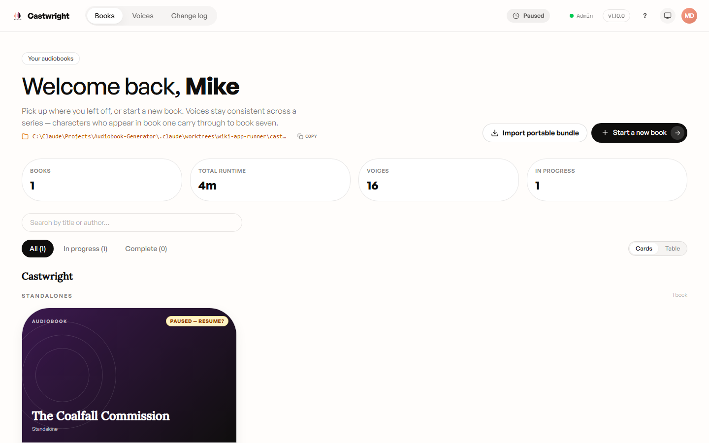
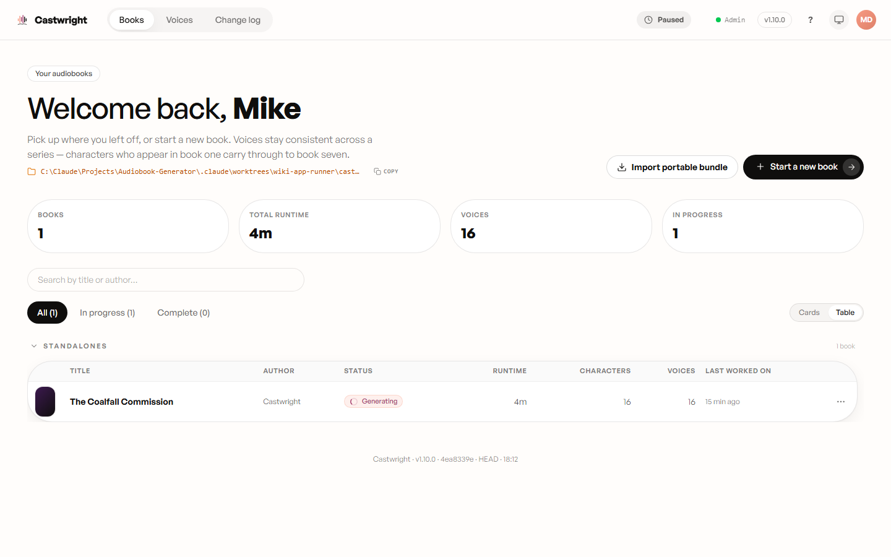

# Library Management

The **Books** view (`#/`) is your home library — every book you've uploaded,
grouped by author and then by series, with search, tags, and a status filter
on top. It has two presentations, toggled by the **Cards / Table** control in
the top-right: card view (a visual grid, good for browsing covers) and table
view (dense rows, good for scanning many books at once). Both read the same
underlying data and stay in sync with each other.

The header shows your workspace's on-disk root (with a one-click **Copy**),
four running totals (books, total runtime, distinct voices, in-progress
count), a search box (matches title or author), and a status filter (**All /
In progress / Complete**). Every book also carries a **tags** array — once a
book has tags, a chip row appears under the search box and clicking a chip
ANDs it into the current filter; a library with no tagged books (like this
one) simply doesn't render the row, rather than showing it empty.

## Series grouping

Every book belongs to a series — or, if it's a standalone, to a synthetic
**"Standalones"** group. The **table view** makes this grouping the most
explicit: each series gets its own collapsible section (a chevron toggle plus
a live book count), with a **"Standalones"** pseudo-section collecting every
standalone book across every author into one place at the bottom.

> **About this screenshot:** this environment's demo workspace holds a single
> standalone book (*The Coalfall Commission*), so the shot above shows one
> "Standalones" section with a book count of 1 and nothing to collapse into.
> The real behaviour, read from the component that renders this
> (`src/components/library/library-table.tsx`), is richer: an author with a
> real series (e.g. three books in a trilogy) gets its own named section
> ("Author — Series name") showing each book's position (`#1`, `#2`, …), and
> once you've listened across multiple books in a series, a **Series Memory**
> chip appears next to the section header summarising which characters'
> voices have carried through. The card view (above) shows the same grouping
> as a plain section heading rather than a collapsible one.

## Book bundles

The plan for this page originally called for a screenshot of a **book
bundle** — multiple books grouped or packaged together. That feature doesn't
exist anywhere in the app today. The one feature that uses the word "bundle"
is **Import portable bundle** (visible in the top-right of the screenshot
above) — it imports a single book's `.portable.zip` export (manuscript +
state + cast + audio) from another machine, not a multi-book package. A
follow-up issue is filed to resolve the naming mismatch between this plan and
the shipped feature set (see [#1294](https://github.com/dudarenok-maker/Castwright/issues/1294));
this sub-section is intentionally omitted rather than describing a screenshot
that doesn't exist.

## Everyday actions

Every book card (or table row) has a kebab menu with **Edit details**, **Find
cover image**, **Re-parse manuscript**, **Replace manuscript…**, and **Delete
book**. Re-parsing and replacing both discard cached analysis, cast, and any
generated audio — you'll confirm the cast again afterwards — while the
manuscript file itself (re-parse) or its replacement (replace) stays on disk.
Deleting a book removes its whole directory, including listening history and
stats, and can't be undone.

Next: [Mobile, Tablet & Companion App](Mobile-Tablet-and-Companion-App).
