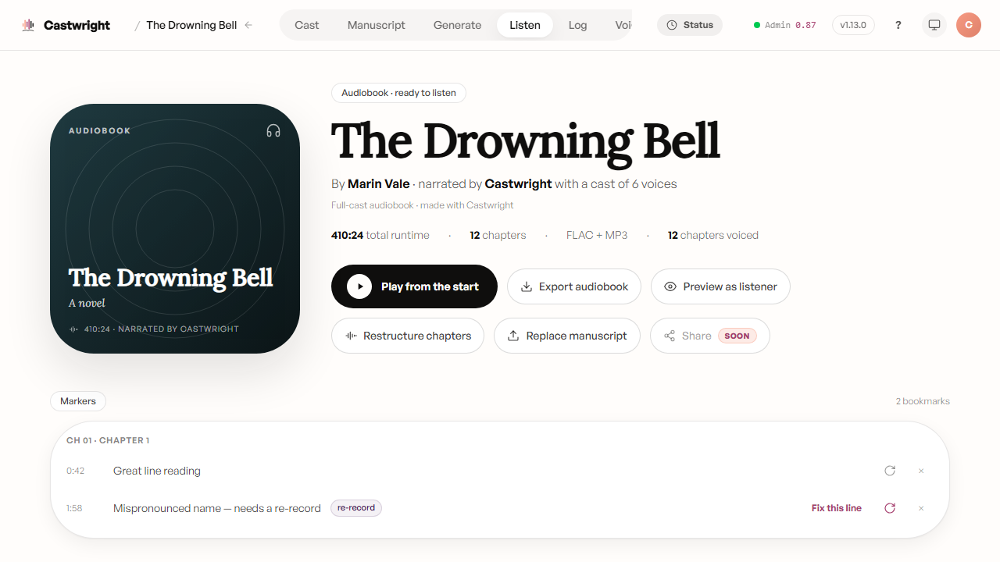
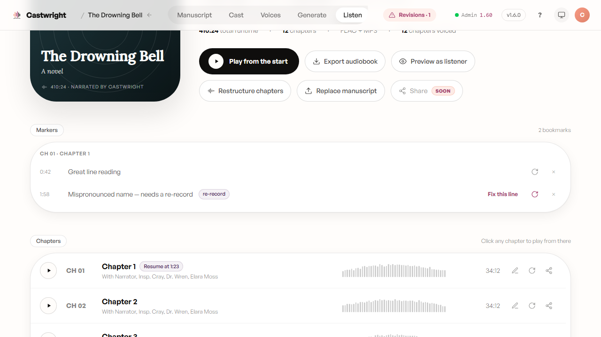
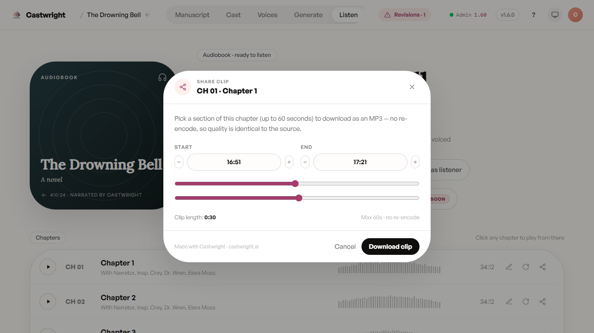

# Listening & Revising

The Listen view is home base for a book once at least one chapter has rendered — not just a playback screen, but the place you actually judge whether the performance landed, and fix it in place when it didn't. Below, *The Drowning Bell* — finished, 12 chapters, a cast of 6 — with cover art, title, cast size, and total runtime up top, and quick actions to play from the start, export, preview as a listener would hear it, restructure chapters, or replace the manuscript.

<picture>
  <source media="(prefers-color-scheme: dark)" srcset="images/listening-and-revising/01-listen-header-dark.png">
  <source media="(prefers-color-scheme: light)" srcset="images/listening-and-revising/01-listen-header.png">
  
</picture>

## Player and chapters

Click any chapter row to play it in the mini-player pinned to the bottom of the screen — it stays there across every view, so you can keep listening while you work elsewhere in the app. Drop a bookmark while listening (the mini-player's marker icon, or the `M` key) and it shows up in a Markers panel above the chapter list, grouped by chapter, with click-to-seek back to that exact moment.

## Flagging a line for revision

A plain bookmark is just a note to yourself. Flip one to a re-record marker — the refresh icon next to it — and it grows a **"Fix this line"** button that jumps straight into the per-line re-record flow for that exact moment. You never have to regenerate a whole chapter to fix one reading that didn't land. Below, *The Drowning Bell*'s Markers panel with both kinds side by side — a plain note ("Great line reading") and a re-record marker ("Mispronounced name — needs a re-record") carrying the "re-record" pill and its "Fix this line" button:

<picture>
  <source media="(prefers-color-scheme: dark)" srcset="images/listening-and-revising/markers-and-rerecord-dark.png">
  <source media="(prefers-color-scheme: light)" srcset="images/listening-and-revising/markers-and-rerecord.png">
  
</picture>

## Sharing a clip

Pick up to 60 seconds of a chapter and download it as a standalone MP3 — no re-encoding, so the quality matches the source exactly. It's the fastest way to hand someone thirty seconds of proof that the apprentice really does sound thirteen.

<picture>
  <source media="(prefers-color-scheme: dark)" srcset="images/listening-and-revising/share-clip-picker-dark.png">
  <source media="(prefers-color-scheme: light)" srcset="images/listening-and-revising/share-clip-picker.png">
  
</picture>

Drag either handle to set the start and end, and the clip-length readout updates live so you can dial in exactly 60 seconds or less before downloading.

> A screenshot of the per-line re-record flow itself (once "Fix this line" is clicked) is tracked as a follow-up (Refs #1289).

Next: [Exporting](Exporting).
