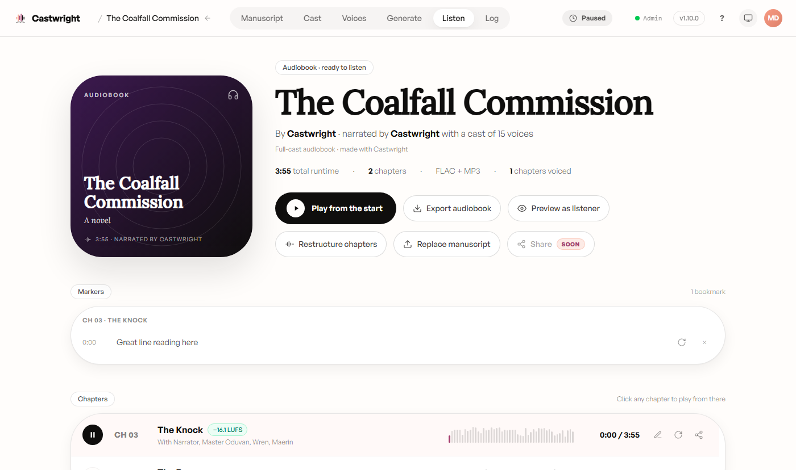
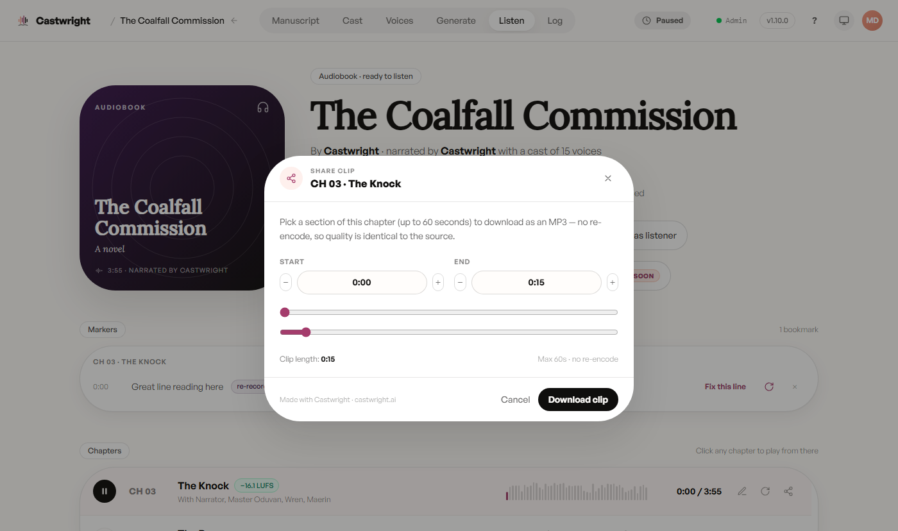

# Listening & Revising

The Listen view is the home base for a book once at least one chapter has
rendered — cover art, title, cast size, and total runtime up top, with quick
actions to play from the start, export, or preview as a listener.

## Player and chapters

Click any chapter row to play it in the mini-player at the bottom of the
screen. Bookmarks you drop while listening — the mini-player's marker icon,
or the `M` keyboard shortcut — show up in a Markers panel above the chapter
list, grouped by chapter, with click-to-seek.

## Flagging a line for revision

A plain bookmark is just a note. Flip one to a re-record marker (the refresh
icon next to it) and it grows a "Fix this line" button that jumps straight
into the per-line re-record flow for that exact moment — no need to
regenerate the whole chapter to fix one reading.

The demo book didn't have a chapter mid-regeneration at capture time, so this
shows the marker-based way to flag a line rather than the live post-regenerate
A/B compare screen (old take vs. new, played side by side for review). Capturing
that screen is tracked as a follow-up, once a real pending revision exists on
the demo book to shoot.

## Sharing a clip

Pick up to 60 seconds of a chapter and download it as a standalone MP3 — no
re-encoding, so the quality matches the source exactly.

Next: [Exporting](Exporting).
