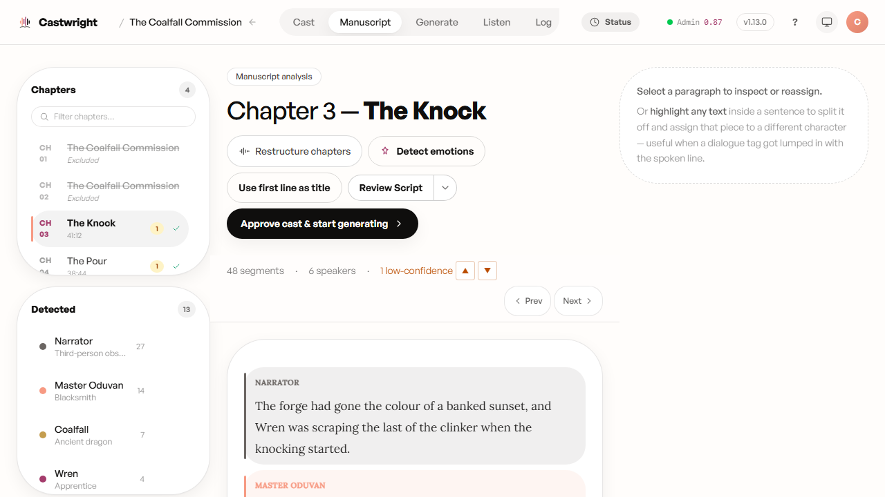
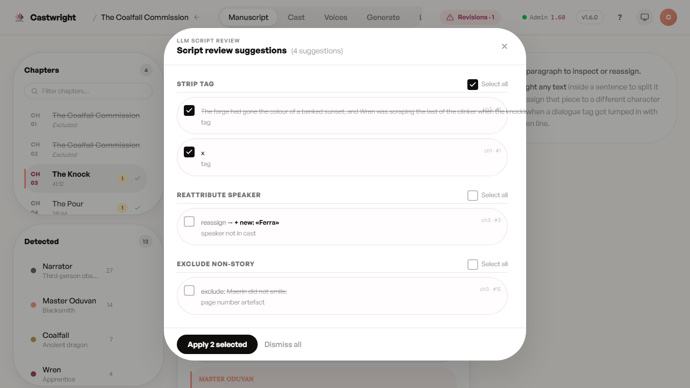
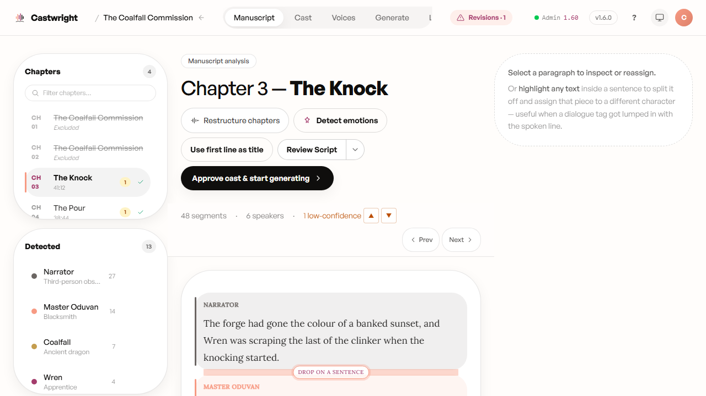

# Manuscript Management

Uploading a book gets a manuscript into Castwright. The **Manuscript** tab — one of the six tabs across the top of a book once it's ready (Cast / Manuscript / Generate / Listen / Log / Voices) — is where you keep shaping it afterward: correcting who says what, running a second read for the mistakes only a careful reader catches, and tidying chapters that came in slightly wrong. It's a genuinely ongoing surface, not a one-time step you pass through on the way to generating audio.

## Every sentence, attributed and color-coded

The manuscript renders as your book's own prose, paragraph by paragraph, with every sentence carrying a color-coded bar for the speaker Castwright assigned it. Consecutive sentences from the same speaker group into a segment, so a page of dialogue reads as a series of colored blocks rather than a wall of identical text. The narrator gets a neutral grey — deliberately, so narration never competes with the cast for your attention. Below, *The Coalfall Commission*'s Chapter 3: 48 segments, 6 speakers, one line flagged low-confidence, with the chapter sidebar and detected-cast sidebar both visible.

<picture>
  <source media="(prefers-color-scheme: dark)" srcset="images/manuscript-management/01-attribution-view-dark.png">
  <source media="(prefers-color-scheme: light)" srcset="images/manuscript-management/01-attribution-view.png">
  
</picture>

## Fixing an attribution

Two ways to correct a speaker assignment, both non-destructive and both logged:

- **Drag the boundary.** A handle sits between adjacent segments — grab it and slide it to move the line between two speakers, with a peach drop indicator showing where it'll land. On a phone or tablet the same handle answers to touch or pen; there's no separate "mobile way" to do this.
- **Select and reassign a span.** Highlight any range of text — even mid-sentence — and a popover offers every character in the cast. Castwright splits the sentence at your selection automatically, so you're never forced to reassign a whole line just to fix its second half.

Every reassignment writes an entry to the **Log** tab, so nothing here is a silent edit — you can always see what changed and when.

## Finding what needs a second look

- A **low-confidence navigator** in the header jumps you straight to every line Castwright wasn't sure about (with J/K keys for jumping without touching the mouse) — visible above as "1 low-confidence." This is covered in full on [Reviewing Low-Confidence Speaker Tags](Reviewing-Low-Confidence-Speaker-Tags).
- The **chapter sidebar** carries a text filter, an amber badge on any chapter with low-confidence lines still open, and a status icon for in-progress, done, or failed chapters — so you can see where attention is still owed without opening every chapter.
- The **cast sidebar** lets you click a character to filter the manuscript down to just their lines — useful for auditing one character's voice across the whole book — with an inline "Add character" for a speaker Castwright missed entirely.

## A second reader for the whole chapter

Beyond fixing lines one at a time, **Review Script** sends a chapter (or the whole book) to a second LLM pass that reads back over the attribution the way a careful editor would — catching a stray speaker tag, a line split between two people, dialogue buried inside a paragraph of narration, or an emotion that doesn't fit. It surfaces every proposed fix in a diff view you accept or wave off line by line, rather than applying anything silently.

<picture>
  <source media="(prefers-color-scheme: dark)" srcset="images/manuscript-management/review-script-diff-dark.png">
  <source media="(prefers-color-scheme: light)" srcset="images/manuscript-management/review-script-diff.png">
  
</picture>

Findings survive you — reload the page, close the tab, or come back tomorrow, and a chapter's proposed fixes are still sitting there untouched. Closing the diff view never discards them; only an explicit "Dismiss all" does. If you start a fresh review over a chapter that still has findings waiting on you, Castwright asks you to confirm first rather than quietly reviewing over the top of them.

Below, Chapter 3's suggestions grouped by kind — strip a stray dialogue tag, reassign a line to a speaker outside the detected cast, or exclude a page-number artefact — with **Select all** per group and a running count of what's checked, so you accept exactly the fixes you want in one **Apply** click.

## Two more editing tools in the same header

- **Detect Emotions** re-runs the emotion pass that decides how a line should land (furious, deadpan, broken) across a chapter, without re-running the full analysis.
- **Promote first sentence to title** fixes a common EPUB import quirk — a chapter's title landing as its first line of narration — lifting it into the heading in one click, shown to you before it commits.

Need to merge or split chapters instead of fixing attribution? That's **Restructure**, covered in [Uploading a Book](Uploading-a-Book) — it's one click away from the same screen.

Mid-drag, the boundary handle highlights peach and swaps its label to "drop on a sentence," so you always know a reassignment is live before you let go:

<picture>
  <source media="(prefers-color-scheme: dark)" srcset="images/manuscript-management/boundary-drag-dark.png">
  <source media="(prefers-color-scheme: light)" srcset="images/manuscript-management/boundary-drag.png">
  
</picture>

Next: with the cast confirmed and the manuscript in good shape, head to [Reviewing Cast & Assigning Voices](Reviewing-Cast-and-Assigning-Voices).
