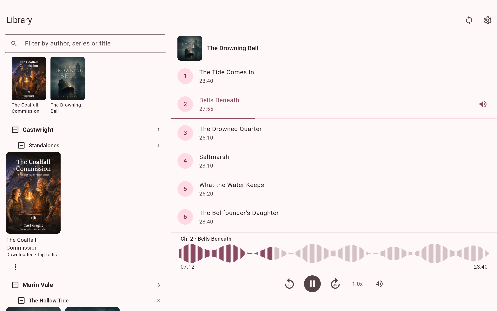

# Mobile, Tablet & Companion App

Castwright is usable from a phone or tablet in three ways: over your LAN in a
mobile browser (with a one-time root-certificate trust step), through the
native **Castwright Companion** Android app, or — if you just want to check
progress — by resizing any browser to a phone width, since every view is
built responsive-first.

## LAN access

Other devices reach the app over **LAN HTTPS** plus a locally trusted certificate, so a
phone's browser doesn't show a security warning. **As of v1.13.0 this is the default** —
any production start (`npm run start:prod`, the native installers, or Pinokio) serves
HTTPS on `:8443` across your LAN and auto-generates the pairing token, so you no longer
have to run `npm run start:lan` by hand. (It still exists for the explicit profile that
also advertises `castwright.local` + the `:443` forwarder; `npm run dev:lan` is the LAN
variant for local HMR development, which is otherwise plain-HTTP.) The one prerequisite is
`mkcert` — Pinokio installs it for you; native installs auto-provision the certificate on
first start once you've installed `mkcert` once (if it's absent the app falls back to
loopback HTTP rather than failing). **Admin → LAN access** is where you authorize a
browser device once the server is up — see the LAN access card on the [Admin](Admin) page.

**The friendly `castwright.local` / `castwright.dev.local` hostnames still
need pairing.** These addresses (and any raw LAN IP) always go through the
same LAN entry point as a phone would — even when you type them into a
browser on the desktop machine itself — so the app loads but the library
fails with `401: Missing or invalid LAN access token` until that browser is
paired via the steps below. `https://localhost:8443` is the one address
exempt from this: it's recognised as loopback and skips pairing entirely, so
it's the quickest way to check the app locally without pairing anything.

<picture>
  <source media="(prefers-color-scheme: dark)" srcset="images/mobile-tablet-and-companion-app/lan-access-qr-dark.png">
  <source media="(prefers-color-scheme: light)" srcset="images/mobile-tablet-and-companion-app/lan-access-qr.png">
  
</picture>

Click **Authorize a device** (a device name is optional — it defaults to "Device") and a pairing QR appears right below the card, ready for a phone's camera. When testing from a desktop browser tab on the same machine, a one-click "Open pairing link on castwright.local" link also appears next to the QR — clicking it opens a new tab with the authorization confirmation directly, no camera needed (available only when the friendly hostname is confirmed reachable).

The one-time root-certificate step is
`npm run install:cert-mobile` — it generates a per-LAN-IP certificate, prints
the LAN URLs for both the Vite dev server and the production bundle, and
prints an ASCII QR **in the terminal** (not the browser) linking to
`https://<lan-ip>:8443/cert/root.crt`, followed by per-OS trust steps for
iOS, Android, macOS, Windows, and Linux. See the full walkthrough in
[Installing Castwright](Installing-Castwright).

## Phone layout

Every view targets three breakpoints — `<640px` (phone: single-column,
bottom sheets, full-screen modals), `640–1024px` (tablet: two-column,
dialog-style modals), and `≥1024px` (desktop: three-pane, full top bar) —
with every desktop drag/hover affordance shipping a tap equivalent. Below is
the Books view at a phone viewport: the top bar collapses to a hamburger
menu, the four stat tiles wrap to two columns, and the card grid drops to
one column.

<picture>
  <source media="(prefers-color-scheme: dark)" srcset="images/mobile-tablet-and-companion-app/02-phone-viewport-dark.png">
  <source media="(prefers-color-scheme: light)" srcset="images/mobile-tablet-and-companion-app/02-phone-viewport.png">
  
</picture>

> **Known issue found in an earlier capture at this viewport:** `document.documentElement.scrollWidth` measured wider than `clientWidth` — a genuine horizontal-overflow bug, not a capture artifact. The cause was the workspace-path row under the page header (`WorkspacePathRow` in `src/components/library/library-chrome.tsx`): its path `` carries a fixed `max-w-[520px]` with no responsive breakpoint, so on a narrow phone the row alone can exceed the viewport width and drag the whole page into horizontal scroll — a violation of this project's own "no horizontal overflow at 375×667" mobile testing invariant. Worth re-checking against a current build; flagged as a real bug rather than fixed in this docs pass.

## Android companion app

The **Castwright Companion** app is a real, code-complete Flutter app
(`apps/android/`) — offline downloads, a finished-shelf, and cross-device
sync, paired to your desktop over the same LAN HTTPS session via a QR-based
deep link. Its store listings aren't live yet, so today's distribution is a
direct APK download plus in-browser pairing, both surfaced from the Listen
view's Companion banner — see [Exporting](Exporting) for that banner.

Once paired, the companion app mirrors your library for offline listening,
tracks finished books in its own shelf, and keeps that shelf and your
listening position in sync across every paired device.

### Instant play over your LAN

You don't have to download a chapter before you can hear it. Tap any
undownloaded chapter and it starts **instantly over your home network** — the
app streams it from your desktop over the same trusted LAN session, with no
OS-level certificate to install and the device's pairing token never leaving
the app. Off the home network it degrades cleanly: a chapter you haven't
downloaded falls back to download-to-play (or asks you to re-pair if the
device token has expired), while anything already downloaded still plays fully
offline.

### On a tablet or foldable

On a screen wide enough for it — a tablet, or an unfolded foldable — the
companion drops its phone-first single column for a **two-pane layout**: your
library on the left, a **persistent player on the right**. That player pane
keeps playing through a book switch *and* through a device rotation — picking a
different book reloads the right pane without ever stopping playback, and
turning the device never tears the player down. Narrower tablets in portrait
get a cover-forward grid instead, and a phone is unchanged. The same adaptive
layout is what the app will use on iPad.

<picture>
  <source media="(prefers-color-scheme: dark)" srcset="images/mobile-tablet-and-companion-app/03-companion-tablet-two-pane-dark.png">
  <source media="(prefers-color-scheme: light)" srcset="images/mobile-tablet-and-companion-app/03-companion-tablet-two-pane.png">
  
</picture>

### Try the demo — no server, no pairing

The pairing screen has a **"Try the demo"** entry that runs the whole app
against a self-contained sample library — no desktop server, no pairing, no
network at all (it's airplane-mode safe). It's the quickest way to see what the
companion feels like before pairing it to your own library.

<picture>
  <source media="(prefers-color-scheme: dark)" srcset="images/mobile-tablet-and-companion-app/pair-a-device-modal-dark.png">
  <source media="(prefers-color-scheme: light)" srcset="images/mobile-tablet-and-companion-app/pair-a-device-modal.png">
  
</picture>

The Listen view's Companion banner opens the pairing flow **name-first**: you
name the device, then **Pair a device → Scan QR** in the app, pointed at the
resulting code — it expires after a few minutes, with **Regenerate code** and a
manual-entry fallback if scanning isn't an option. Naming the device first
means it appears under that name in **Admin → LAN access** rather than a
generic "Device."

Next: [Admin](Admin).
