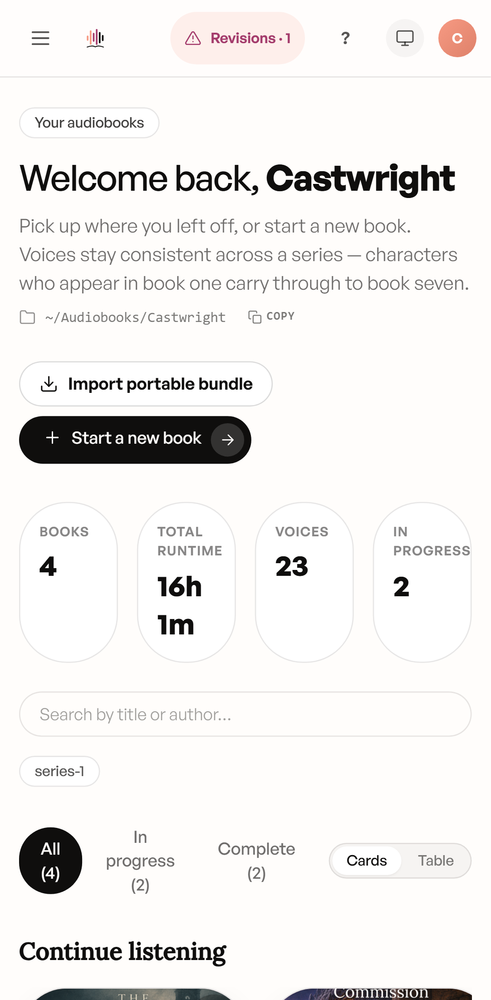

# Mobile, Tablet & Companion App

Castwright is usable from a phone or tablet in three ways: over your LAN in a
mobile browser (with a one-time root-certificate trust step), through the
native **Castwright Companion** Android app, or — if you just want to check
progress — by resizing any browser to a phone width, since every view is
built responsive-first.

## LAN access

The desktop app doesn't listen on plain HTTP for other devices — it needs
**LAN HTTPS mode** (`npm run dev:lan` or `npm run start:lan`) plus a locally
trusted certificate, so a phone's browser doesn't show a security warning.
**Admin → LAN access** is where you authorize a browser device once that
mode is running — see the LAN access card on the [Admin & Model
Manager](Admin-and-Model-Manager) page.

The one-time root-certificate step is
`npm run install:cert-mobile` — it generates a per-LAN-IP certificate, prints
the LAN URLs for both the Vite dev server and the production bundle, and
prints an ASCII QR **in the terminal** (not the browser) linking to
`https://<lan-ip>:8443/cert/root.crt`, followed by per-OS trust steps for
iOS, Android, macOS, Windows, and Linux. See the full walkthrough in
[Installing Castwright](Installing-Castwright).

## Phone layout

Every view targets three breakpoints — `<640px` (phone: single-column,
bottom sheets, full-screen modals), `640–1024px` (tablet: two-column,
dialog-style modals), and `≥1024px` (desktop: three-pane, full top bar) —
with every desktop drag/hover affordance shipping a tap equivalent. Below is
the Books view at a phone viewport: the top bar collapses to a hamburger
menu, the four stat tiles wrap to two columns, and the card grid drops to
one column.

> **Known issue found in an earlier capture at this viewport:** `document.documentElement.scrollWidth` measured wider than `clientWidth` — a genuine horizontal-overflow bug, not a capture artifact. The cause was the workspace-path row under the page header (`WorkspacePathRow` in `src/components/library/library-chrome.tsx`): its path `` carries a fixed `max-w-[520px]` with no responsive breakpoint, so on a narrow phone the row alone can exceed the viewport width and drag the whole page into horizontal scroll — a violation of this project's own "no horizontal overflow at 375×667" mobile testing invariant. Worth re-checking against a current build; flagged as a real bug rather than fixed in this docs pass.

## Android companion app

The **Castwright Companion** app is a real, code-complete Flutter app
(`apps/android/`) — offline downloads, a finished-shelf, and cross-device
sync, paired to your desktop over the same LAN HTTPS session via a QR-based
deep link. Its store listings aren't live yet, so today's distribution is a
direct APK download plus in-browser pairing, both surfaced from the Listen
view's Companion banner — see [Exporting](Exporting) for that banner.

Once paired, the companion app mirrors your library for offline listening,
tracks finished books in its own shelf, and keeps that shelf and your
listening position in sync across every paired device.

> Screenshots of the LAN-access QR card and the Pair-a-device modal are tracked as a follow-up.

Next: [Admin & Model Manager](Admin-and-Model-Manager).
