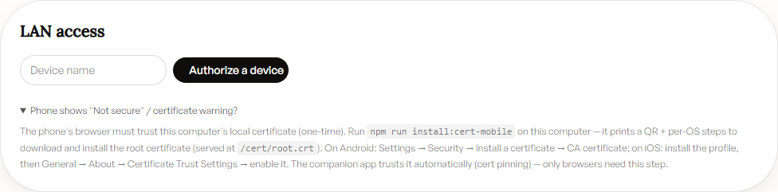
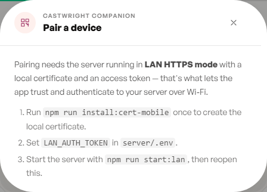

# Mobile, Tablet & Companion App

Castwright is usable from a phone or tablet in three ways: over your LAN in a
mobile browser (with a one-time root-certificate trust step), through the
native **Castwright Companion** Android app, or — if you just want to check
progress — by resizing any browser to a phone width, since every view is
built responsive-first.

## LAN access

The desktop app doesn't listen on plain HTTP for other devices — it needs
**LAN HTTPS mode** (`npm run dev:lan` or `npm run start:lan`) plus a locally
trusted certificate, so a phone's browser doesn't show a security warning.
**Admin → LAN access** is where you authorize a browser device once that
mode is running:

> **About this screenshot:** this box is running the plain (non-LAN-HTTPS)
> dev server, so there's no live QR to show yet — clicking **Authorize a
> device** here would 409. The screenshot above is the real, honest idle
> state of the card instead, with the "Phone shows 'Not secure'?" details
> panel expanded. Once the server is actually running in LAN HTTPS mode,
> clicking **Authorize a device** replaces this panel with a live QR (the
> same `PairingQr` component the companion-pairing flow below uses) that a
> phone's browser can scan to get a signed-in session on your Wi-Fi.

The one-time root-certificate step referenced in that panel is
`npm run install:cert-mobile` — it generates a per-LAN-IP certificate, prints
the LAN URLs for both the Vite dev server and the production bundle, and
prints an ASCII QR **in the terminal** (not the browser) linking to
`https://<lan-ip>:8443/cert/root.crt`, followed by per-OS trust steps for
iOS, Android, macOS, Windows, and Linux. See the full walkthrough in
[Installing Castwright](Installing-Castwright).

## Phone layout

Every view targets three breakpoints — `<640px` (phone: single-column,
bottom sheets, full-screen modals), `640–1024px` (tablet: two-column,
dialog-style modals), and `≥1024px` (desktop: three-pane, full top bar) —
with every desktop drag/hover affordance shipping a tap equivalent. Below is
the Books view at a 390×844 phone viewport: the top bar collapses to a
hamburger menu, the four stat tiles wrap to two columns, and the card grid
drops to one column.

> **Known issue found while capturing this shot:** at this viewport,
> `document.documentElement.scrollWidth` measures 622px against a 390px
> `clientWidth` — a genuine horizontal-overflow bug, not a capture artifact.
> The cause is the workspace-path row under the page header
> (`WorkspacePathRow` in `src/components/library/library-chrome.tsx`): its
> path `` carries a fixed `max-w-[520px]` with no responsive
> breakpoint, so on a narrow phone the row alone can exceed the viewport
> width and drag the whole page into horizontal scroll — a violation of this
> project's own "no horizontal overflow at 375×667" mobile testing
> invariant. Not fixed in this docs-only PR (out of scope); flagged to the
> user as a real bug worth filing separately, since a docs task filing an
> unrelated app bug on its own isn't this PR's call to make.

## Android companion app

The **Castwright Companion** app is a real, code-complete Flutter app
(`apps/android/`) — offline downloads, a finished-shelf, and cross-device
sync, paired to your desktop over the same LAN HTTPS session via a QR-based
deep link. Its store listings aren't live yet, so today's distribution is a
direct APK download plus in-browser pairing, both surfaced from the Listen
view's Companion banner:

> **About this screenshot:** pairing a real device also needs LAN HTTPS mode
> running with `LAN_AUTH_TOKEN` set, which this box doesn't have configured,
> so opening **Pair a device** shows the real "not available yet"
> instructional state (the three setup steps) instead of a QR — which is
> exactly what most readers will see the first time they try this, before
> they've set up LAN HTTPS. Once that mode is running, the same modal shows
> a live QR the app's **Pair a device → Scan QR** camera reads directly (the
> app then verifies the server's certificate fingerprint itself — no manual
> certificate install needed on the phone, unlike the browser-pairing flow
> above).

Once paired, the companion app mirrors your library for offline listening,
tracks finished books in its own shelf, and keeps that shelf and your
listening position in sync across every paired device.

Next: [Admin & Model Manager](Admin-and-Model-Manager).
