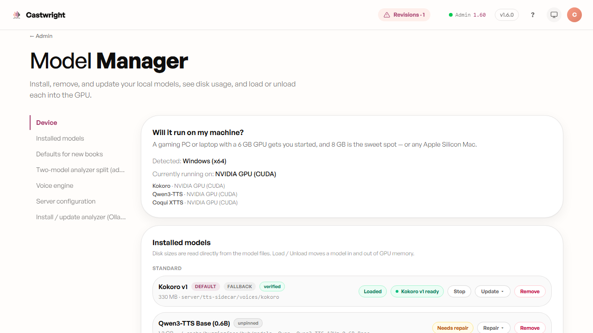
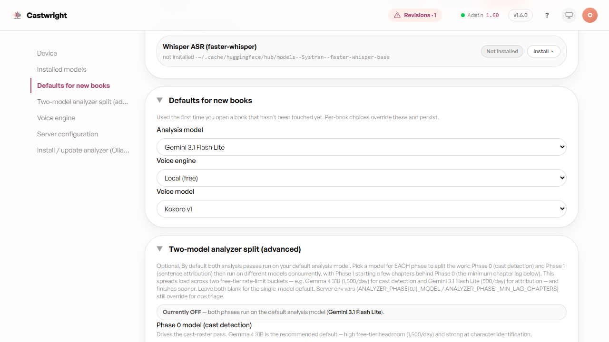
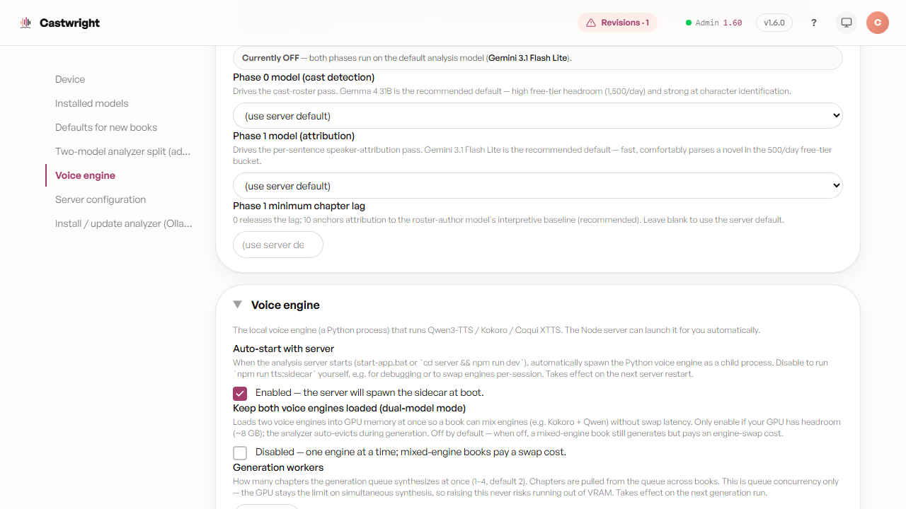
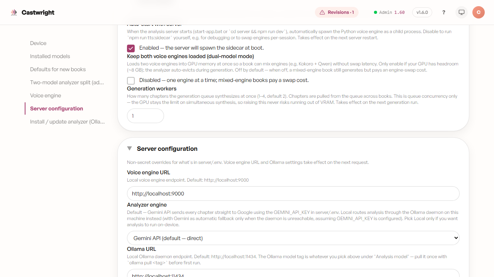
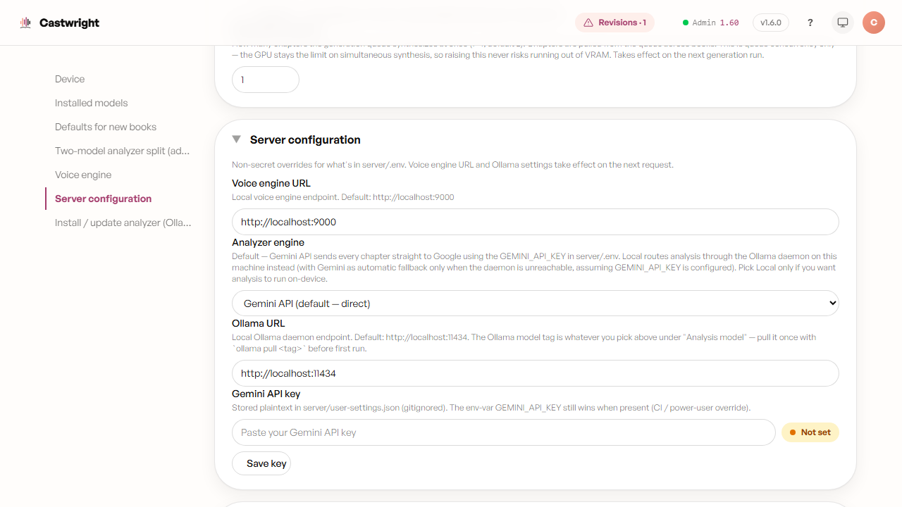
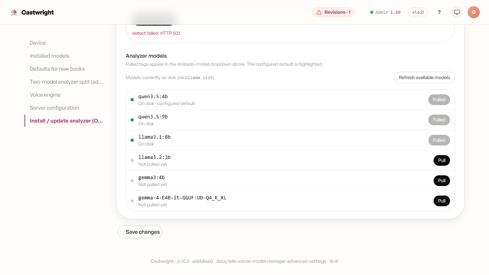

# Model Manager

**Model Manager** (`#/models`, reached via the **Open Model Manager** button
on [Admin](Admin)) is where every local model — TTS engines, the ASR model,
and the local analyzer — gets installed, updated, removed, and loaded or
unloaded from the GPU, all from one place. It's also where the settings that
used to live on the Account page now live: default engine per model kind,
the two-model analyzer split, TTS sidecar tuning, and server configuration.

## Device

The **Device** panel shows the GPU(s) detected on this machine and their
VRAM — this is what determines which engines are even offered (a CPU-only
box still runs Kokoro; a GPU box can run Qwen/Coqui too).

## Installed models

Every model is grouped under **Standard** (Kokoro, Qwen3-TTS Base 0.6B/1.7B,
Qwen3-TTS VoiceDesign), **Optional add-ons** (Coqui XTTS v2), **Analyzer
models (Ollama)**, and **Speech recognition (ASR)**. Each row shows:

- **Disk size + path** — read straight off the model files on disk, not a
  cached estimate.
- **Status badges** — `Not installed`, `Weights missing` / `Needs repair`
  (present but broken — offers a **Repair** action instead of Load),
  `Installed`, or `Loaded`, plus `Default` / `Fallback` tags for the
  engines that hold those roles, and an integrity chip (`verified` /
  `mismatch` / `unpinned`) for fixed-file models.
- **Load / Stop** — the same [Model Control Pill](The-Model-Control-Pill)
  used everywhere else in the app, when the row has a usable install.
- **Install / Update / Repair** — expands an inline installer under the
  row for engines that ship one (Kokoro, Coqui, Qwen Base, Whisper).
- **Remove** — deletes the model's weights from disk, gated by a confirm
  dialog that explains and blocks the three cases the server itself
  refuses: the model is currently loaded, it's the universal fallback
  engine, or it's your current default engine.

## Defaults for new books

| Knob | What it does | Default | Range |
|---|---|---|---|
| Analysis model | Model used to analyze new books | `account.defaultAnalysisModel` | curated list ∪ live Ollama tags |
| Voice engine | Default TTS engine for new books | `account.defaultTtsEngine` | Kokoro / Qwen3-TTS / Coqui |
| Voice model | Default voice model, scoped to chosen engine | resolved `defaultTtsModelKey` | engine-dependent |

## Two-model analyzer split (advanced)

Splits analysis across two models so cast detection and sentence
attribution run concurrently on different free-tier rate-limit buckets.
**Off by default** — both phases use your default analysis model until you
opt in.

| Knob | What it does | Default | Range |
|---|---|---|---|
| Phase 0 model (cast detection) | Model used for cast detection | blank = server default | dropdown |
| Phase 1 model (attribution) | Model used for sentence attribution | blank = server default | dropdown |
| Phase 1 minimum chapter lag | Chapters Phase 0 must clear before Phase 1 starts | 10 (effective) | integer, 0–50 |

## Voice engine

| Knob | What it does | Default | Range |
|---|---|---|---|
| Auto-start with server | Starts the TTS sidecar automatically with the server (needs server restart) | `true` | boolean |
| Keep both voice engines loaded | Dual-model mode — both engines resident at once | `false` | boolean |
| Generation workers | Chapters synthesized concurrently | 1 | integer, 1–4 |

## Server configuration

| Knob | What it does | Default | Range |
|---|---|---|---|
| Voice engine URL | Base URL of the TTS sidecar | `http://localhost:9000` | string, private/loopback host only |
| Analyzer engine | Routes analysis through Gemini direct vs. local Ollama for THIS account | `gemini` | gemini / local |
| Ollama URL | Base URL of the local Ollama daemon | `http://localhost:11434` | string |
| Gemini API key | API key for Gemini analyzer/persona calls | (unset) | string |

> **Not the same knob as [Advanced Settings](Advanced-Settings)'s "Analyzer
> engine."** This one is your per-account preference (defaults to
> `gemini`, matching the free-tier-friendly out-of-the-box experience);
> Advanced Settings' `analyzer.engine` is the lower-level server/env
> config knob (defaults to `local`), used only when no per-account
> preference is set. Same English label, two different controls.

## Install / update analyzer (Ollama)

Install the Ollama daemon and pull analyzer model weights without dropping
to a terminal — pull-tag UI plus a live health probe. The voice-engine / ASR
models (Kokoro, Qwen, Coqui, Whisper) install from their own rows in
**Installed models** above, not here.

Next: [Advanced Settings](Advanced-Settings).
