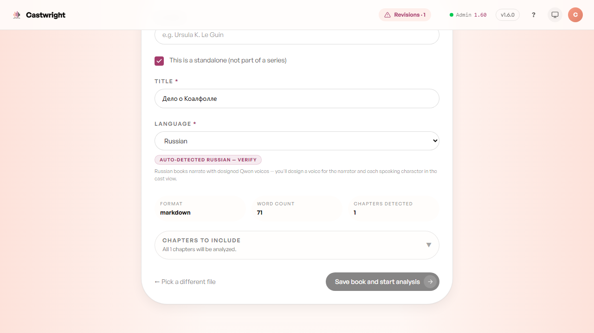
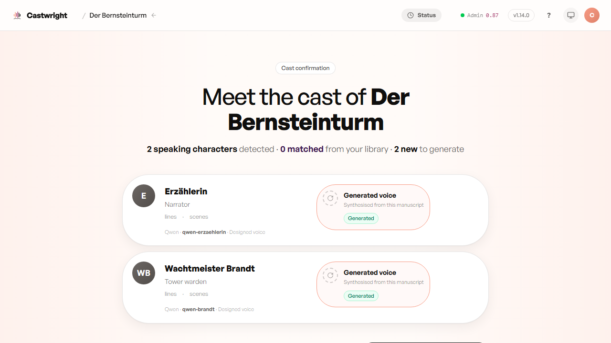

# Multi-language Support

Castwright isn't an English-only tool that happens to tolerate other languages — it performs **seven languages today, with the same full-cast craft as English: English, Russian, Spanish, French, German, Chinese, and Japanese**. The manuscript is read in its own language, every character gets a voice that speaks it, and the cast's tone and descriptions stay written in the book's own tongue rather than flattened into something English-shaped.

Language is auto-detected from the manuscript the moment you import it, and shown on the Confirm details screen before you commit to anything — a language Castwright can't perform yet falls back to English rather than guessing and getting it wrong silently.

Every supported language ships a runnable demo, too: the same *Coalfall Commission* is translated and cast in each, with language-matched voices, so you can hear a full cast in your own tongue before importing anything of your own.

Pasting in the Russian variant of the Coalfall Commission fixture
(`server/src/__fixtures__/the-coalfall-commission.ru.md`) auto-selects
**Russian** in the Language field and shows the "Auto-detected Russian —
verify" chip, plus a note that Russian books narrate with designed Qwen
voices — you'll design a voice for the narrator and each speaking character
in the cast view (Qwen is the engine behind every non-English cast; see
[Voice Engines](Voice-Engines)). Once analysis finishes, the cast
confirmation screen shows the detected characters with their own-language
names, each ready to design a Qwen voice for.

<picture>
  <source media="(prefers-color-scheme: dark)" srcset="images/multi-language-support/language-detection-dark.png">
  <source media="(prefers-color-scheme: light)" srcset="images/multi-language-support/language-detection.png">
  
</picture>

Below, *Der Bernsteinturm* — a German standalone — at the cast confirmation step: both detected characters, Erzählerin and Wachtmeister Brandt, keep their German names and roles, each queued to generate a new Qwen voice.

<picture>
  <source media="(prefers-color-scheme: dark)" srcset="images/multi-language-support/non-english-cast-confirmation-dark.png">
  <source media="(prefers-color-scheme: light)" srcset="images/multi-language-support/non-english-cast-confirmation.png">
  
</picture>

The narrator is localized too. A newly analysed non-English book seeds the narrator with a name in the book's own language — **Erzähler**, **Рассказчик**, **Narrador**, **Narrateur** (with "Narrator" kept as an alias) — and one consistent folkloric voice, rather than an English "Narrator" on a preset. Rename the narrator or redesign its voice and the change survives a re-parse.

## Chinese and Japanese

**Chinese (`zh`) and Japanese (`ja`) are first-class as of v1.14.0** — no longer turned away at the Confirm screen, but rostered, attributed, cast, and rendered through the same pipeline as every other language. Detection, word count, and chapter-heading/front-matter handling are all CJK-aware, and attribution is honorific-tolerant: a role-title or honorific fused straight onto a name with no separator — 奥杜万师傅 for "Master Oduvan", 卡斯珀寡妇 for "Widow Casper" — resolves to the right character instead of tripping the roster. Both Coqui XTTS (`zh-cn` / `ja`) and Qwen render CJK; see [Voice Engines](Voice-Engines).

> **Pick a capable local analyzer model for a CJK book.** CJK attribution quality depends on the analyzer model more than English does, and there's no automatic per-language routing — so for a Chinese or Japanese book, choose a strong local Qwen analyzer model (Advanced Settings → analyzer phase-0 / phase-1 model) rather than leaving a lightweight cloud default in place. A weak model can attribute CJK dialogue poorly enough to trip the attribution-drift safety net and refuse the run — a correct outcome, but avoidable by choosing the right model up front. See [Analysis & the Analyzer](Analysis-and-the-Analyzer).

## Casting a non-English book

For a non-English book, the voice picker hides voices that don't speak the
book's language — a Russian cast doesn't want a Spanish-only voice turning
up as an option. A small note under the list says how many are hidden and
why ("N hidden · can't read Russian"); tap "show all" to bring them back if
you want to browse anyway. English books are unaffected — every voice you
own is available.

## The rule that holds no matter which language

A cast never crosses languages inside a single book — every character and the narrator perform in the manuscript's own language, always. It's the one hard rule the whole feature is built around, and it's why the fallback for an unsupported language is honest English rather than a mixed-language cast nobody asked for.

See [Troubleshooting](Troubleshooting) for more on language detection and
casting edge cases.

Next: [Troubleshooting](Troubleshooting).
