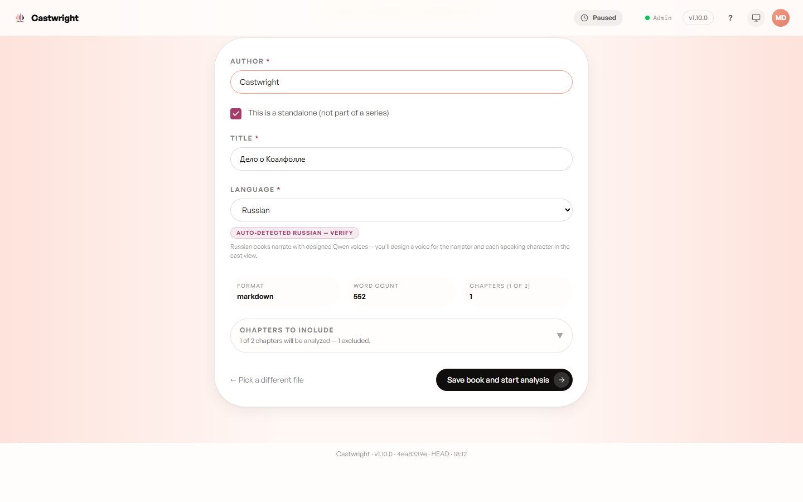
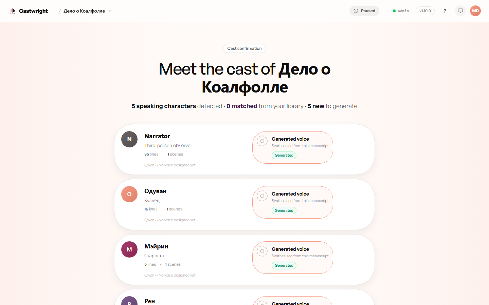

# Multi-language Support

English, Russian, and Spanish are fully supported today, with the same
full-cast craft as English — the manuscript is read in its own language,
every character gets a voice that speaks it, and the cast's tone and
descriptions stay written in the book's own tongue. French and German are
dormant (built but not yet enabled). Language is auto-detected from the
manuscript the moment you import it, and shown on the Confirm details
screen before you commit — a language it can't perform yet falls back to
English rather than guessing.

Pasting in the Russian variant of the Coalfall Commission fixture
(`server/src/__fixtures__/the-coalfall-commission.ru.md`) auto-selects
**Russian** in the Language field and shows the "Auto-detected Russian —
verify" chip, plus a note that Russian books narrate with designed Qwen
voices — you'll design a voice for the narrator and each speaking character
in the cast view (Qwen is the engine behind every non-English cast; see
[Voice Engines](Voice-Engines)).

Once analysis finishes, the cast confirmation screen shows the detected
characters with their own-language names — here, Одуван, Мэйрин, and Рен
alongside the Narrator — each ready to design a Qwen voice for:

## Casting a non-English book

For a non-English book, the voice picker hides voices that don't speak the
book's language — a Russian cast doesn't want a Spanish-only voice turning
up as an option. A small note under the list says how many are hidden and
why ("N hidden · can't read Russian"); tap "show all" to bring them back if
you want to browse anyway. English books are unaffected — every voice you
own is available.

See [Troubleshooting](Troubleshooting) for more on language detection and
casting edge cases.

Next: [Troubleshooting](Troubleshooting).
