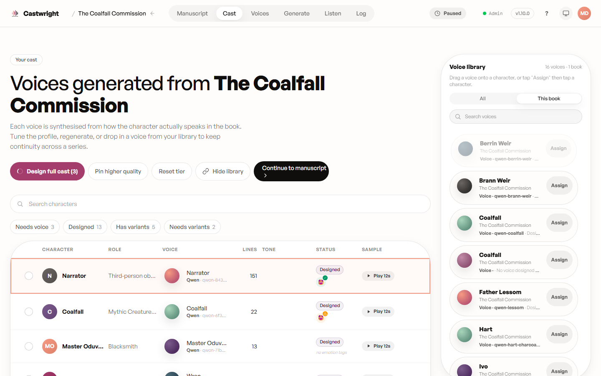
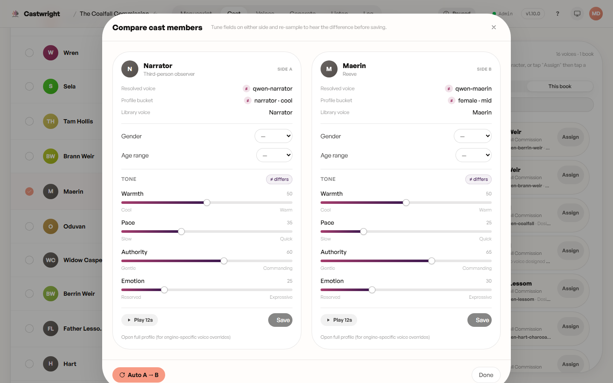

# Reviewing Cast & Assigning Voices

Every speaking character gets a row: role, the voice currently assigned,
line/scene counts, and a status pill (Designed, Sampled, Generated, Needs
voice, and so on). "Design full cast" designs bespoke Qwen voices for
whatever's missing in one pass — see [Designing a Voice](Designing-a-Voice)
for the single-character version of that flow. "Continue to manuscript" is
always available; the voice-readiness gate lives at generation start, not
here.

## Assigning a voice

Drag a voice card onto a cast row on desktop, or tap "Assign" then tap the
row on touch.

## A/B compare

Select exactly two cast members (their row checkboxes) and click "Compare"
to open them side by side — tune gender, age range, and tone on either side,
re-sample to hear the difference, and save only the side you like.

## Confirming the cast

Right after analysis, the confirmation screen lists every detected character
with a matched/generate decision before you ever reach the cast table above.

Next: [Designing a Voice](Designing-a-Voice).
