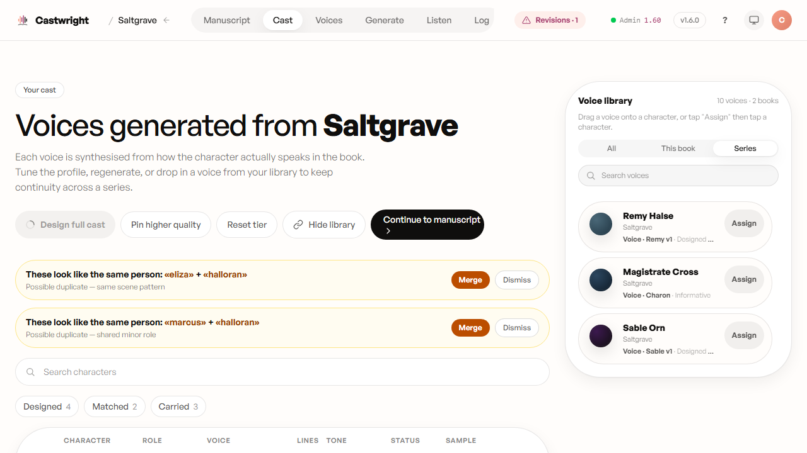
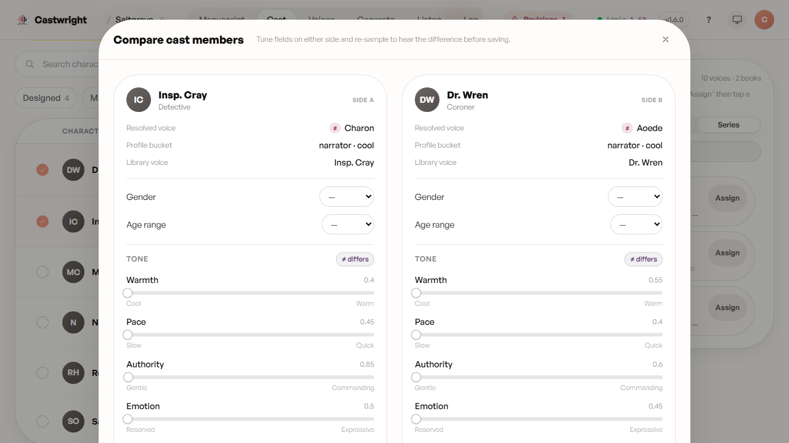
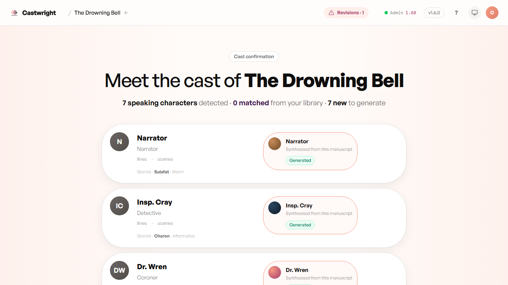

# Reviewing Cast & Assigning Voices

This is the spreadsheet view of your cast — the point where "Castwright found six characters" becomes "here's who each one actually sounds like." Every speaking character gets a row: role, the voice currently assigned, line counts, and a status pill (Designed, Matched, Carried, Sampled, Generated, and so on), so you can see at a glance who's ready and who still needs attention.

Below, *Saltgrave* — book two of the *Hollow Tide* series — where the cast is a mix of **Designed** (new for this book), **Matched** (a possible-duplicate flagged for merge), and **Carried** voices reused from book one. That mix is the whole point of a series: the narrator, Insp. Cray, and Dr. Wren keep the exact voice they had in *The Drowning Bell*, with no redesign needed.

<picture>
  <source media="(prefers-color-scheme: dark)" srcset="images/reviewing-cast-and-assigning-voices/01-cast-review-dark.png">
  <source media="(prefers-color-scheme: light)" srcset="images/reviewing-cast-and-assigning-voices/01-cast-review.png">
  
</picture>

**"Design full cast"** designs bespoke Qwen voices for whatever's still missing, in one pass, rather than working through the roster one character at a time — see [Designing a Voice](Designing-a-Voice) for the single-character version of the same flow. **"Continue to manuscript"** is always available from here; the voice-readiness gate that actually blocks an incomplete cast lives at generation start, not on this screen, so you're free to move on and come back.

## Assigning a voice

The **voice library** panel on the right — filterable by All / This book / Series, with search — is where you assign a voice: drag a voice card onto a cast row on desktop, or tap **Assign** on the card, then tap the row you want it on. Filtering to **Series** (as above) surfaces exactly the voices worth reusing across this book's series.

<picture>
  <source media="(prefers-color-scheme: dark)" srcset="images/reviewing-cast-and-assigning-voices/03-assign-pill-dark.png">
  <source media="(prefers-color-scheme: light)" srcset="images/reviewing-cast-and-assigning-voices/03-assign-pill.png">
  
</picture>

## Possible-duplicate detection

Two rows above flag "These look like the same person" — a possible-duplicate pair Castwright noticed from a shared scene pattern or a shared minor role. **Merge** collapses them into one character (carrying the merged name into aliases, so future books still recognize them); **Dismiss** keeps them separate if they really are two different people.

## A/B compare

Torn between two takes on a character? Select exactly two cast members (their row checkboxes) and click "Compare" to open them side by side — tune gender, age range, and tone on either side, re-sample to hear the difference, and save only the one you actually like.

<picture>
  <source media="(prefers-color-scheme: dark)" srcset="images/reviewing-cast-and-assigning-voices/ab-compare-dark.png">
  <source media="(prefers-color-scheme: light)" srcset="images/reviewing-cast-and-assigning-voices/ab-compare.png">
  
</picture>

Below, Insp. Cray and Dr. Wren — both carried into *Saltgrave* from *The Drowning Bell* — compared side by side: each side shows its resolved voice and profile bucket with a `≠` marker on anything that differs, and the same gender/age/tone controls as the single-character drawer, so you can nudge one side and re-sample without leaving the comparison.

## Confirming the cast

Before you ever reach the cast table above, the confirmation screen — the first thing you see right after analysis finishes — lists every detected character with a matched-or-generate decision. Below is *The Drowning Bell*, book one of its series: "7 speaking characters detected · 0 matched from your library · 7 new to generate" — there's no earlier book yet, so every voice generates fresh. Once a series has a book behind it, a returning character is offered back here with its provenance instead (exactly what "Matched" and "Carried" mean on *Saltgrave*'s cast table above), so continuity across a series is a decision you confirm once, not a redesign you repeat book after book.

<picture>
  <source media="(prefers-color-scheme: dark)" srcset="images/reviewing-cast-and-assigning-voices/05-confirm-cast-dark.png">
  <source media="(prefers-color-scheme: light)" srcset="images/reviewing-cast-and-assigning-voices/05-confirm-cast.png">
  
</picture>

Next: [Designing a Voice](Designing-a-Voice).
