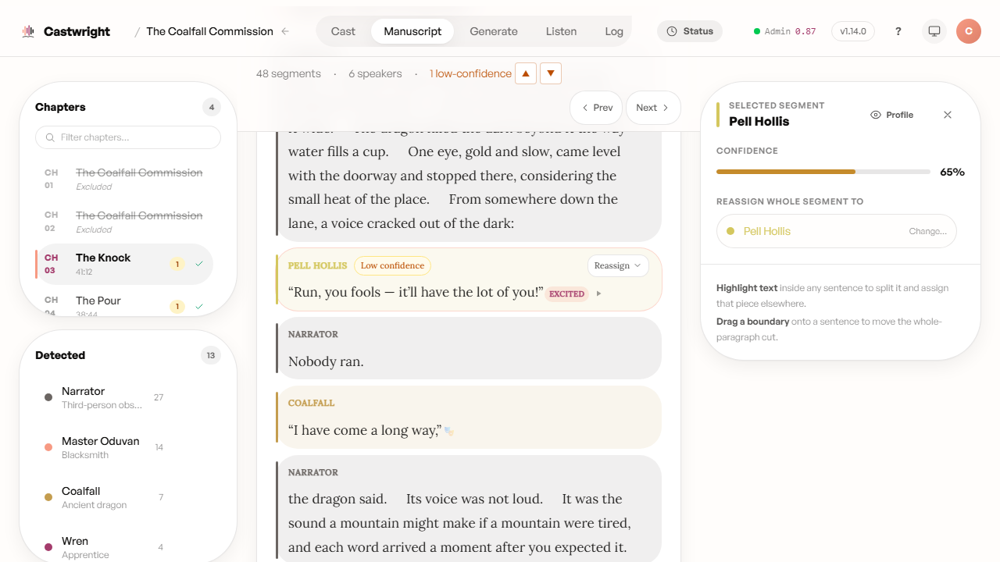

# Reviewing Low-Confidence Speaker Tags

No analyzer gets every line right on the first pass — long-tail dialogue with no "she said" hanging off it is exactly where attribution quietly goes wrong, and the honest failure mode is finding out three chapters later when the wrong character answers a question. So before you generate a single line of audio, it's worth a pass over anything the analyzer itself flagged as unsure.

Castwright tags every line it attributed with less than 75% confidence, and the manuscript view's sticky stats bar counts them per chapter. Rather than hunting for them by eye, a navigator jumps you straight to each one with the ▲/▼ buttons — or the `J`/`K` keys, if you'd rather keep your hands off the mouse.

<picture>
  <source media="(prefers-color-scheme: dark)" srcset="images/reviewing-low-confidence-speaker-tags/01-low-confidence-nav-dark.png">
  <source media="(prefers-color-scheme: light)" srcset="images/reviewing-low-confidence-speaker-tags/01-low-confidence-nav.png">
  
</picture>

## Resolving a flagged line

Jumping to a flagged line opens the segment inspector on the right, showing its confidence score and a reassign control — either for the whole segment or sentence by sentence, if the analyzer only got part of it wrong. Pick the right character from the list (or search for one) to resolve the tag. It's the same non-destructive reassignment mechanism used everywhere in the [Manuscript Management](Manuscript-Management) view, so nothing here is a special case to learn separately.

<picture>
  <source media="(prefers-color-scheme: dark)" srcset="images/reviewing-low-confidence-speaker-tags/segment-inspector-dark.png">
  <source media="(prefers-color-scheme: light)" srcset="images/reviewing-low-confidence-speaker-tags/segment-inspector.png">
  
</picture>

Below, the navigator has jumped to Pell Hollis's line at 65% confidence — the inspector shows the score, the current reassignment target, and the same highlight-to-split and drag-a-boundary tools available everywhere else in the manuscript.

When a chapter has nothing flagged, the stats bar just reads "0
low-confidence" in place of the navigator — nothing to do there, and nothing standing between you and generating audio with confidence in the attribution underneath it.

Next: [Generating Audio](Generating-Audio).
