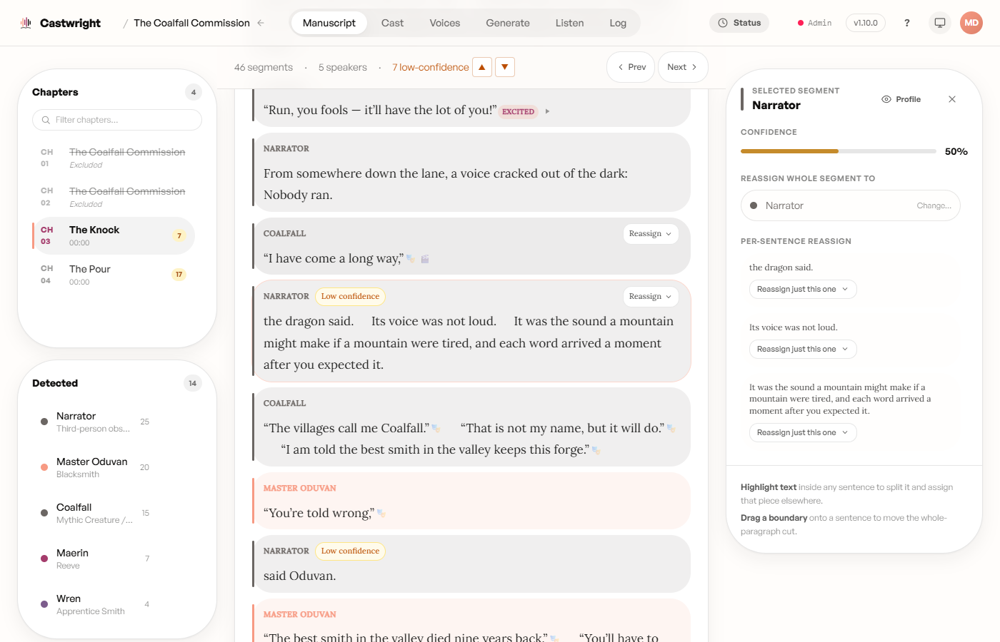
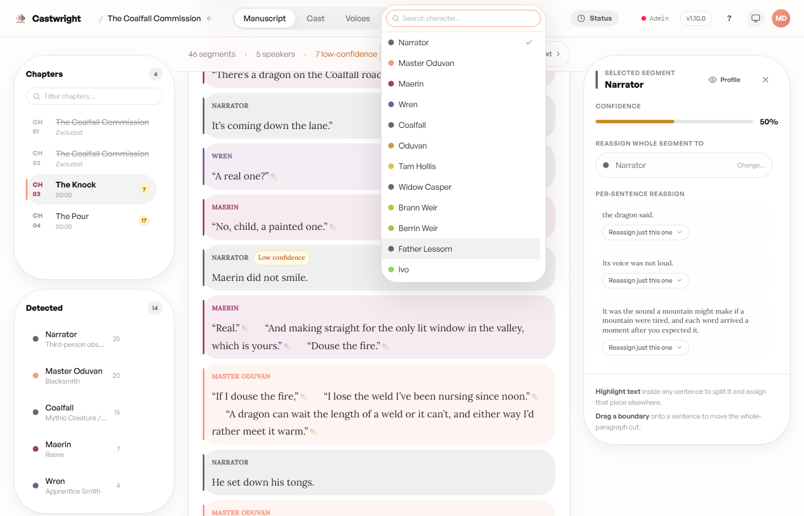

# Reviewing Low-Confidence Speaker Tags

Before generating audio, it's worth a pass over any line the analyzer wasn't
confident about attributing to a speaker (confidence under 75%). The
manuscript view's sticky stats bar counts them per chapter and lets you
jump straight to each one with the ▲/▼ buttons (or the `J`/`K` keys).

Jumping to a flagged line opens the segment inspector on the right, showing
its confidence score and a reassign control — either for the whole segment
or sentence by sentence. Pick the right character from the list (or search
for one) to resolve the tag.

When a chapter has nothing flagged, the stats bar just reads "0
low-confidence" in place of the navigator — nothing to do there.

Next: [Generating Audio](Generating-Audio).
