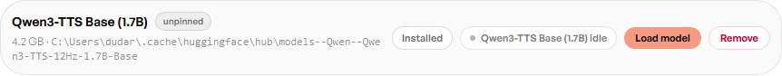
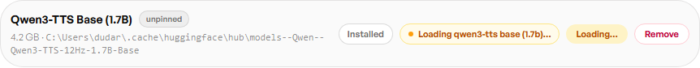

# The Model Control Pill

Every button-driven engine or model tier in **Admin → Model Manager** — Coqui,
and Qwen's Base and higher-quality tiers — gets the same pill-and-button
control: a status pill on the left (idle / loading / ready / unreachable) and
a Load or Stop action on the right. It's the one place the app tells you
what's actually resident in GPU memory right now, separate from what's
merely installed on disk.

The sequence below is a real load/unload cycle captured against **Qwen3-TTS
Base (1.7B)** — the higher-quality Qwen tier, installed but not loaded at the
time of capture.

**Idle** — installed, not loaded. The pill reads "idle" and the action is
**Load model**.

**Loading** — clicking Load model fires the request; the pill switches to an
amber "Loading …" state and the button disables so a second click can't fire
mid-load.

**Ready** — once the weights are resident, the pill turns green ("ready")
and the action becomes **Stop**, so the same control unloads it again and
frees the VRAM.

An engine without an installed package yet (e.g. Coqui before its `pip
install` step) or without its weights fetched (e.g. Kokoro before its
one-time download) shows an install/repair action instead of this pill —
there's nothing to load until that step completes. See
[Voice Engines](Voice-Engines) for what each engine's row looks like in
those states.

Next: [Library Management](Library-Management).
