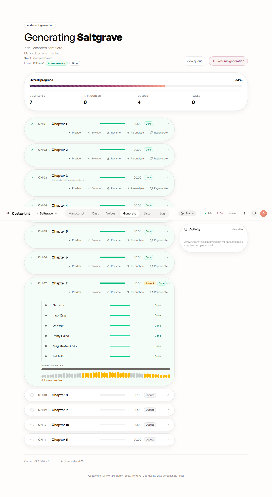
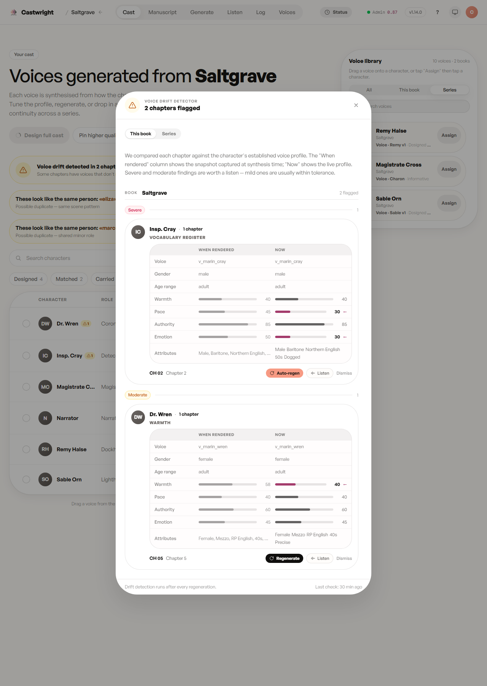
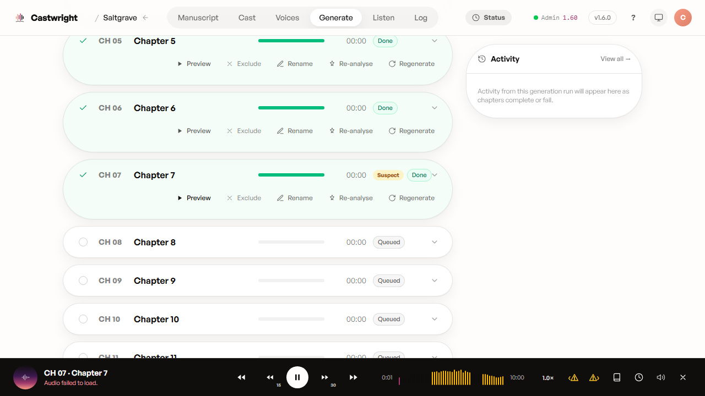

# The Quality Gate

The honest worry with any AI voice is a line that comes out fluent but *wrong* — a dropped clause, a clipped word, a stretch of dead air — and you only catch it three chapters later. Castwright runs two independent checks so that mistake gets caught before you do, not after.

## Check one: the acoustic gate, before a chapter assembles

Every rendered sentence is checked acoustically — dead air, near-silence, clipping, duration drift against what the line should take to say — before the chapter is assembled. A sentence that fails gets automatically re-recorded, up to a fixed retry budget, with no action from you.

A second, optional pass reads the words themselves. Off by default (turn it on in **Advanced Configuration → QA gates**), it transcribes each rendered line and checks it against the script — the "fluent but wrong" case the acoustic check can't see: a dropped clause, a swapped word, a line that says something other than what was written. Together the two checks cover both ways a take can go bad — the sound of it, and the sense of it.

A line that still doesn't clear after its retries ships anyway with the best take kept, and the chapter is marked **Suspect** so you know to take a listen rather than trust it blindly.

Expanding a Suspect chapter's row on the Generate screen shows exactly where the trouble is: a waveform strip with each flagged stretch rendered as an amber band, an "N issues to review" caption, and a tooltip on each band naming the reason — a line rendered suspiciously short against how long it should have taken to say, or a line whose words drifted from the script.

A chapter that clears cleanly shows none of this — no Suspect badge, no amber band, every character row reads Done straight through. That's the gate working quietly in the common case: nothing to review because nothing needed a re-record.

## Check two: voice drift, after a chapter renders

The acoustic gate catches a broken *take*. It doesn't catch a voice that rendered cleanly but drifted away from the character it's supposed to be. That's what the drift detector is for: once a chapter renders, it compares that chapter's synthesis against the character's established voice profile and flags any character whose rendered voice has wandered.

Flags are severity-tiered — **Severe**, **Moderate**, **Mild** — and open into a comparison view: the profile's voice attributes (gender, age, warmth, pace, authority, emotion) as they were "when rendered" against "now," a **Listen** control that A/B-plays the actual chapter audio against a fresh sample of the current profile so you can hear the drift rather than just read it, and a one-click **Regenerate** for that chapter. A Severe flag offers **Auto-regen** — no confirmation step, because at that severity the drift is confident enough not to need a second opinion. Anything you're not worried about, **Dismiss** (or **Dismiss all**) clears it.

The report opens scoped to the book you're in. If that book is part of a series, a **This book** / **Series** toggle sits at the top — flip it to pull in flags from every other title sharing the cast. However many chapters are flagged, the list loads a screenful at a time; scroll, and the rest follows.

## Where a flag follows you: the preview surface

A Suspect flag isn't stranded on the Generate screen. The same amber-marked waveform follows the audio wherever you play it — including the mini-player that pins to the bottom of every view. Hit preview on a chapter from Generate, or play it from the Listen tab's chapter list, and a bad take lights up amber in the scrubber before you've even pressed play — so a flagged line never has to be rediscovered by ear from scratch.

Next: [Listening & Revising](Listening-and-Revising).
