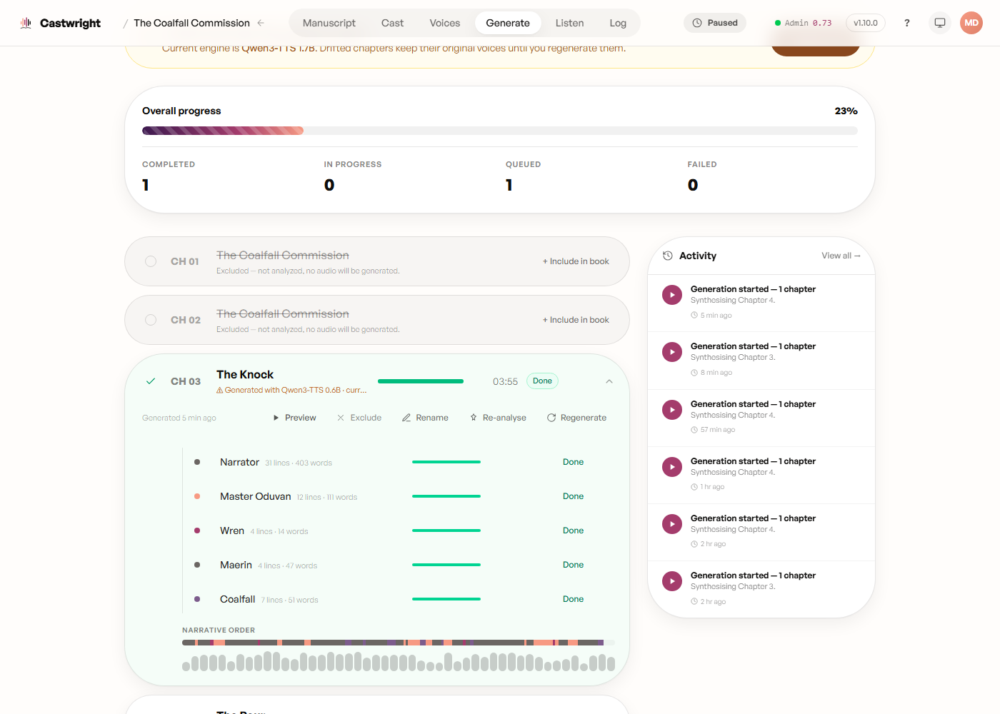

# The Quality Gate

Every generated line passes an automatic acoustic check before it's
considered done — near-silent, clipped, or duration-drifted audio gets
automatically re-recorded (up to a fixed retry budget) before the chapter
assembles. A line that still doesn't pass after its retries ships anyway
with the best take kept, and the chapter is marked "Suspect" so you know to
take a listen.

Expanding a completed chapter's row shows this per-character, alongside a
"Narrative order" strip and the chapter's waveform — any flagged stretch of
audio shows up there as an amber band, with an "N issues to review" caption
above it.

The Coalfall Commission's Chapter One rendered clean on this pass — no
"Suspect" badge, no amber bands, every character row reads "Done" straight
through. That's the gate working quietly in the common case: nothing to
review because nothing needed a re-record. A real flagged-and-re-recorded
example wasn't available from this run; capturing one is tracked as a
follow-up.

Next: [Listening & Revising](Listening-and-Revising).
