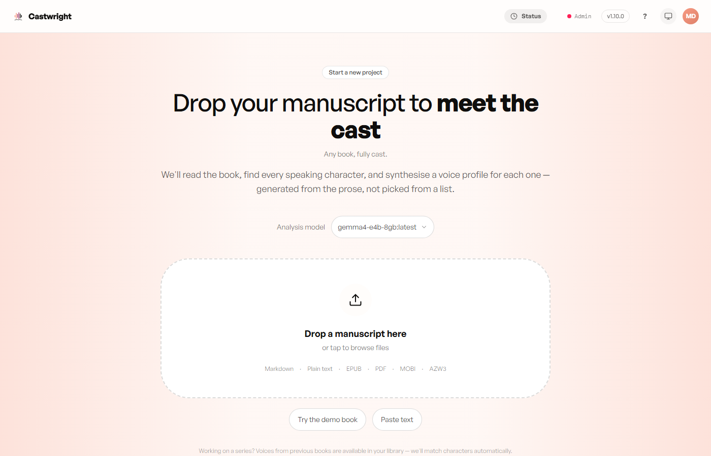
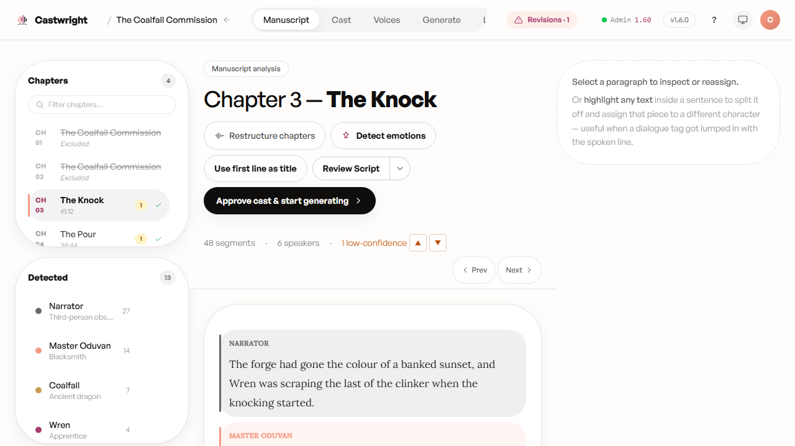
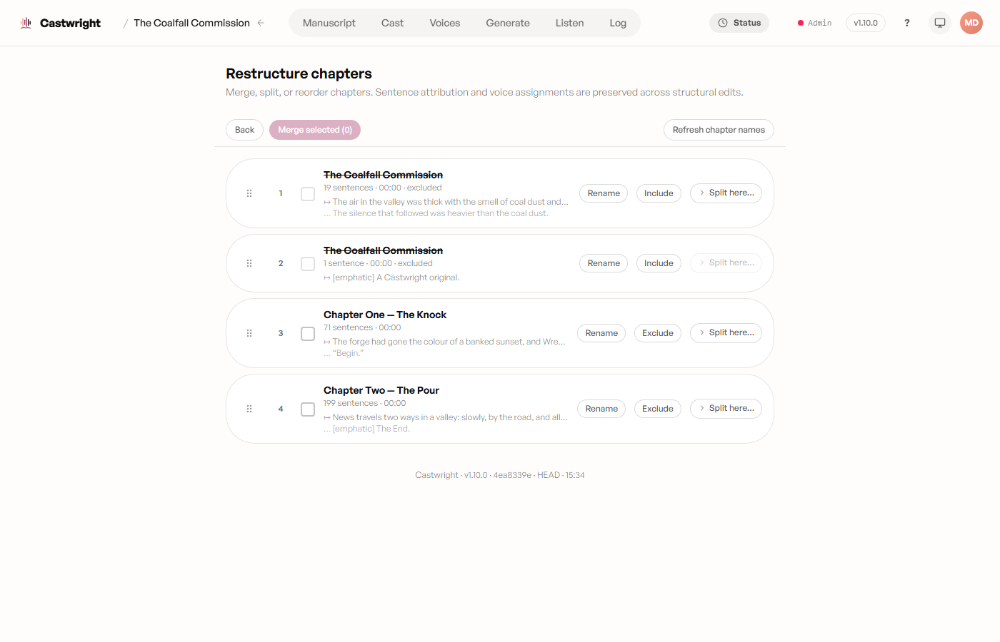

# Uploading a Book

This is where a book becomes a Castwright project — the manuscript arrives, Castwright makes its best guess at structure and language, and you get the chance to correct anything it guessed wrong before analysis ever starts.

## 1. Upload your manuscript

Drop a file (Markdown, plain text, EPUB, PDF, MOBI, or AZW3), paste text
directly, or try the built-in demo book. Pick an analysis model here too —
see [Analysis & the Analyzer](Analysis-and-the-Analyzer) for what the local
vs. cloud choice means.

<picture>
  <source media="(prefers-color-scheme: dark)" srcset="images/uploading-a-book/01-upload-dark.png">
  <source media="(prefers-color-scheme: light)" srcset="images/uploading-a-book/01-upload.png">
  
</picture>

## 2. Confirm title, author, and chapters

Right after upload, Castwright shows what it detected — author, series,
title, language, and a chapter list with front/back matter (title pages,
copyright notices, etc.) pre-excluded. Fix anything the parser guessed
wrong, then **Save book and start analysis**.

> A screenshot of this confirm-metadata screen is tracked as a follow-up.

That kicks off the analyzer — see [Analysis & the
Analyzer](Analysis-and-the-Analyzer) for what happens next.

## 3. Fine-tune structure any time after

Once the cast is confirmed, two tools stay available from the book's tab
bar for the life of the project — useful if the automatic split or chapter
boundaries need a correction:

**Manuscript** — the ongoing tab covered in full on [Manuscript Management](Manuscript-Management): review paragraph-boundary and speaker-attribution results
sentence by sentence, drag a boundary to move a cut, or highlight text
inside a sentence to split it off and reassign that piece to a different
character.

<picture>
  <source media="(prefers-color-scheme: dark)" srcset="images/uploading-a-book/02-manuscript-paragraphs-dark.png">
  <source media="(prefers-color-scheme: light)" srcset="images/uploading-a-book/02-manuscript-paragraphs.png">
  
</picture>

**Restructure chapters** — merge, split, reorder, rename, or
include/exclude chapters. Sentence attribution and voice assignments carry
across the edit.

<picture>
  <source media="(prefers-color-scheme: dark)" srcset="images/uploading-a-book/03-restructure-dark.png">
  <source media="(prefers-color-scheme: light)" srcset="images/uploading-a-book/03-restructure.png">
  
</picture>

Next: [Manuscript Management](Manuscript-Management), or straight on to [Analysis & the Analyzer](Analysis-and-the-Analyzer).
