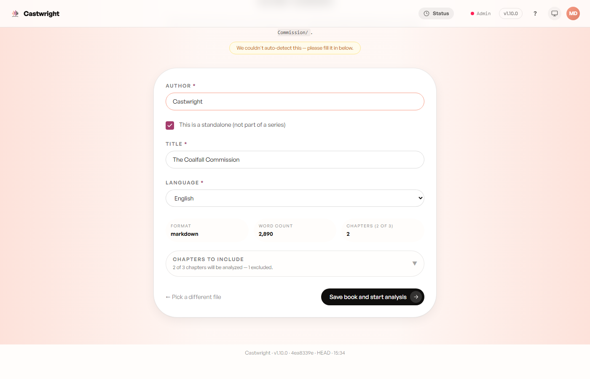

# Uploading a Book

## 1. Upload your manuscript

Drop a file (Markdown, plain text, EPUB, PDF, MOBI, or AZW3), paste text
directly, or try the built-in demo book. Pick an analysis model here too —
see [Analysis & the Analyzer](Analysis-and-the-Analyzer) for what the local
vs. cloud choice means.

## 2. Confirm title, author, and chapters

Right after upload, Castwright shows what it detected — author, series,
title, language, and a chapter list with front/back matter (title pages,
copyright notices, etc.) pre-excluded. Fix anything the parser guessed
wrong, then **Save book and start analysis**.

That kicks off the analyzer — see [Analysis & the
Analyzer](Analysis-and-the-Analyzer) for what happens next.

## 3. Fine-tune structure any time after

Once the cast is confirmed, two tools stay available from the book's tab
bar for the life of the project — useful if the automatic split or chapter
boundaries need a correction:

**Manuscript** — review paragraph-boundary and speaker-attribution results
sentence by sentence. Drag a boundary onto a sentence to move a cut, or
highlight text inside a sentence to split it off and reassign that piece to
a different character.

**Restructure chapters** — merge, split, reorder, rename, or
include/exclude chapters. Sentence attribution and voice assignments carry
across the edit.

Next: [Analysis & the Analyzer](Analysis-and-the-Analyzer).
