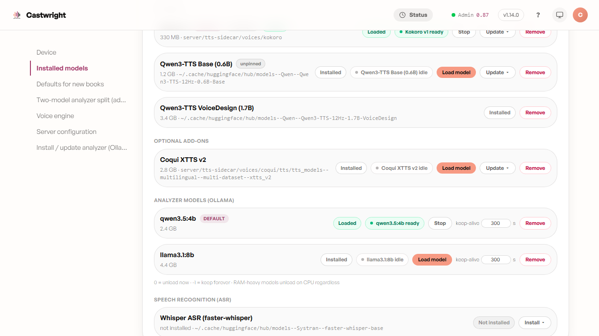
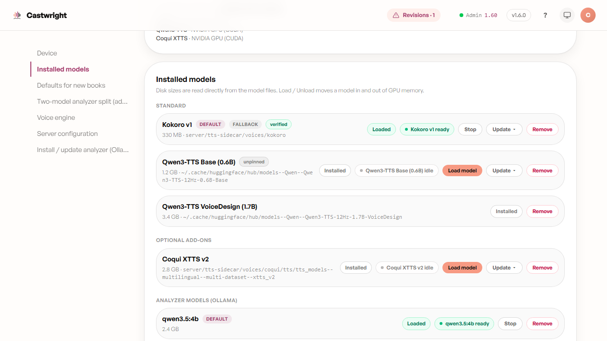

# Voice Engines

No single engine is right for every character or every machine — a catalogue voice, a cloned sample, and a designed voice each solve a different problem, so Castwright supports four TTS engines and lets you pick per character. They surface in two different places:
**Kokoro**, **Coqui**, and **Qwen** are local models with disk/VRAM residency,
managed from **Admin → Model Manager** (each row shows install state, size,
and — once usable — a Load/Unload pill; see
[The Model Control Pill](The-Model-Control-Pill)). **Gemini** has no local
model to manage — it's a cloud voice catalog you pick from directly on a
character, in the Profile Drawer's "Model voice" picker.

See [Installing Castwright](Installing-Castwright) for setup steps for each.

## Kokoro (always-available fallback)

Ships as a **standard** engine — installs with the Python sidecar — and every
character carries a Kokoro preset as a fallback, so a book still generates
even before Qwen or Coqui are set up. As of v1.14.0 Kokoro no longer eagerly
loads at startup by default: it warms on demand on the first synth that needs
it, freeing the ~1 GB it used to hold resident. Its fallback role is unchanged
— every character still carries a Kokoro preset — only its idle VRAM footprint
is; opt back into the always-hot engine with **Preload Kokoro at startup** in
[Advanced Settings](Advanced-Settings) (`PRELOAD_KOKORO`). Below, Kokoro's row in Model Manager:
fully installed, **DEFAULT** + **FALLBACK** badges, **verified** integrity,
loaded and ready with a **Stop** action.

<picture>
  <source media="(prefers-color-scheme: dark)" srcset="images/the-model-control-pill/03-pill-loaded-dark.png">
  <source media="(prefers-color-scheme: light)" srcset="images/the-model-control-pill/03-pill-loaded.png">
  
</picture>

## Coqui XTTS v2

An **optional add-on** (not installed by default) — install it from **Admin
→ Model Manager → Optional add-ons → Coqui → Install**. Once the package is
present, Coqui gets the same idle/loading/ready pill as any other engine (see
[The Model Control Pill](The-Model-Control-Pill)). Coqui also renders Chinese
(`zh-cn`) and Japanese, so it's a valid engine for a CJK cast rather than just
English and European voices — its installer pulls the extra CJK text frontends
those languages need. Below, Coqui's row once installed: **Installed** badge,
**Load model** pill, and an **Update** toggle for reinstalling the package.

<picture>
  <source media="(prefers-color-scheme: dark)" srcset="images/voice-engines/coqui-row-dark.png">
  <source media="(prefers-color-scheme: light)" srcset="images/voice-engines/coqui-row.png">
  
</picture>

## Qwen (default generation engine)

Qwen is the flagship per-character engine — the one the cast's designed
voices actually use. It ships a Base tier (0.6B, the everyday default, and a
higher-quality 1.7B) plus a VoiceDesign model used transiently while
designing a bespoke voice — each its own Model Manager row, loaded and
unloaded independently. Below, the Base (0.6B) row installed and idle: an
**unpinned** integrity chip (its weights aren't a single fixed-file release,
so size-based integrity pinning doesn't apply the way it does for Kokoro),
**Installed** badge, and a **Load model** pill.

<picture>
  <source media="(prefers-color-scheme: dark)" srcset="images/voice-engines/qwen-row-dark.png">
  <source media="(prefers-color-scheme: light)" srcset="images/voice-engines/qwen-row.png">
  
</picture>

## Gemini

Gemini isn't a local model, so it has no Model Manager row — there's nothing
to load or unload. It shows up instead as a voice family in the Voice
Library and as one of the tabs in a character's **Model voice** picker
(Profile Drawer → Voice profile), alongside Coqui and Kokoro — those preset
tabs only render once that character's engine is set to something other than
Qwen; a Qwen-engine character designs a bespoke voice instead (see
[Designing a Voice](Designing-a-Voice)) and never sees this picker. Below, "Charon"
— a Gemini voice reused across two cast members in *The Hollow Tide* series —
with **Audition base voice** and **Rebaseline the series** actions.

<picture>
  <source media="(prefers-color-scheme: dark)" srcset="images/voice-engines/04-gemini-dark.png">
  <source media="(prefers-color-scheme: light)" srcset="images/voice-engines/04-gemini.png">
  
</picture>

Next: [The Model Control Pill](The-Model-Control-Pill).
