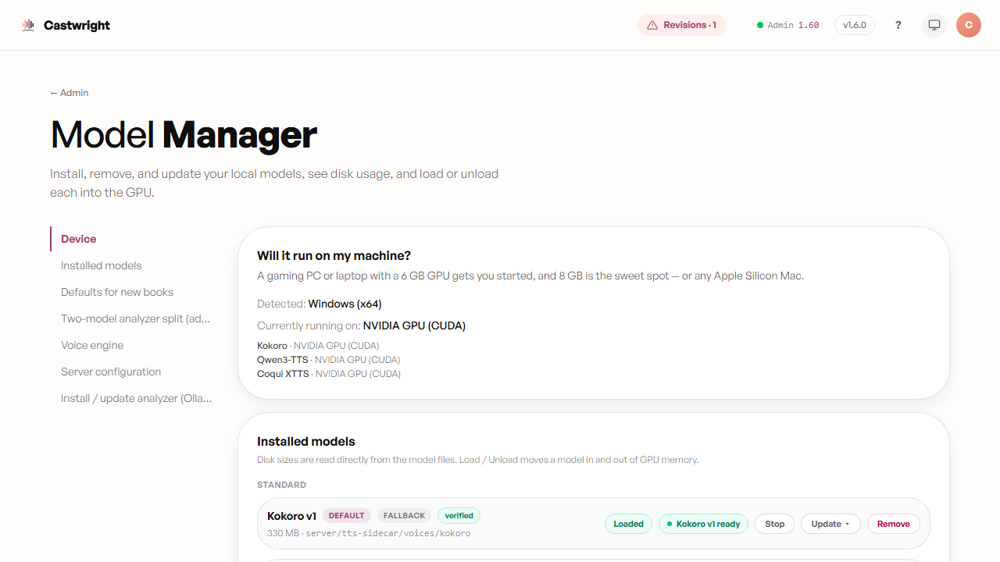
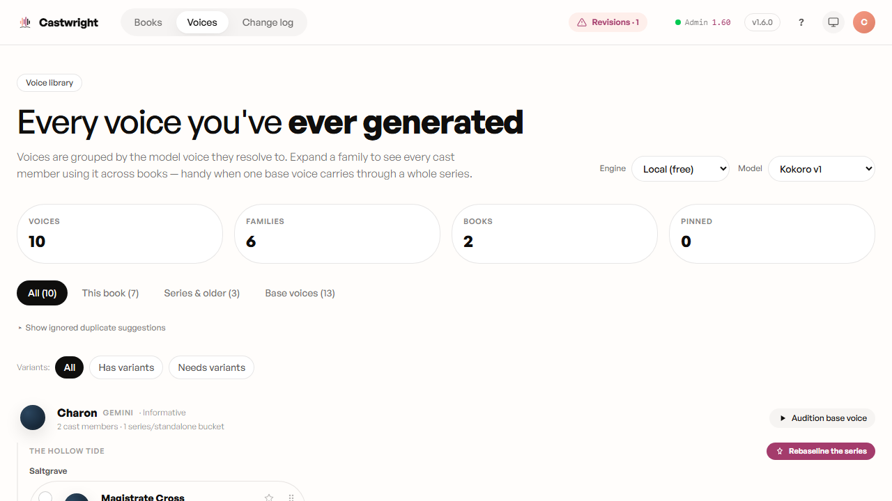

# Voice Engines

No single engine is right for every character or every machine — a catalogue voice, a cloned sample, and a designed voice each solve a different problem, so Castwright supports four TTS engines and lets you pick per character. They surface in two different places:
**Kokoro**, **Coqui**, and **Qwen** are local models with disk/VRAM residency,
managed from **Admin → Model Manager** (each row shows install state, size,
and — once usable — a Load/Unload pill; see
[The Model Control Pill](The-Model-Control-Pill)). **Gemini** has no local
model to manage — it's a cloud voice catalog you pick from directly on a
character, in the Profile Drawer's "Model voice" picker.

See [Installing Castwright](Installing-Castwright) for setup steps for each.

## Kokoro (always-available fallback)

Ships as a **standard** engine — installs with the Python sidecar — and every
character carries a Kokoro preset as a fallback, so a book still generates
even before Qwen or Coqui are set up. Below, Kokoro's row in Model Manager:
fully installed, **DEFAULT** + **FALLBACK** badges, **verified** integrity,
loaded and ready with a **Stop** action.

## Coqui XTTS v2

An **optional add-on** (not installed by default) — install it from **Admin
→ Model Manager → Optional add-ons → Coqui → Install**. Once the package is
present, Coqui gets the same idle/loading/ready pill as any other engine (see
[The Model Control Pill](The-Model-Control-Pill)).

## Qwen (default generation engine)

Qwen is the flagship per-character engine — the one the cast's designed
voices actually use. It ships a Base tier (0.6B, the everyday default, and a
higher-quality 1.7B) plus a VoiceDesign model used transiently while
designing a bespoke voice — each its own Model Manager row, loaded and
unloaded independently.

## Gemini

Gemini isn't a local model, so it has no Model Manager row — there's nothing
to load or unload. It shows up instead as a voice family in the Voice
Library and as one of the tabs in a character's **Model voice** picker
(Profile Drawer → Voice profile), alongside Coqui and Kokoro. Below, "Charon"
— a Gemini voice reused across two cast members in *The Hollow Tide* series —
with **Audition base voice** and **Rebaseline the series** actions.

> A screenshot of Coqui's and Qwen's individual Model Manager rows is tracked as a follow-up — the shot above shows Kokoro's row as a real example of the shared pill/badge pattern every engine uses.

Next: [The Model Control Pill](The-Model-Control-Pill).
