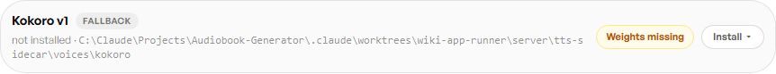
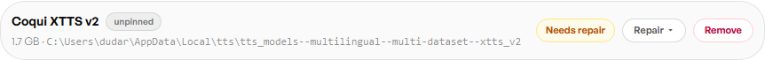
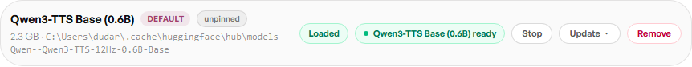

# Voice Engines

Castwright supports four TTS engines. They surface in two different places:
**Kokoro**, **Coqui**, and **Qwen** are local models with disk/VRAM residency,
managed from **Admin → Model Manager** (each row shows install state, size,
and — once usable — a Load/Unload pill; see
[The Model Control Pill](The-Model-Control-Pill)). **Gemini** has no local
model to manage — it's a cloud voice catalog you pick from directly on a
character, in the Profile Drawer's "Model voice" picker.

See [Installing Castwright](Installing-Castwright) for setup steps for each.

## Kokoro (always-available fallback)

Ships as a **standard** engine — installs with the Python sidecar — and every
character carries a Kokoro preset as a fallback, so a book still generates
even before Qwen or Coqui are set up. On this box the weights haven't been
fetched yet, so Model Manager shows it "Weights missing" with an **Install**
action rather than a live Load/Unload pill — that's the genuine pre-install
state, not a broken one.

## Coqui XTTS v2

An **optional add-on** (not installed by default). This box has the model
weights on disk but not the `coqui-tts` Python package, so Model Manager
flags it "Needs repair" with a **Repair** action instead of a Load/Unload
pill — again, the real state of an engine whose package step hasn't run yet.
Once the package is present, Coqui gets the same idle/loading/ready pill as
Qwen below.

## Qwen (default generation engine)

Qwen is the flagship per-character engine — the one the cast's designed
voices actually use. It's fully installed and resident on this box: the
Base (0.6B) model is loaded and marked **Default**, with a live "ready"
pill and a **Stop** action.

Qwen also ships a higher-quality **Base (1.7B)** tier and a **VoiceDesign
(1.7B)** model (used transiently while designing a bespoke voice) — both
listed as separate Model Manager rows. See
[The Model Control Pill](The-Model-Control-Pill) for a full load/unload
walkthrough using the 1.7B tier.

## Gemini

Gemini isn't a local model, so it has no Model Manager row — there's nothing
to load or unload. It shows up instead as one of the tabs in a character's
**Model voice** picker (Profile Drawer → Voice profile), alongside Coqui and
Kokoro, once that character's engine is set to something other than Qwen.
Each tab is a fixed catalog of prebuilt voices for that engine.

Next: [The Model Control Pill](The-Model-Control-Pill).
